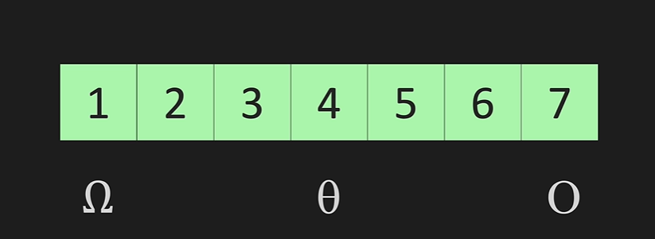
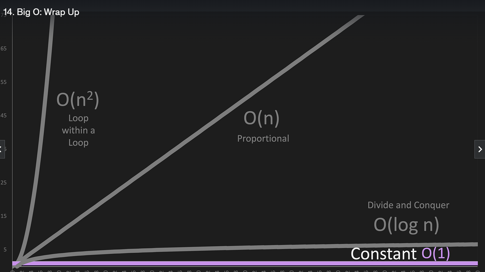
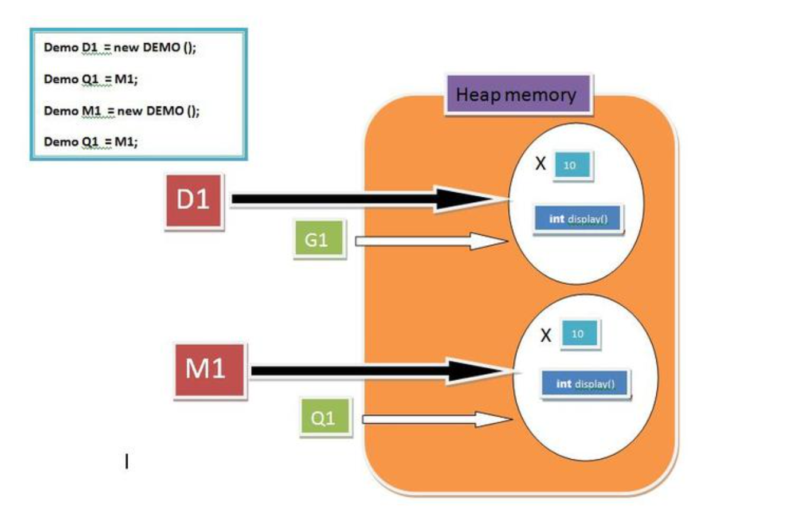

DSA

1. Big O Upper bound (worst-case)
2. Big Omega Lower bound (best-case)
3. Big Theta Tight/Average bound (avg-case)

**TIme Complexity**



Time complexity is a way to represent the amount of time an algorithm takes to run as a function of the input size. 
Big O notation is a way to describe the upper bound of the time complexity of an algorithm. 
It is a way to describe the worst-case scenario of an algorithm.



Cheat sheet for Big O notation.
https://www.bigocheatsheet.com/


**Space complexity** 

Space complexity tells you how much memory (RAM) an algorithm needs as the input size grows.
we usually consider:


* Input space – memory used to store the input 
* Auxiliary space – extra memory used by the algorithm
 variables
  - arrays
  - recursion stack
  - data structures (lists, maps, etc.)

Note :- Most of the time, space complexity = auxiliary space, not input space.


**Reference**

When we create an object (instance) of class then space is reserved in heap memory

<!-- @formatter:off -->
```java
class Demo {
 int x = 10;
 int display()
 {
  return 0;
 }
}
class Main {
 public static void main(String[] args)
 {
  Demo D1 = new Demo();
  Demo M1 = new Demo();
  Demo Q1 = new Demo();
 }
}
```
A simple way to remember it is:



* **Stack** = "What the program is currently doing" (method calls and local variables).

  * The stack is used for method execution. It stores local variables, method parameters, and references to objects. Each method call creates a new stack frame, which is removed automatically when the method finishes.


* **Heap** = "What the program has created" (objects and arrays). 
  * The heap is used for dynamic memory allocation. All objects and arrays are created on the heap, and the JVM's garbage collector automatically frees heap memory when objects are no longer reachable.


