Tree: There is not rule that binary binarysearchtree should have node two nodes

# `Binary Search Tree`
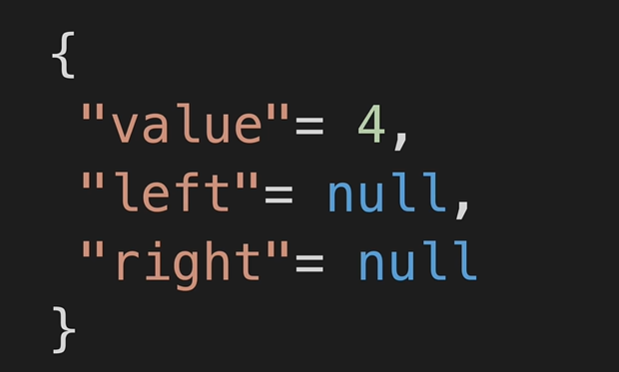

* Nodes left and right

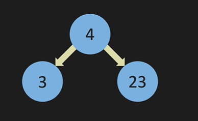

* Nested representation how actual object looks like

* **Full Binary binarysearchtree :**

Every node has either 0 or 2 child nodes, i.e., left and right or no children

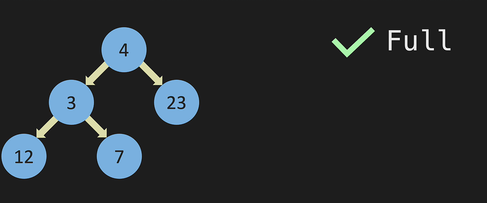

Not Full if root node has only one node in right or left

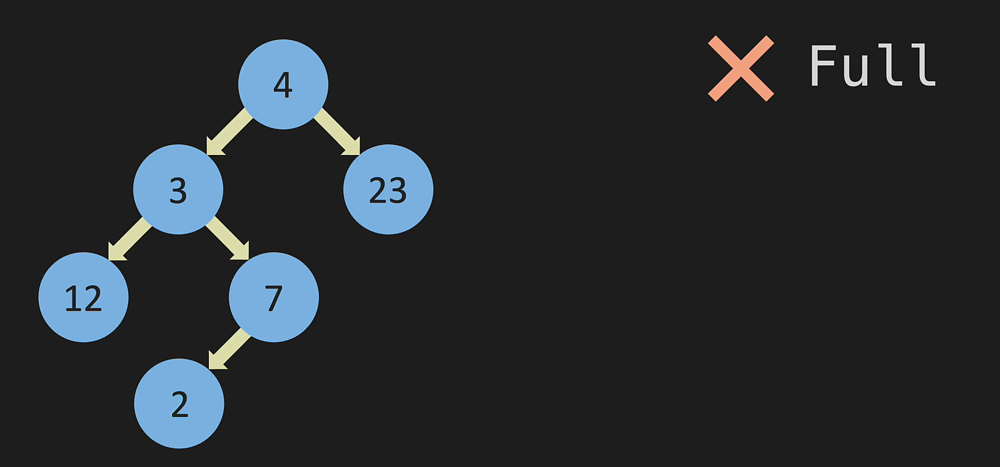

* **Perfect binary binarysearchtree :**

All nodes have exactly two children, and all leaf nodes are at the same level

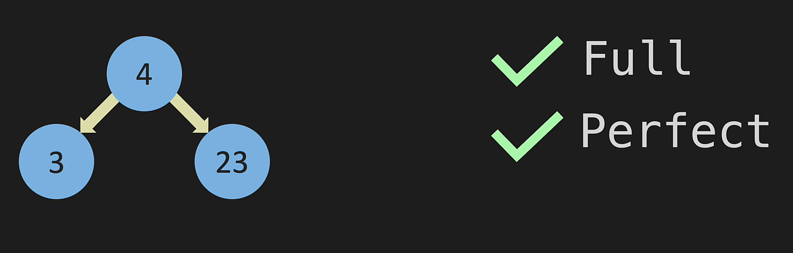

* **Complete binarysearchtree:**

All levels, except possibly the last, are filled, and all nodes are as left as possible

ex: Complete binarysearchtree if we are filling the binarysearchtree in all level with any gaps

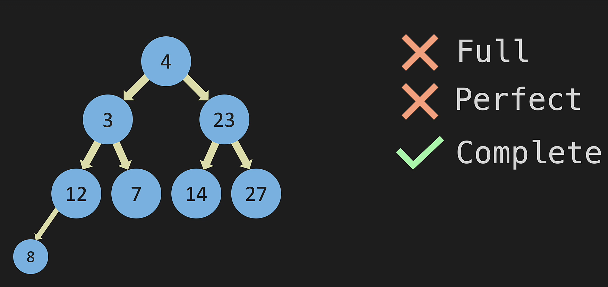

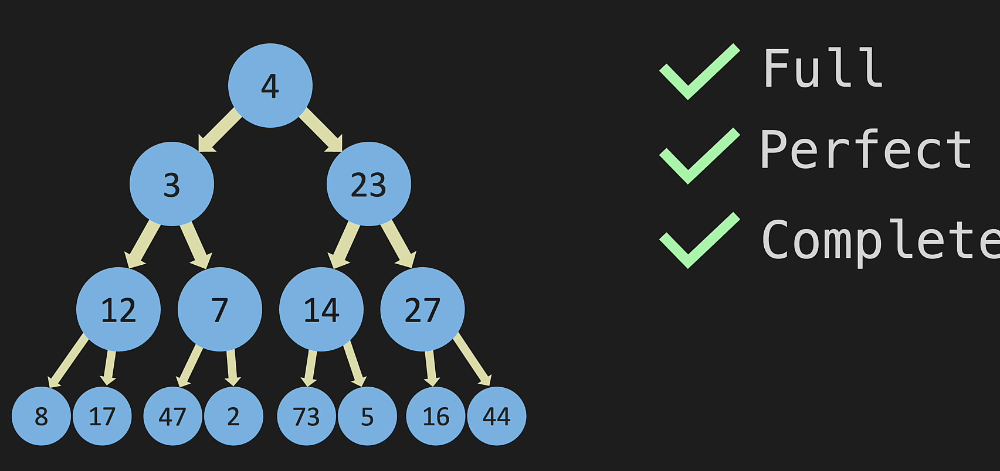

* Parent Node 

* Child Node

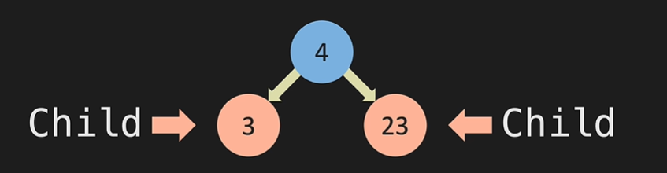

* Leaf node 

Note: This is not binarysearchtree only one parent for child node

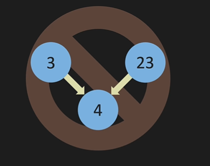

## **Binary search binarysearchtree**

Left value is less and right value is more

A Binary Search Tree is a data structure used in computer science for organizing and storing data in a sorted manner. Each node in a Binary Search Tree has at most two children, a left child and a right child, with the left child containing values less than the parent node and the right child containing values greater than the parent node. This hierarchical structure allows for efficient searching, insertion, and deletion operations on the data stored in the binarysearchtree.

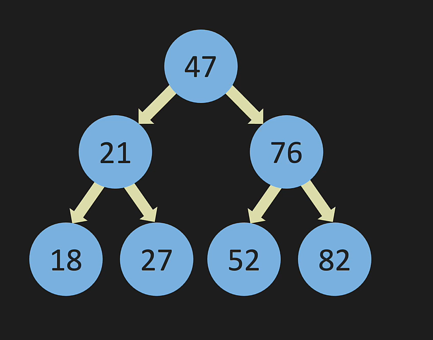

## Time complexity calculation 

To number of nodes in a binarysearchtree

Formula : 2^level-1

* in Level 1 = 2^1-1 = 1
* In level 2 = 2^2-1 = 3
* In level 3 = 2^3-1 = 7
* In level 4 = 2^4-1 = 16

As we go larger in nodes the -1 is insignificant

Binary search binarysearchtree operation 
* To find or add 35 value it is 4 steps 
* To find or add 76 value it is 2 steps

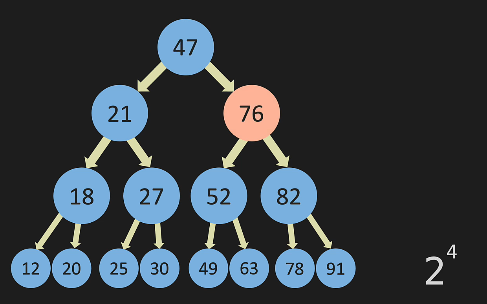

O(log N) achieved in average case 

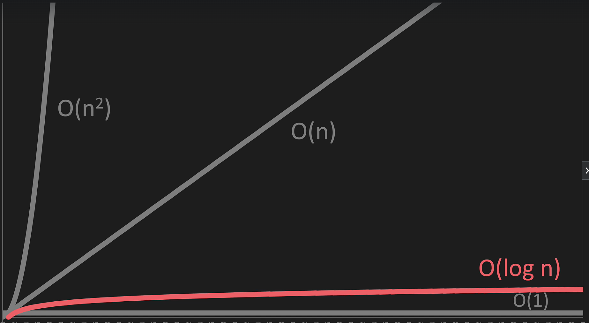

Worst case Big O(N) if binary search binarysearchtree does not fork (This is similar to linked List)

Operation Average and Worst case for binary search binarysearchtree

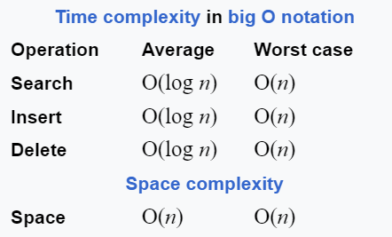

**Linked list V/S Binary search binarysearchtree**

In details of binary search binarysearchtree 

