# Graph

1. vertex or Node

2. Edge or connection

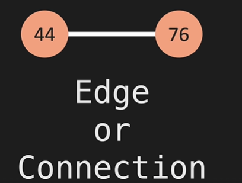

1. [ ] Note : No limit of edge

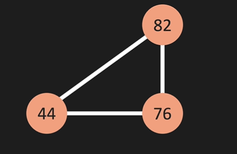

* Weight edge
Ex: used in google maps and network routing for defining traffics

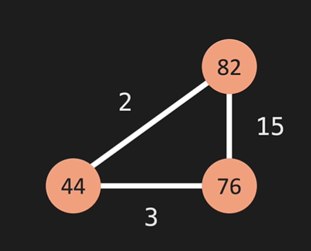
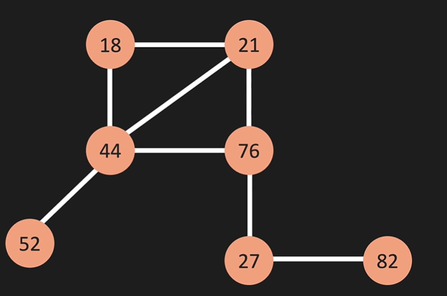

# Adjacency Matrix Representation

If an Undirected Graph G consists of n vertices then the adjacency matrix of a graph is n x n matrix A = [aij] and
defined by - aij = 1 {if there is a path exists from Vi to Vj}
1. bidirectional (symmetric matrix)

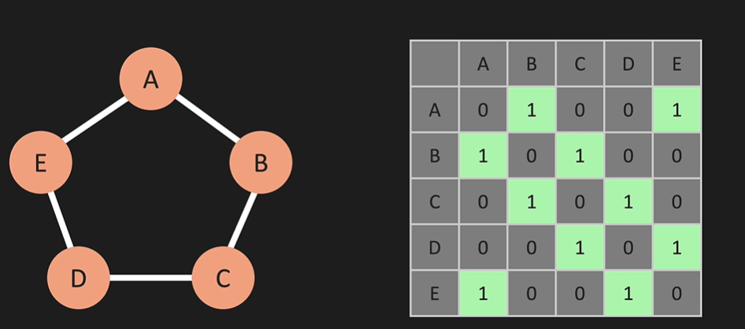
2. weight edge

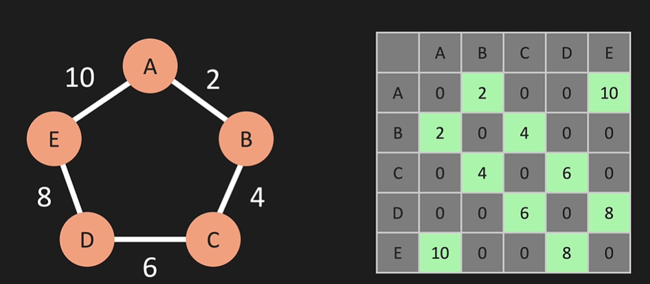
3. unidirectional (Lost symmertic matric) 

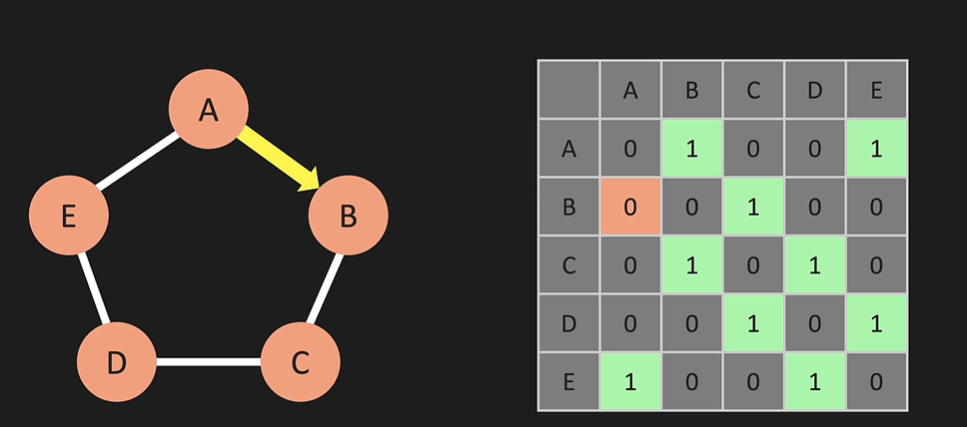

# Adjacency List

Adjacency List is a method of representing graphs in list form, or it can be defined as a format used to represent graphs as an array of linked lists

hash map representation
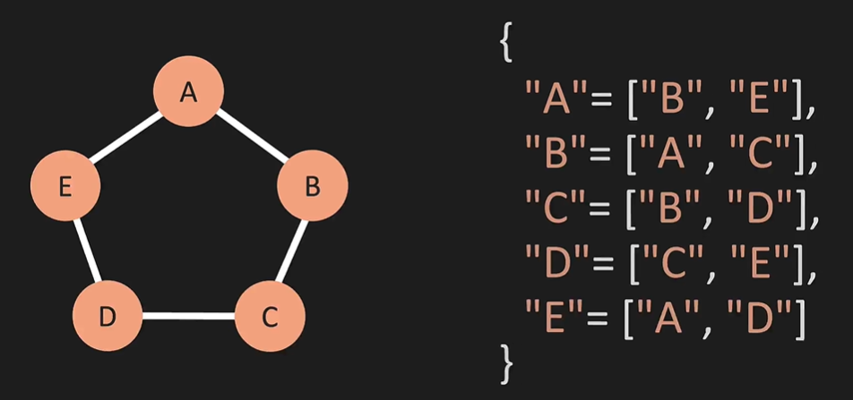

# Big O

* Space complexity

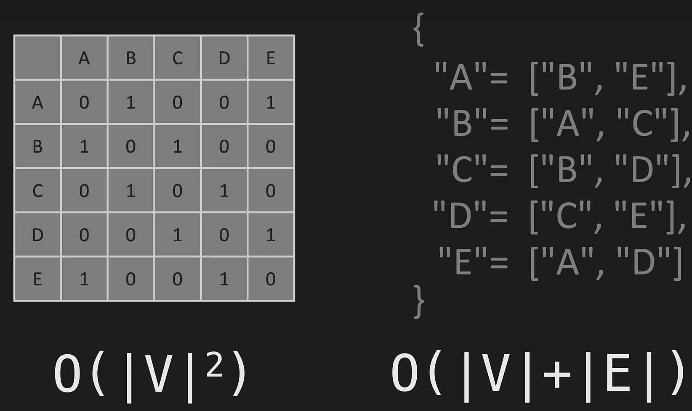

1. When adding new vertex 

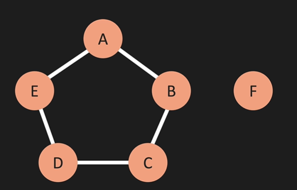
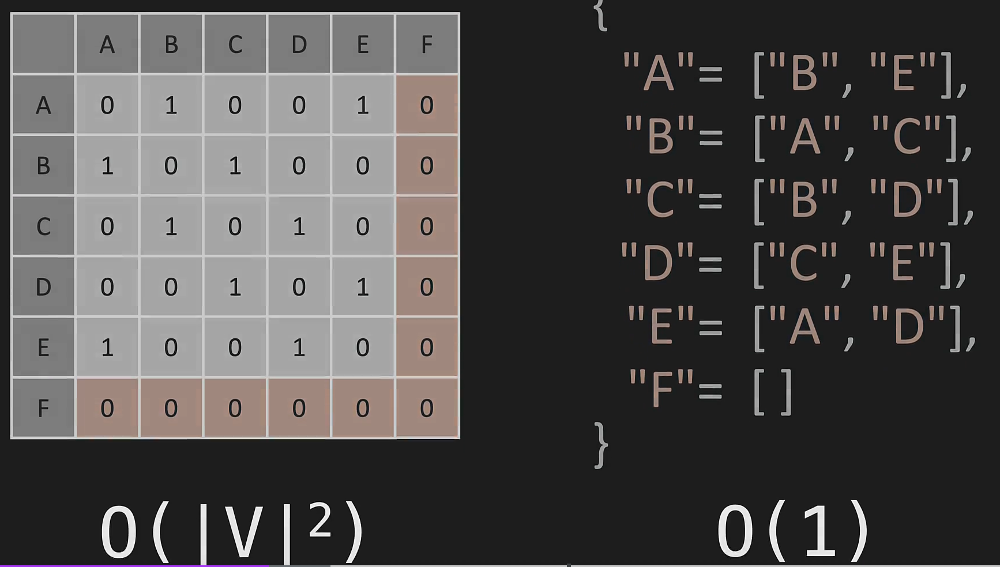

2. Adding edge b/w vertex

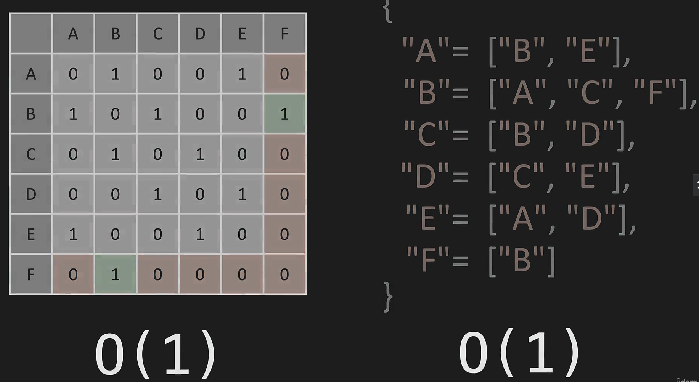

3. Removing Edge b/w vertex

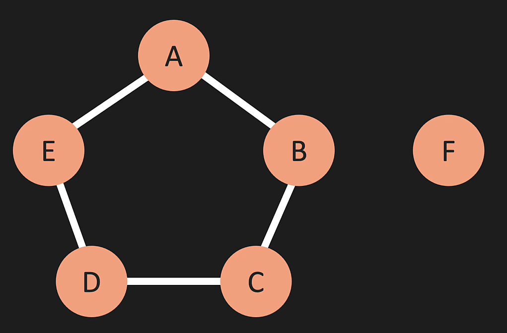
Adjacency List we need to find b O(1) and iterate through each edge in b and same with f(vertex)
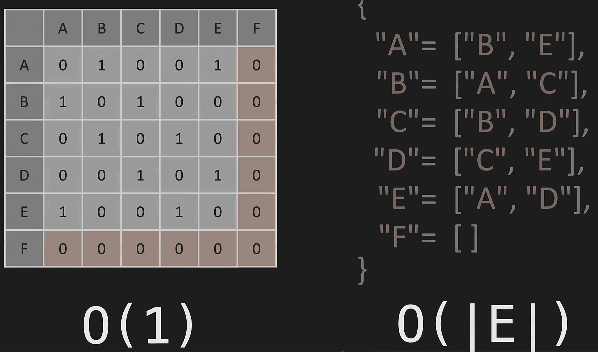

4. Remove a vertex 

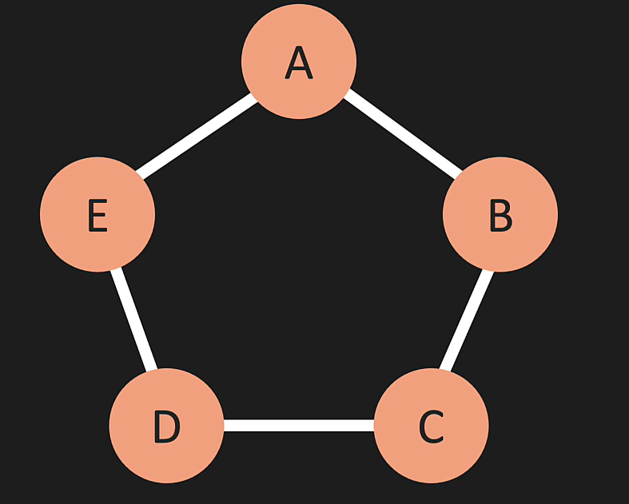
* In Adjacency List we need to check ever vertex edge list and remove edge before (we need to touch every vertex and edge)
* In Adjacency matrix we need to remove (F) and rewrite the array

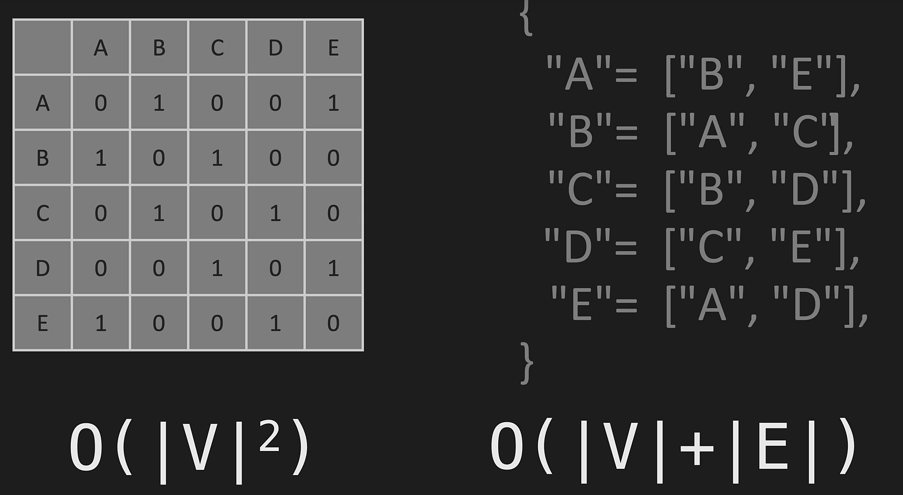

1. [ ] Notes : In Adjacency matrix we need to maintain zero(0) so if we have billion record (Ex: users graph: IF each user's have 1000 friend we would have millions zero for each user's)

