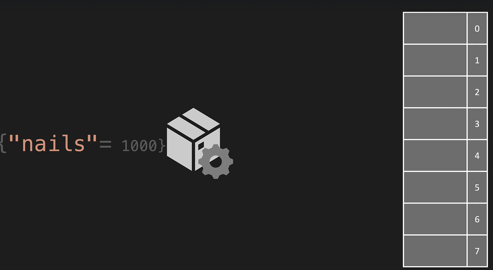
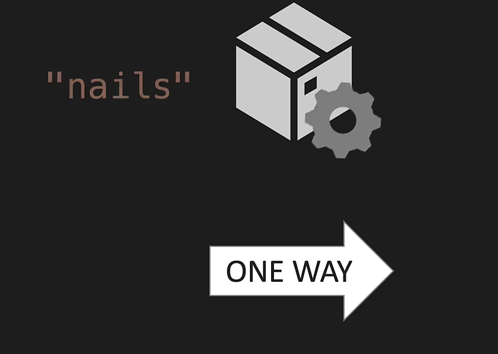
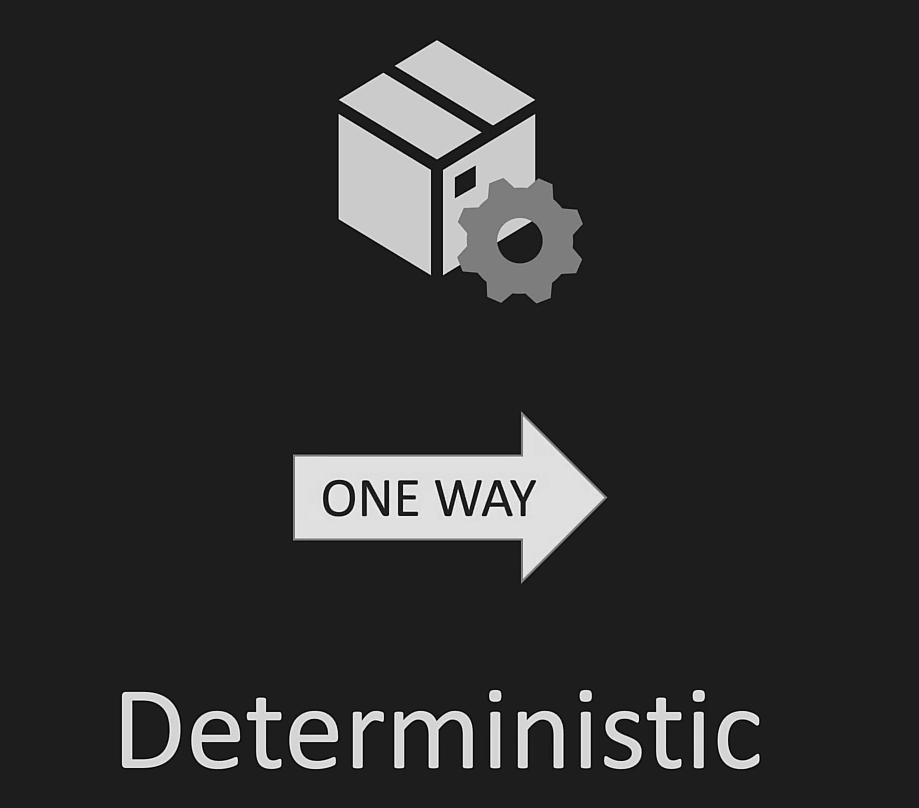
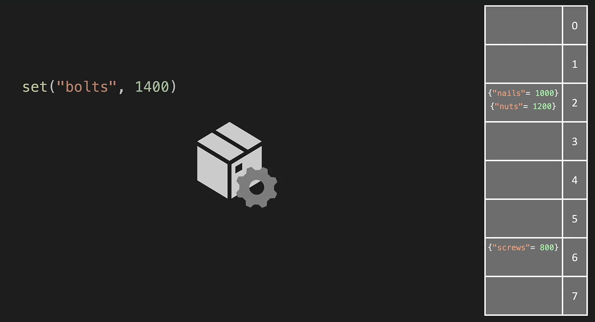
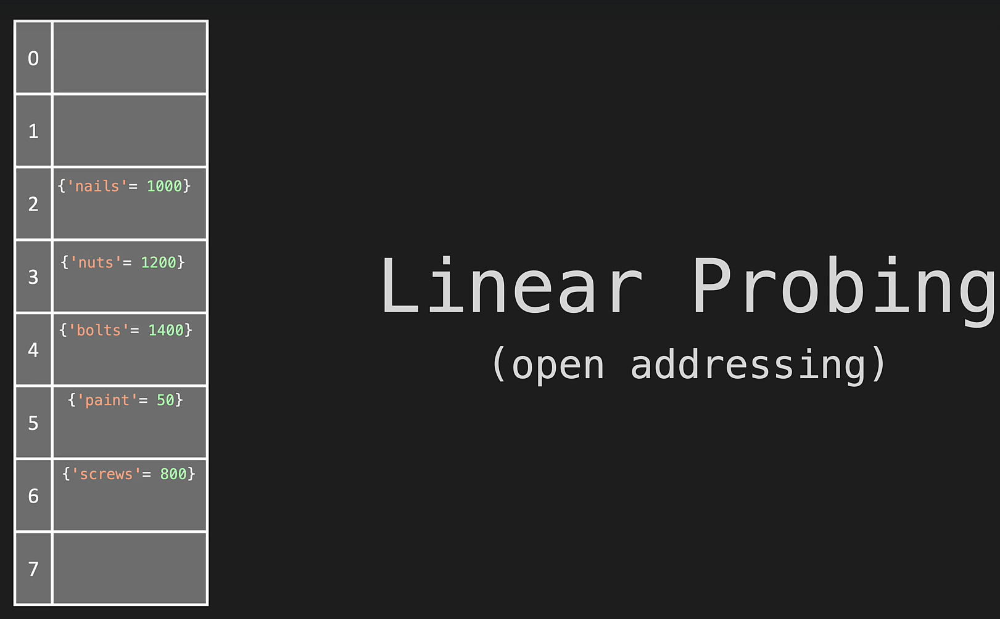
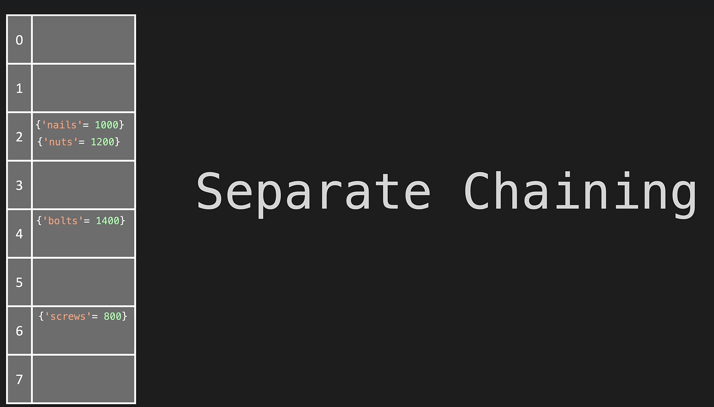
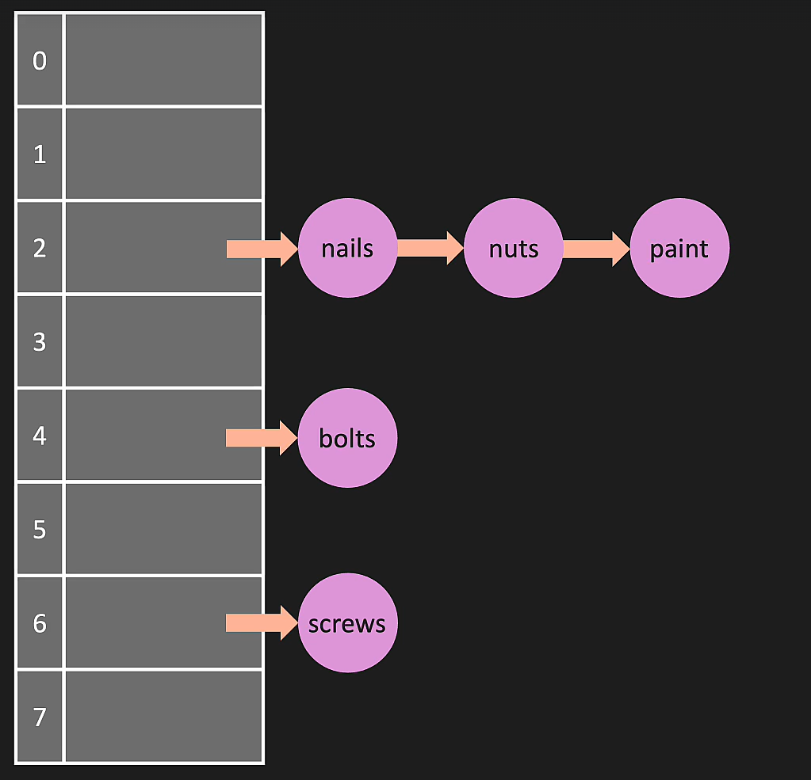
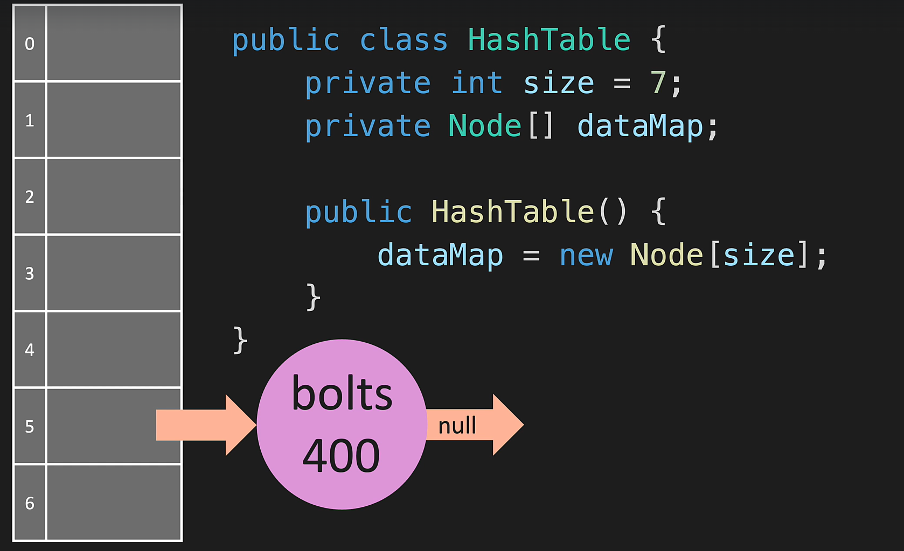
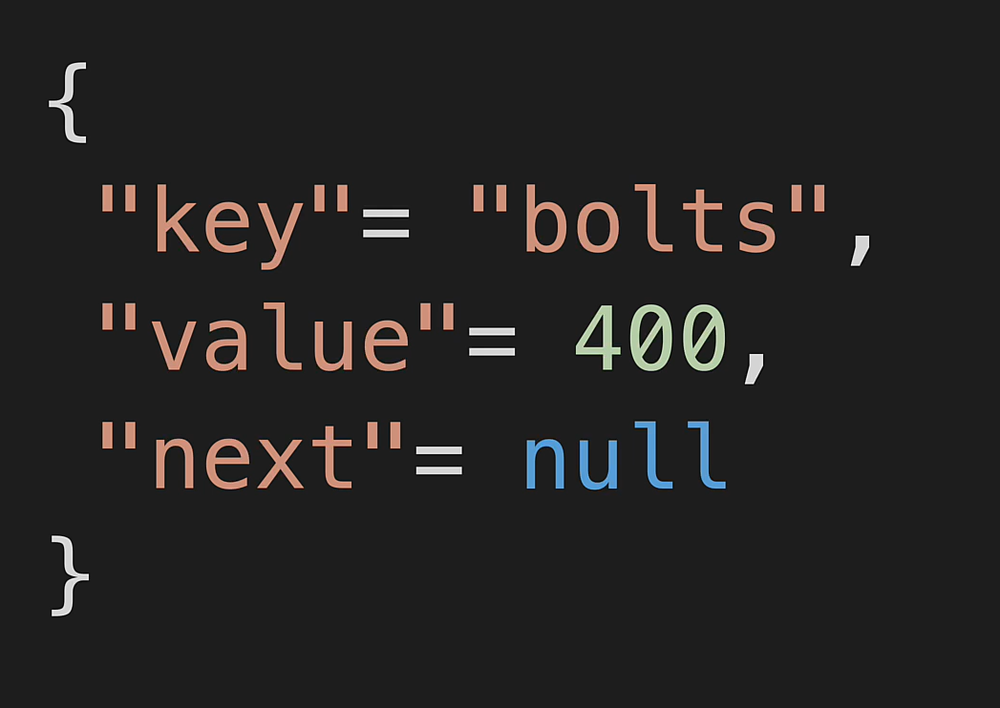

# **Hast Table**

Hashing is a technique that is used to uniquely identify a specific object from a group of similar objects.

We allocate a space and hash gives a index based on key where to save it

* One Way : Key can be use to create a index but index cannot be used to get jey

* Deterministic : Hence, when we pass the same input to the hash function, it always generates the same output hash code

## collision

Hash collision or hash clash is when two distinct pieces of data in a hash table share the same hash value
Since a hash function gets us a small number for a key which is a big integer or string, there is a possibility that two keys result in the same value. The situation where a newly inserted key maps to an already occupied slot in the hash table is called collision and must be handled using some collision handling technique.

Hash collision solutions :

1. Linear Probing : Linear probing is a strategy for resolving collisions, by placing the new key into the closest following empty cell

2. Separate Chaining : The idea behind separate chaining is to implement the array as a linked list called a chain.

* Using linked list space 

Object representation of hash map Node

