# Heaps

A Heap is a complete binary tree data structure that satisfies the heap property: for every node, the value of its
children is less than or equal to its own value. Heaps are usually used to implement priority queues, where the
smallest (or largest) element is always at the root of the tree.

* A heap will always be complete tree (without gaps)
* The tree is always balanced

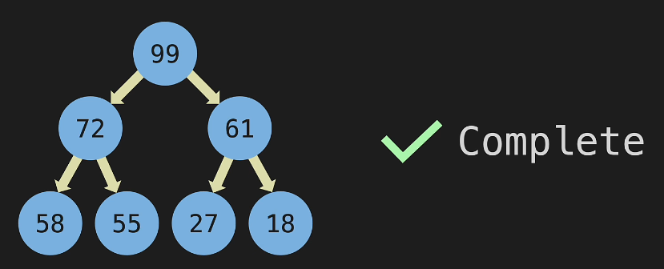

* In heaps we can have duplicate

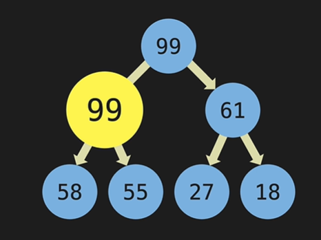

#   * Types

1. max heap

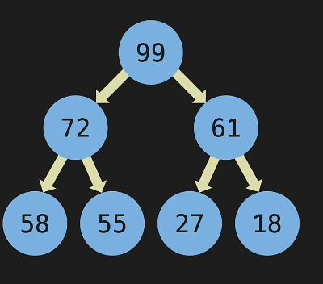

2. Min heap

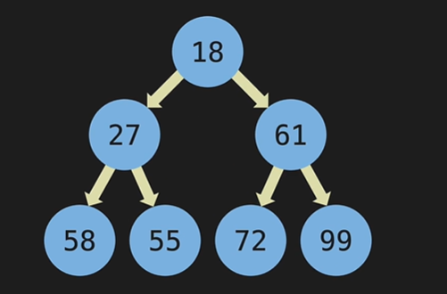

# Heap representation

1.[ ] Note : To implement this we will use Array

Common method used while implementing

1. without leaving Zero index
2. With leaving Zero index

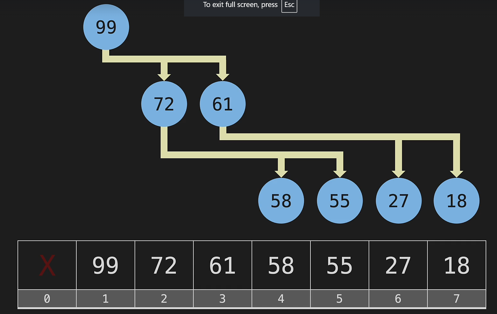

* Finding children logic
  int leftIndex=2*parentIndex
  int RightIndex=2*parentIndex*1

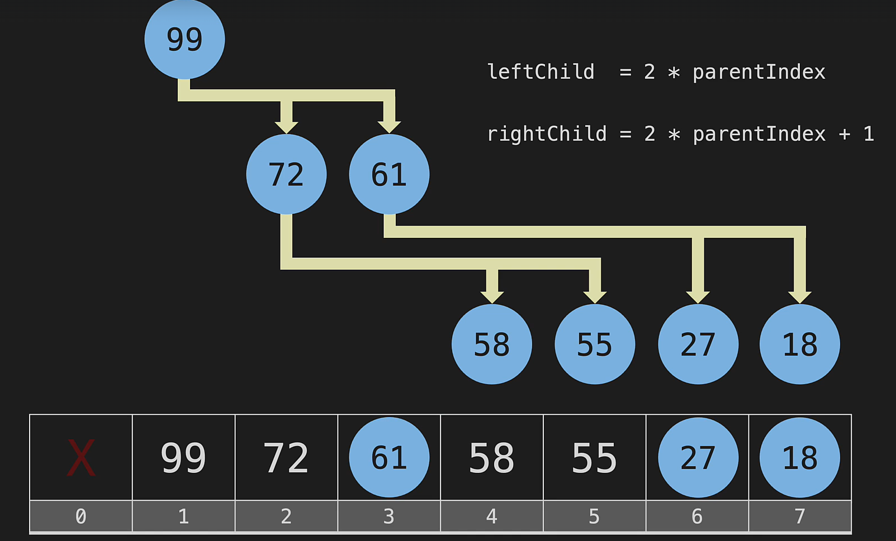

* Finding parent from child
  int index= childIndex/2
  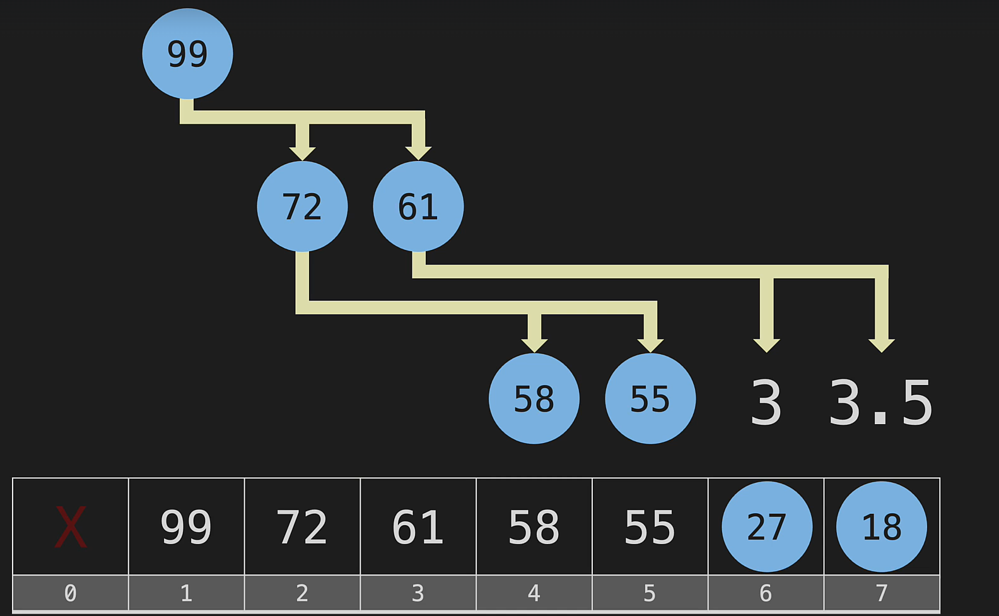

* Inserting into a heap
  First add it in the last and start swapping with the parent if greater
  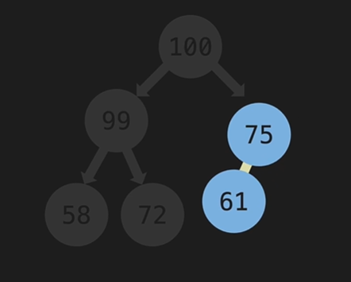

Will checks and swaps 100 and 99
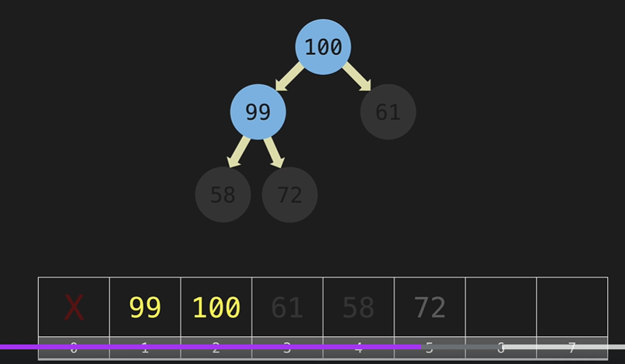

[ ] Notes :

1. Remove item in heap

* While removing from the heap we only remove 1 element in the heap even if it's duplicate

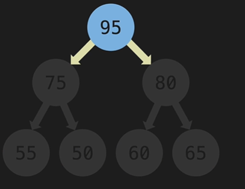
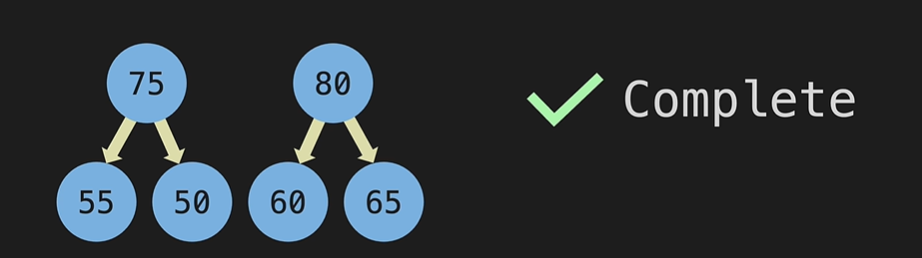

* Bring last element in the index to root node

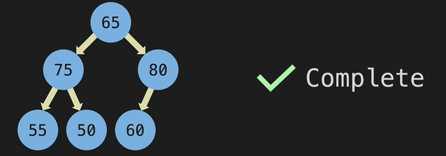

* start swapping the root node with child node if the parent node is greater

  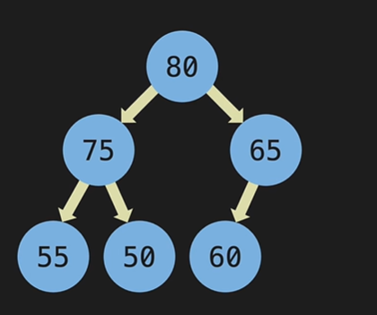
  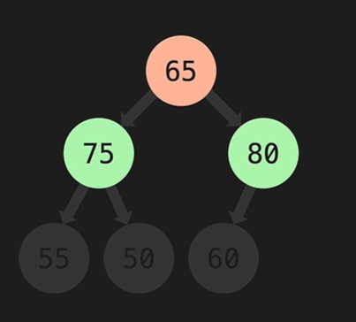

##### Priority Queue  :

heap is the most efficient DS for priority queue

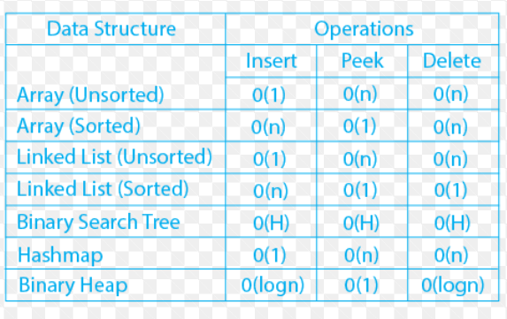

Ref link : https://www.geeksforgeeks.org/priority-queue-using-binary-heap/

