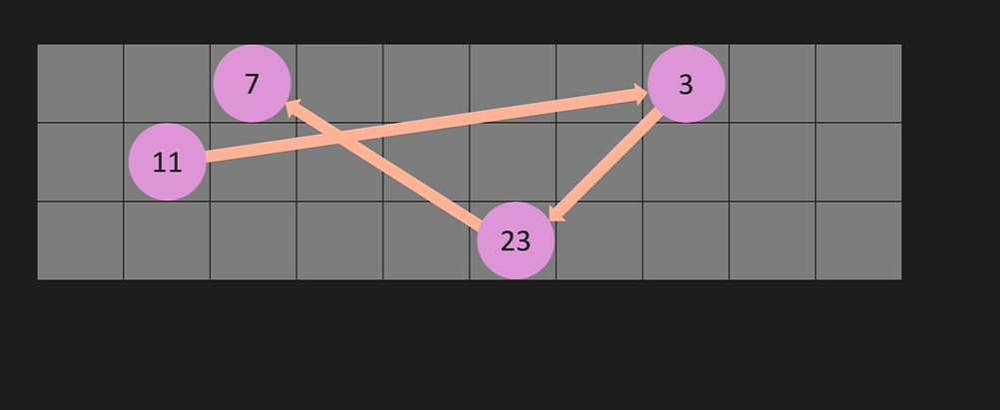
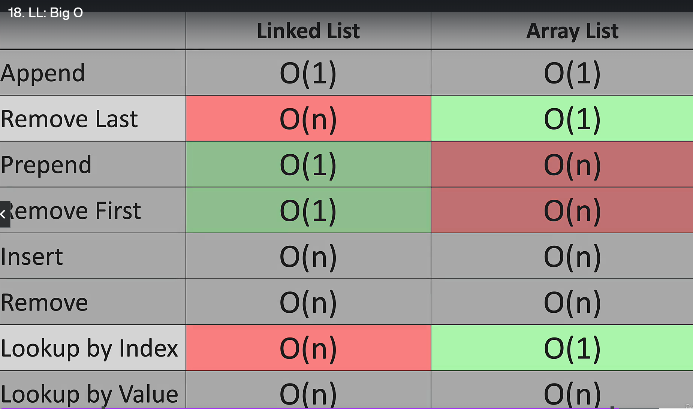
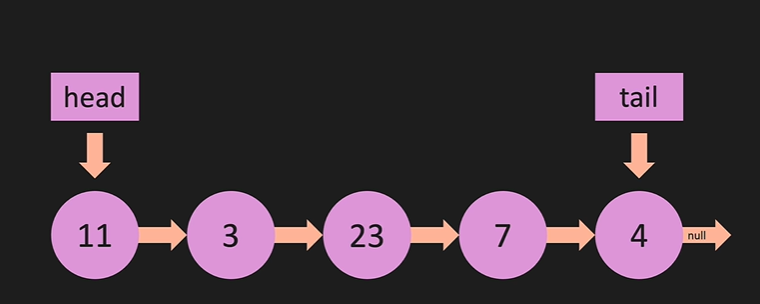
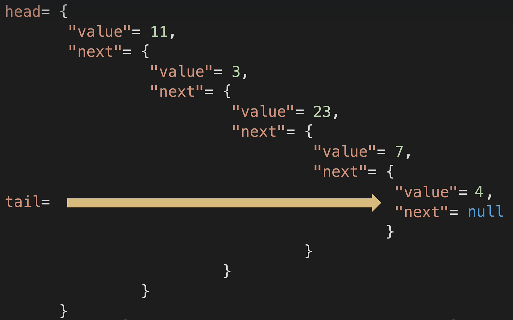

# LinkedList
1. Nodes
2. pointers
3. head
4. tail
5. reference

* Linked List access time complexity

* Object Representation

1. [ ] Algorithm
   1. Floyd's cycle-finding algorithm:- detects cycles in a sequence by using two pointers moving at different speed
    