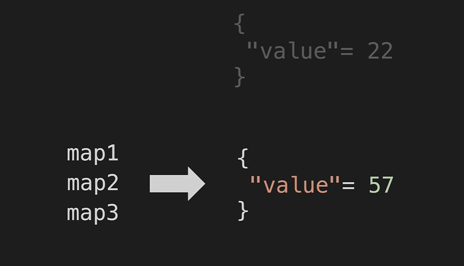

java uses garbage collection to manage memory.
* "value"=2 will be cleared by garbage collection. since no map is use it
* When there is not reference to the object it will be deleted by garbage collector
* Garbage collection reference : 
https://newrelic.com/blog/best-practices/java-garbage-collection