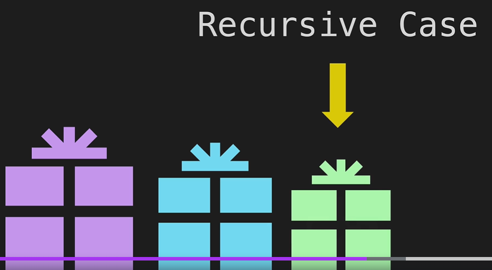
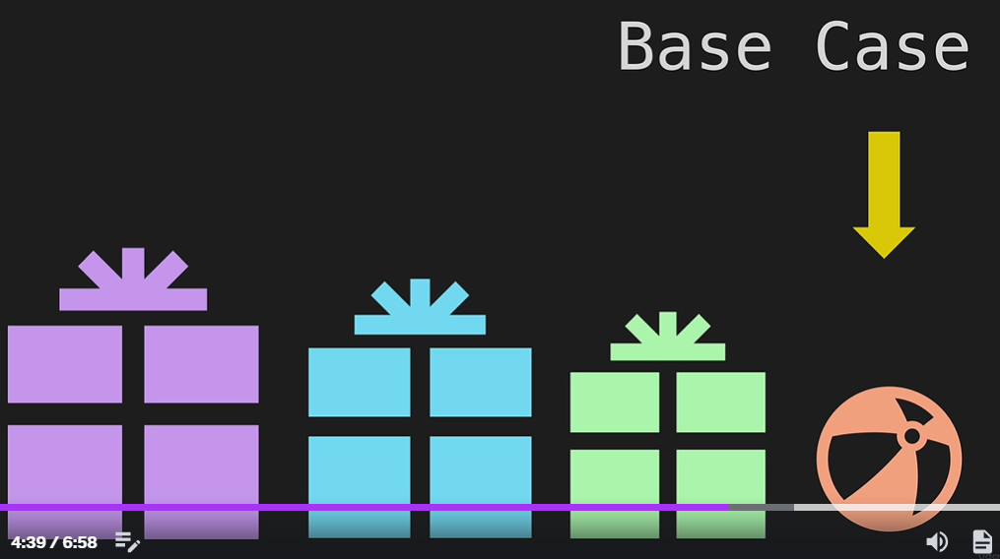
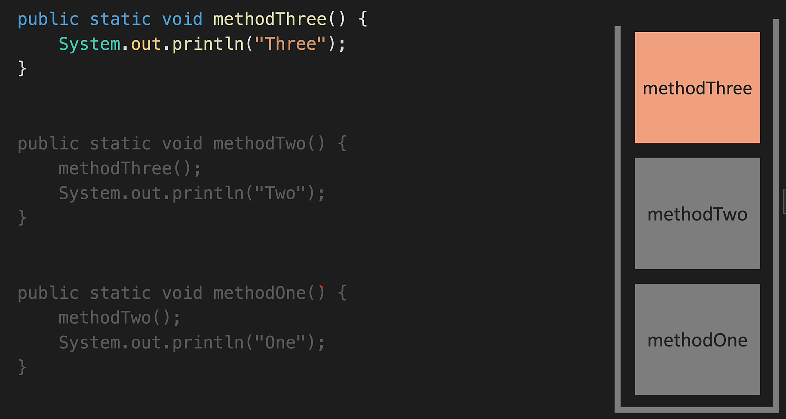
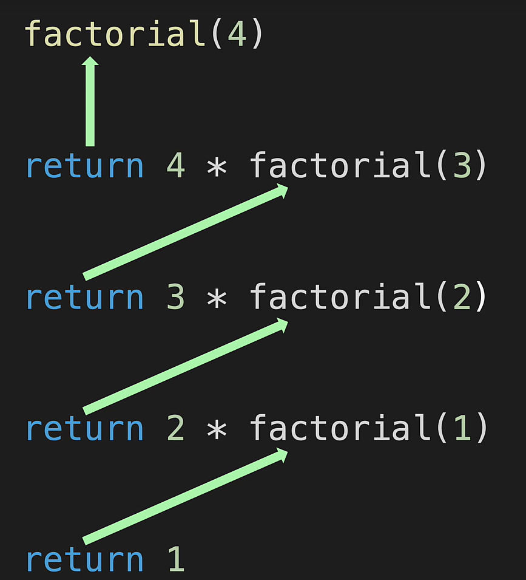
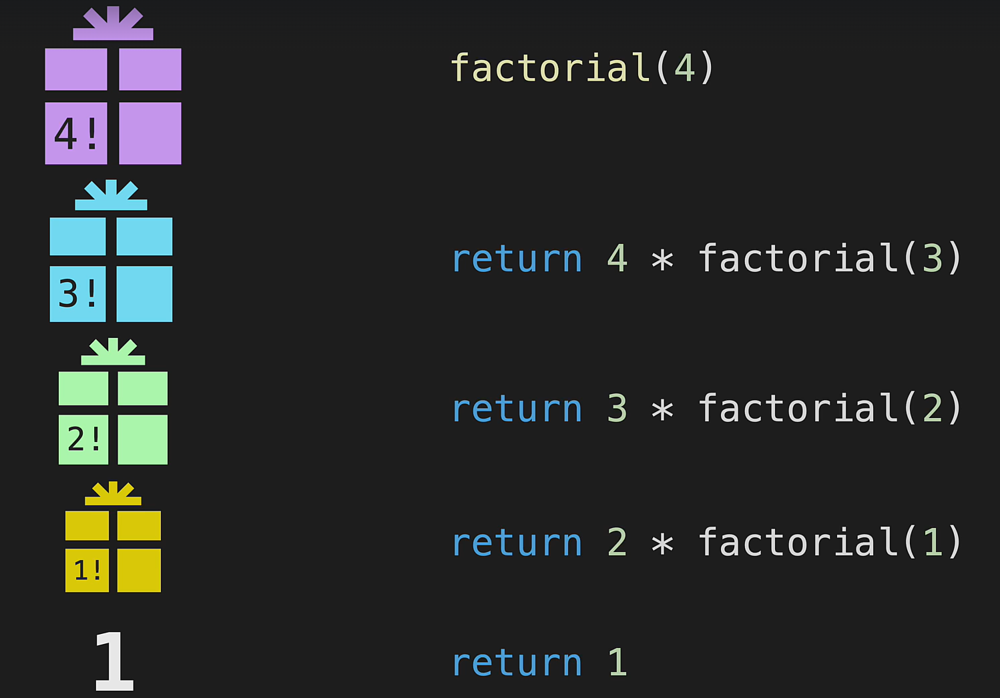
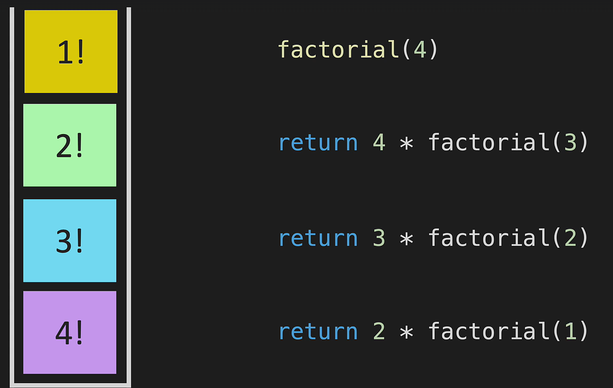

# Recursion

Recursion is a programming concept where a function calls itself in its own definition. It's a powerful technique that allows solving complex problems by breaking them into simpler, similar sub-problems.

* Recursive case

* Base Case 

1. [ ] Without base case the recursion will go on forever and will cause stack overflow error.
2. [ ] Recursion is a powerful tool, but it's not always the best solution. It can be less efficient than an iterative solution because it uses more memory and time on the call stack. It's also harder to debug and understand. Use recursion when it makes the code cleaner and easier to understand, or when it's the most natural way to solve the problem.

## Call stack
The call stack is what a program uses to keep track of method calls. The call stack is made up of stack frames—one for each method call.

Ref link : https://dev.to/theplebdev/java-quickies-the-call-stack-3g4g

### Factorial Example 

