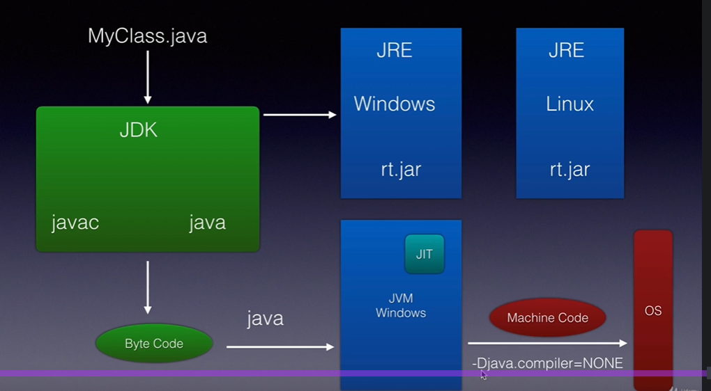
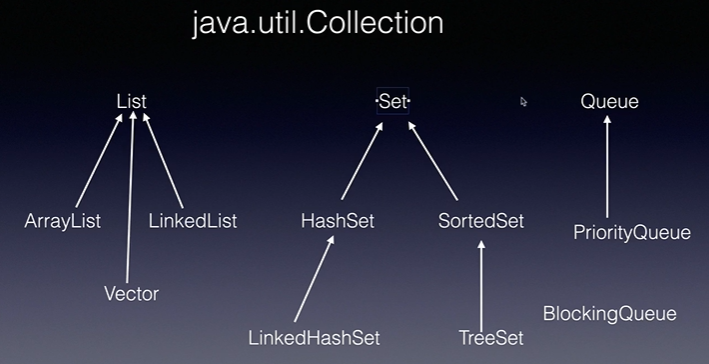
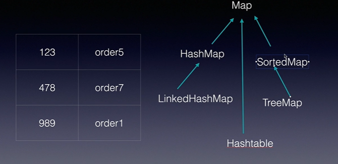
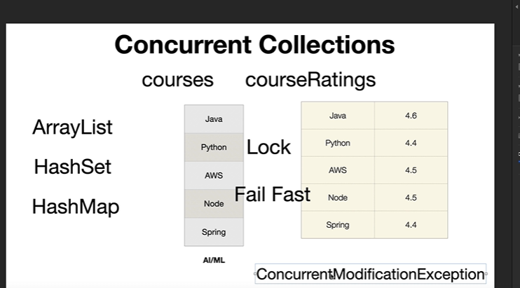
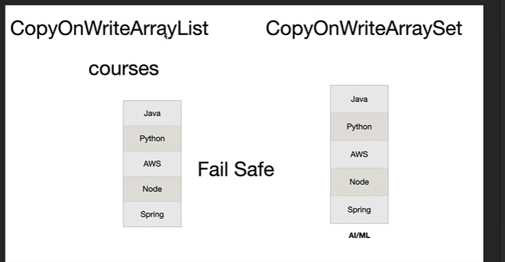

# Just-In-Time (JIT) Compiler in Java



## Definition

The **Just-In-Time (JIT) Compiler** is a component of the **Java Virtual Machine (JVM)** that improves application performance by converting **frequently executed bytecode into native machine code at runtime**.

Instead of interpreting the same bytecode repeatedly, JIT compiles it once and executes the compiled machine code directly.

---

# Why Do We Need JIT?

Java is a **platform-independent** language.

When Java code is compiled, it is converted into **bytecode**, not machine code.

```
Java Source Code (.java)
        │
        ▼
      javac
        │
        ▼
Bytecode (.class)
```

The JVM cannot execute bytecode directly on the CPU.

Initially, the **Interpreter** executes the bytecode line by line.

Repeated interpretation is slower.

JIT improves performance by compiling frequently executed bytecode into native machine code.

---

# How JIT Works

## Step 1

Write Java code

```java
public class Main {
    public static void main(String[] args) {
        for(int i = 0; i < 1000000; i++) {
            add(10,20);
        }
    }
    static int add(int a, int b){
        return a + b;
    }
}
```

---
## Step 2

Compile

```
javac Main.java
```

Produces

```
Main.class
```
(Bytecode)
---

## Step 3

JVM Starts

Initially, the Interpreter executes the bytecode.

```
Bytecode
    │
    ▼
Interpreter
```

---

## Step 4

Method Becomes Hot

The JVM notices that

```
add()
```

is executed thousands or millions of times.

This is called a **Hot Method**.

---

## Step 5

JIT Compiles It

```
Bytecode
     │
     ▼
JIT Compiler
     │
     ▼
Native Machine Code
```

Now the JVM executes the compiled machine code directly.

This is much faster.

---

# Execution Flow

```
Java Source (.java)
        │
        ▼
     javac Compiler
        │
        ▼
Bytecode (.class)
        │
        ▼
JVM
        │
        ├────────► Interpreter
        │
        ▼
Is Method Frequently Used?
        │
      Yes
        │
        ▼
JIT Compiler
        │
        ▼
Native Machine Code
        │
        ▼
CPU Execution
```

---

# Example

```java
for(int i = 0; i < 1000000; i++){
    add(10,20);
}
```

Initially

```
Interpreter
```

After repeated execution

```
JIT Compiler
```

Future executions use

```
Machine Code
```

instead of interpreting bytecode every time.

---

# Hot Methods

A **Hot Method** is a method that is executed frequently.

Example

```java
calculateSalary();
```

If it is called millions of times,

JIT compiles it into machine code.

---

# Advantages

- Improves runtime performance
- Faster execution
- Compiles only frequently executed methods
- Performs runtime optimizations
- Reduces repeated interpretation

---

# Disadvantages

- Slight startup delay
- Uses additional memory
- Compilation consumes CPU resources

---

# Types of JIT Compiler

## C1 Compiler (Client Compiler)

- Faster compilation
- Less optimization
- Better startup performance

---

## C2 Compiler (Server Compiler)

- More aggressive optimization
- Better for long-running applications
- Higher runtime performance

---

## Tiered Compilation

Modern JVMs use both.

```
Interpreter
      │
      ▼
C1 Compiler
      │
      ▼
C2 Compiler
```

This provides:

- Fast startup
- High throughput

---

# JIT vs Interpreter

| Interpreter | JIT Compiler |
|-------------|--------------|
| Executes bytecode line by line | Converts bytecode to machine code |
| Slower | Faster |
| No optimization | Performs runtime optimization |
| Executes every call | Compiles hot methods once |

---

# JIT vs AOT (Ahead-of-Time)

| JIT | AOT |
|-----|-----|
| Compiles during runtime | Compiles before execution |
| Better runtime optimization | Faster startup |
| Used by JVM | Used by GraalVM Native Image |

---

# Interview Questions

## What is JIT?

The Just-In-Time (JIT) Compiler is a JVM component that converts frequently executed bytecode into native machine code during runtime to improve application performance.

---

## Why is JIT faster than an Interpreter?

The interpreter executes bytecode line by line every time a method is called.

JIT compiles frequently used methods into machine code once, allowing the CPU to execute them directly.

---

## What is a Hot Method?

A Hot Method is a method that is executed frequently. The JVM identifies these methods and compiles them into machine code using the JIT Compiler.

---

# Implementation Considerations

- JIT compilation happens automatically inside the JVM.
- Only frequently executed (hot) methods are compiled.
- Compilation occurs during runtime.
- Developers do not manually invoke the JIT Compiler.

---

# Design Considerations

- Provides a balance between platform independence and performance.
- Uses adaptive optimization based on application behavior.
- Optimizes long-running applications more effectively than short-lived programs.

---

# Pitfalls

- Small programs may not benefit much from JIT because they finish before optimization occurs.
- Initial execution can be slower due to interpretation and compilation overhead.
- Uses extra memory to store compiled native code.
- Excessive dynamic class loading can reduce JIT optimization opportunities.

---

# Key Points

- JIT stands for **Just-In-Time Compiler**.
- It is part of the **JVM**.
- Converts **bytecode** into **native machine code**.
- Compiles only **hot methods**.
- Works together with the **Interpreter**.
- Improves runtime performance significantly.

---

# One-Line Interview Answer

> **The JIT Compiler is a JVM component that improves Java application performance by compiling frequently executed bytecode into native machine code during runtime, eliminating repeated interpretation.**


# Abstract Class vs Interface (5–6 Line Notes)
### Abstract Class
- Use an **abstract class** when multiple related classes share **common state and behavior**.
- It can have **instance variables, constructors, abstract methods, and concrete methods**.
- Promotes **code reuse** by providing a common base implementation.
- Supports **single inheritance** (`extends`).
- **Example:** `Vehicle → Car, Bike, Bus`.
---

### Interface
- Use an **interface** to define a **contract** that different classes must follow.
- It specifies **what a class can do**, not how it does it.
- Supports **multiple inheritance** (`implements` multiple interfaces).
- Best for unrelated classes that share common behavior.
- **Example:** `Payment → UPI, Credit Card, PayPal`.
---


### Interview Rule

- **Abstract Class** → Common code + shared state (**IS-A** relationship).
- **Interface** → Common behavior/contract (**CAN-DO** relationship).


# Java Constructor Notes
## What is a Constructor?
A **constructor** is a special method used to **initialize an object** when it is created.
When you create an object using the `new` keyword, the constructor is called automatically.

**default constructor** is a constructor automatically provided by the Java compiler only
if you do not write any constructor** in the class with accessibility as class
It is a **no-argument constructor** that initializes fields with their **default values
### Example

```java
class Student {
    String name;
    int age;
    // Constructor
    Student(String name, int age) {
        this.name = name;
        this.age = age;
    }
}
public class Main {
    public static void main(String[] args) {
        Student s = new Student("Manoj", 25);
    }
}
```

# Object Class Methods (Java)
Every Java class **implicitly extends the `Object` class**, so every object has these methods by default.

---

# 1. clone()
### What is it?
Creates a **copy (duplicate)** of an object.
### Think of it like
Photocopying a document Original ➜ Copy
### Example
```java
Student s1 = new Student("Manoj");

Student s2 = (Student) s1.clone();
```
### Important Points
- Creates a new object with the same values.
- By default, `Object.clone()` performs a **shallow copy**.
- The class must implement the `Cloneable` interface.
- Throws `CloneNotSupportedException` if not supported.

### Interview Point

> `clone()` creates a copy of an existing object.

---

# 2. hashCode()

### What is it?
Returns an **integer hash value** that represents the object.
### Think of it like
An employee ID.
Every employee has an ID.
Similarly, every object has a hash code.

### Example
```java
Student s = new Student();

System.out.println(s.hashCode());
```
Output
```
468121027
```
### Why is it used?
Used internally by collections like
- HashMap
- HashSet
- Hashtable
to quickly locate objects.

### Interview Point
> Equal objects should have the same hashCode.
---

# 3. toString()
### What is it?
Returns the **String representation** of an object.
### Default Behavior
```java
Student s = new Student();

System.out.println(s);
```
Output
```
Student@5e91993f
```
This means
```
ClassName@HashCode
```
### Override Example
```java
@Override
public String toString() {
    return "Student{name='Manoj'}";
}
```
Output
```
Student{name='Manoj'}
```
### Why Override?
To print meaningful information instead of memory details.
### Interview Point
> `toString()` is commonly overridden for logging and debugging.
---

# 4. finalize() (Deprecated)
### What is it?
Called by the Garbage Collector **before destroying an object**.

### Think of it like
Cleaning your desk before leaving the office.

### Example
```java
@Override
protected void finalize() {
    System.out.println("Object is being destroyed");
}
```
### Important Points
- Deprecated since Java 9.
- Never rely on it.
- Use `try-with-resources` or `AutoCloseable` instead.
### Interview Point
> `finalize()` is deprecated and should not be used.
---

# 5. wait()
### What is it?
Makes the **current thread pause** until another thread wakes it up.
### Think of it like
Waiting in a queue until your token number is called.
### Example
```java
synchronized(obj) {
    obj.wait();
}
```
### Important Points
- Releases the object's lock.
- Must be called inside a synchronized block.
- Thread remains waiting until `notify()` or `notifyAll()` is called.
### Interview Point
> `wait()` pauses a thread and releases the monitor lock.
---

# 6. notify()
### What is it?
Wakes **one waiting thread**.
### Think of it like
Teacher calls one student from the waiting room.
### Example
```java
synchronized(obj) {
    obj.notify();
}
```
### Important Points
- Wakes only one thread.
- Doesn't release the lock immediately.
- Thread runs only after the current synchronized block finishes.
### Interview Point
> `notify()` wakes one waiting thread.
---

# 7. notifyAll()
### What is it?
Wakes **all waiting threads**.
### Think of it like
Teacher opens the classroom door and everyone enters.
### Example
```java
synchronized(obj) {
    obj.notifyAll();
}
```

### Important Points

- Wakes every waiting thread.
- Only one thread acquires the lock at a time.
- Others wait until the lock becomes available.

### Interview Point

> `notifyAll()` wakes all waiting threads.

---

# Quick Revision

| Method | Purpose | Simple Analogy |
|---------|---------|----------------|
| `clone()` | Creates a copy of an object | Photocopy |
| `hashCode()` | Returns object's hash value | Employee ID |
| `toString()` | Returns object as a String | Identity card |
| `finalize()` | Called before object destruction *(Deprecated)* | Clean desk before leaving |
| `wait()` | Makes current thread wait | Waiting in a queue |
| `notify()` | Wakes one waiting thread | Call one person |
| `notifyAll()` | Wakes all waiting threads | Call everyone |

---

# One-Line Interview Answers

- **clone()** → Creates a copy of an object.
- **hashCode()** → Returns an integer hash value used by hash-based collections.
- **toString()** → Returns the string representation of an object.
- **finalize()** → Called before garbage collection (deprecated).
- **wait()** → Makes the current thread wait until notified.
- **notify()** → Wakes one waiting thread.
- **notifyAll()** → Wakes all waiting threads.

# String Immutability (Java)

## Definition

A **String is immutable**, meaning **once a String object is created, its value cannot be changed**. Any modification creates a **new String object**.

---

## 2. String Constant Pool (SCP)

Java stores string literals in the **String Constant Pool** to save memory.

```java
String s1 = "Java";
String s2 = "Java";
```
Memory
```text
String Pool

        "Java"
        ▲    ▲
        │    │
       s1   s2
```

Both variables share the same object.
## Example

```java
String s = "Hello";

s.concat(" World");

System.out.println(s);
```

**Output**

```
Hello
```

Reason: `concat()` creates a new object; it doesn't modify the original.

Correct way:

```java
String s = "Hello";

s = s.concat(" World");

System.out.println(s);
```
**Output**

```
Hello World
```

---

## Why is String Immutable?

- **Security** → Prevents modification of sensitive data (passwords, URLs, file paths).
- **String Constant Pool (SCP)** → Multiple references can safely share the same String object.
- **Thread Safety** → Safe to share across multiple threads.
- **HashMap Performance** → Hash code never changes, making lookups reliable.
- **Caching** → `hashCode()` is computed once and reused.
---

# String vs StringBuilder vs StringBuffer (2–3 Line Notes)

### String
- **Immutable** – once created, its value cannot be changed.
- Every modification creates a **new String object**.
- Best for constant or read-only text.

### StringBuilder
- **Mutable** – modifies the same object without creating new ones.
- **Not thread-safe**, but **fastest** for string manipulation.
- Best for single-threaded applications.

### StringBuffer
- **Mutable** and **thread-safe** because its methods are synchronized.
- Slightly slower than `StringBuilder`.
- Best for multi-threaded applications.
---

## String vs StringBuilder vs StringBuffer

| Feature     | String | StringBuilder | StringBuffer |
|-------------|---------|---------------|--------------|
| Mutable     | ❌ No | ✅ Yes | ✅ Yes |
| Thread Safe | ✅ Yes | ❌ No | ✅ Yes |
| Performance | Slow for modifications | Fastest | Slower than StringBuilder |

---

## Interview Points

- String objects are **immutable**.
- Every modification creates a **new object**.
- Original String is never modified.
- Use **StringBuilder** for frequent modifications in a single thread.
- Use **StringBuffer** for frequent modifications in a multi-threaded environment.
---

## Quick Revision

```text
String
✔ Immutable
✔ New object on modification

Reasons:
• Security
• String Pool
• Thread Safety
• HashMap
• Cached hashCode()

Mutable Alternatives:
• StringBuilder
• StringBuffer
```

# `==` vs `equals()` in Java (Objects & Primitives)

## `==` Operator
`==` compares:
- **Primitive types** → Compares the **actual values**.
- **Objects** → Compares the **references (memory addresses)**.
### Primitive Example

```java
int a = 10;
int b = 10;
System.out.println(a == b); // true
```
### Object Example
```java
class Student {
}

Student s1 = new Student();
Student s2 = new Student();

System.out.println(s1 == s2);
```
**Output**
```
false
```
Reason: `s1` and `s2` are different objects in memory.
---

## `equals()` Method

- Defined in the **Object** class.
- Used to compare **object contents (logical equality)**.
- By default, `Object.equals()` behaves the same as `==` (compares references).
- Classes like `String`, `Integer`, `List`, etc., **override** `equals()` to compare values.
---

## Example 1: Class NOT Overriding `equals()`
```java
class Student {
    String name;
    Student(String name) {
        this.name = name;
    }
}

Student s1 = new Student("Manoj");
Student s2 = new Student("Manoj");
System.out.println(s1 == s2);       // false
System.out.println(s1.equals(s2));  // false
```

**Reason:** `Student` uses the default `Object.equals()`, which compares references.
---

## Example 2: Class Overriding `equals()`
```java
import java.util.Objects;
class Student {
    String name;
    Student(String name) {
        this.name = name;
    }

    @Override
    public boolean equals(Object obj) {
        if (this == obj)
            return true;
        if (!(obj instanceof Student))
            return false;
        Student other = (Student) obj;
        return Objects.equals(this.name, other.name);
    }
}
```

```java
Student s1 = new Student("Manoj");
Student s2 = new Student("Manoj");

System.out.println(s1 == s2);       // false
System.out.println(s1.equals(s2));  // true
```
Now `equals()` compares the object's data (`name`) instead of the references.
---

## How `String` Works

`String` has already overridden `equals()`.

```java
String s1 = new String("Java");
String s2 = new String("Java");

System.out.println(s1 == s2);       // false
System.out.println(s1.equals(s2));  // true
```
---

# Comparison Table

| Feature           | `==`                 | `equals()`                        |
|-------------------|----------------------|-----------------------------------|
| Primitive Types   | Compares values      | ❌ Not applicable                  |
| Objects           | Compares references  | Compares contents (if overridden) |
| Defined In        | Operator             | `Object` class                    |
| Can be Overridden | ❌ No                 | ✅ Yes                             |

---

# Interview Points

- `==` compares **values for primitives** and **references for objects**.
- `equals()` is a method from the **Object** class.
- By default, `equals()` compares **references**.
- Classes like **String**, **Integer**, **List**, etc., override `equals()` to compare **values**.
- For your own classes, **override `equals()` (and `hashCode()`)** if you want logical equality.

---

# Quick Revision

```text
==

Primitive  → Value Comparison
Object     → Reference Comparison
equals()
Default (Object)      → Reference Comparison
Overridden (String, Integer, List, Custom Class)
                      → Value Comparison
Memory Trick
==       → Same Object?
equals() → Same Data?
```


# final vs finally vs finalize()

## `final` (Keyword)
Used to **restrict modification**.
- **final variable** → Value cannot be reassigned.
- **final method** → Cannot be overridden.
- **final class** → Cannot be inherited.
```java
final int x = 10;
final class A { }
class Parent {
    final void show() {}
}
```
---
## `finally` (Block)
Used with **try-catch**.
- Executes **whether an exception occurs or not**.
- Mainly used for **resource cleanup** (closing files, DB connections, etc.).
```java
try {
    // code
} finally {
    System.out.println("Cleanup");
}
```
---

## `finalize()` (Method)
A method of the **Object** class.
- Called by the **Garbage Collector** before destroying an object.
- **Deprecated** since Java 9. Avoid using it.
```java
@Override
protected void finalize() {
    System.out.println("Object destroyed");
}
```
---

## Comparison

| Feature   | `final`                 | `finally`  | `finalize()`                             |
|-----------|-------------------------|------------|------------------------------------------|
| Type      | Keyword                 | Block      | Method                                   |
| Purpose   | Restrict modification   | Cleanup    | Before Garbage Collection *(Deprecated)* |
| Used With | Variable, Method, Class | try-catch  | Object class                             |

---

### Quick Revision

```text
final      → Restrict
finally    → Cleanup
finalize() → Garbage Collection (Deprecated)
```


# Generics & Type Erasure (Java)

## Generics
**Generics** allow you to write **type-safe and reusable code** by specifying the data type at compile time.
Without Generics:
```java
List list = new ArrayList();

list.add("Java");
list.add(10);   // Allowed
```

With Generics:

```java
List<String> list = new ArrayList<>();
list.add("Java");
// list.add(10); ❌ Compile-time Error
```

### Advantages
- Type safety
- No explicit casting
- Code reusability
- Compile-time error checking
---

## Type Erasure

**Type Erasure** is the process where the Java compiler **removes generic type information during compilation**.
Generics exist **only at compile time**.

### Example
```java
List<String> list = new ArrayList<>();
```
After compilation (conceptually):

```java
List list = new ArrayList();
```
The JVM doesn't know it was `List<String>`.
---
## Why Type Erasure?
- Backward compatibility with older Java versions (before Java 5).
- Allows generic and non-generic code to work together.
---

## Limitations Due to Type Erasure
❌ Cannot create generic objects directly
```java
T obj = new T(); // Error
```

❌ Cannot use `instanceof` with generic type
```java
if (list instanceof List<String>) // Error
```

✅ Allowed
```java
if (list instanceof List)
```

❌ Cannot create generic arrays
```java
new T[10]; // Error
```
---

## Interview Questions

### What are Generics?
A feature that provides **type safety** and **code reusability** by specifying the data type at compile time.

### What is Type Erasure?
The compiler removes generic type information during compilation, so generics are **not available at runtime**.
--

## Quick Revision

```text
Generics
✔ Type-safe
✔ Reusable code
✔ Compile-time checking
✔ No explicit casting

Type Erasure
✔ Removes generic type at compile time
✔ JVM sees raw types only
✔ Exists for backward compatibility

Remember
Generics → Compile Time
Type Erasure → Runtime
```


# Java Collection Types

The **Java Collection Framework (JCF)** is a set of **interfaces and classes** that provides a unified architecture to **store, manage, and manipulate groups of objects** efficiently.
It offers ready-to-use data structures such as **List, Set, Queue, and Map**, along with algorithms for searching, sorting, and traversing data.
**Use when:** You need to store and perform operations (add, remove, search, update, iterate, sort) on multiple objects dynamically.






# ArrayList

- **Resizable array** implementation of `List`; maintains insertion order and allows duplicates.
- **Default capacity** is **10** (created when the first element is added).
- When full, capacity grows by **~50%** (`newCapacity = oldCapacity + oldCapacity/2`).
- Fast random access (**O(1)**), but insertion/deletion in the middle is **O(n)**.

```java
List<String> list = new ArrayList<>();
```

---

# LinkedList

- Implemented as a **Doubly Linked List**.
- Maintains insertion order and allows duplicates.
- Fast insertion/deletion at the beginning or end (**O(1)** if node reference is known).
- Slow random access (**O(n)**) because elements are traversed sequentially.

```java
List<String> list = new LinkedList<>();
```

---

# Vector

- Resizable array similar to **ArrayList**, but **synchronized (thread-safe)**.
- **Default capacity = 10**.
- When full, capacity **doubles** (or grows by `capacityIncrement` if specified).
- Slower than `ArrayList` due to synchronization.

```java
Vector<String> vector = new Vector<>();
```
--


## 2. Set
- Stores **unique elements** (no duplicates).
- Does not support indexing.
- **Use when:** You need uniqueness.

**Example:**
```java
Set<Integer> set = new HashSet<>();
```
## HashSet
- Stores **unique elements** and **does not maintain insertion order**.
- Internally uses a **HashMap**.
- Best choice for **fast insertion, deletion, and lookup**.
---
## LinkedHashSet
- Stores **unique elements** and **maintains insertion order**.
- Internally uses a **LinkedHashMap**.
- Slightly slower than `HashSet` due to maintaining order.
---
## TreeSet
- Stores **unique elements** in **sorted (natural) order**.
- Internally uses a **Red-Black Tree**.
- Operations (`add`, `remove`, `contains`) take **O(log n)** time.
---
## Quick Comparison

| Set           | Order             | Duplicates  | Internal DS    |
|---------------|-------------------|-------------|----------------|
| HashSet       | ❌ No              | ❌ No        | HashMap        |
| LinkedHashSet | ✅ Insertion Order | ❌ No        | LinkedHashMap  |
| TreeSet       | ✅ Sorted Order    | ❌ No        | Red-Black Tree |


## 3. Queue

- **Queue** is an interface that follows the **FIFO (First In, First Out)** principle.
- Elements are inserted at the **rear** and removed from the **front**.
- Common implementations are **LinkedList**, **PriorityQueue**, and **ArrayDeque**.
---

## LinkedList (Queue)
- Implements the **Queue** interface using a **Doubly Linked List**.
- Maintains **insertion (FIFO) order**.
- Suitable for general-purpose queue operations.
```java
Queue<Integer> queue = new LinkedList<>();
```

---
## PriorityQueue
- Elements are processed based on **priority**, not insertion order.
- By default, elements are arranged in **natural (ascending) order**.
- Internally implemented using a **Binary Heap**.

```java
Queue<Integer> queue = new PriorityQueue<>();
```

## ArrayDeque
- Implements the **Deque** interface using a **Resizable Array**.
- Supports insertion and deletion from **both front and rear**.
- Faster than `Stack` and `LinkedList` for queue/deque operations.

```java
Deque<Integer> deque = new ArrayDeque<>();
```
---

# Quick Comparison
| Queue Type    | Order            | Internal DS        | Use Case                   |
|---------------|------------------|--------------------|----------------------------|
| LinkedList    | FIFO             | Doubly Linked List | General Queue              |
| PriorityQueue | Priority Order   | Binary Heap        | Scheduling, Priority Tasks |
| ArrayDeque    | FIFO / Both Ends | Resizable Array    | Queue & Stack Operations   |
---

## 5. Map
## HashMap
- Stores **key-value pairs** with **unique keys**.
- **Does not maintain insertion order**.
- Internally uses a **Hash Table** and provides **O(1)** average lookup time.
```java
Map<Integer, String> map = new HashMap<>();
```

## LinkedHashMap
- Stores **key-value pairs** while **maintaining insertion order**.
- Internally uses a **Hash Table + Doubly Linked List**.
- Slightly slower than `HashMap` because it maintains order.
```java
Map<Integer, String> map = new LinkedHashMap<>();
```

## TreeMap
- Stores **key-value pairs** sorted by **key (natural or custom order)**.
- Internally uses a **Red-Black Tree**.
- Operations (`put`, `get`, `remove`) take **O(log n)** time.
```java
Map<Integer, String> map = new TreeMap<>();
```

## Hashtable
- Stores **key-value pairs** and is **thread-safe** (methods are synchronized).
- **Does not allow `null` keys or `null` values**.
- Slower than `HashMap` due to synchronization.
```java
Map<Integer, String> map = new Hashtable<>();
```

# Internal Working
- Uses a **Hash Table** (array of buckets).
- Key's `hashCode()` determines the bucket.
- If two keys have the same bucket (**collision**), entries are stored together (bucket chain/tree depending on implementation).

```text
Bucket 0 → Key1 → Value1
Bucket 1 → Key2 → Value2
Bucket 2 → Key3 → Value3
```
# When to Use
✅ Use Hashtable only when:
- Working with **legacy code**.
- A legacy API specifically requires `Hashtable`.

🚀 For new applications:
- Use **HashMap** for single-threaded code.
- Use **ConcurrentHashMap** for multi-threaded code.
---

# Interview Questions
### Why is Hashtable slower than HashMap?
Because all methods are **synchronized**, allowing only one thread at a time.
---

## ConcurrentHashMap
- **Thread-safe** map designed for **high concurrency**.
- Allows multiple threads to read/write simultaneously with better performance than `Hashtable`.
- Does **not allow `null` keys or values**.
```java
Map<Integer, String> map = new ConcurrentHashMap<>();
```

# Features

- Stores **Key → Value** pairs.
- **Keys are unique**.
- Does **not maintain insertion order**.
- **Does not allow `null` keys or `null` values`.
- Better performance than `Hashtable`.
---

# Internal Working
- Uses a **Hash Table** internally.
- Multiple threads can access **different buckets simultaneously**.
- Uses **fine-grained locking** (bucket/bin level) instead of locking the entire map.
- Read operations are mostly **lock-free**.

# When to Use
✅ Use `ConcurrentHashMap` when:
- Multiple threads access the same map.
- High performance is required.
- Building scalable concurrent applications.
---
## What is Fine-Grained Locking?
**Fine-grained locking** means **locking only a small part of a data structure instead of locking the entire object**.
This allows **multiple threads to work simultaneously** on different parts, improving performance.
ex:- (insertion,deletion,modification)
---
# Interview Questions
### Why is ConcurrentHashMap faster than Hashtable?
Because it uses **fine-grained locking**, allowing multiple threads to work on different buckets simultaneously, whereas `Hashtable` locks the entire map.

---
---


# Quick Comparison

| Map | Order | Thread Safe | Null Key | Null Value | Internal DS |
|-----|-------|-------------|----------|------------|-------------|
| HashMap | ❌ No | ❌ No | ✅ One | ✅ Yes | Hash Table |
| LinkedHashMap | ✅ Insertion | ❌ No | ✅ One | ✅ Yes | Hash Table + Doubly Linked List |
| TreeMap | ✅ Sorted by Key | ❌ No | ❌ No* | ✅ Yes | Red-Black Tree |
| Hashtable | ❌ No | ✅ Yes | ❌ No | ❌ No | Hash Table |
| ConcurrentHashMap | ❌ No | ✅ Yes | ❌ No | ❌ No | Concurrent Hash Table |

> **Note:** `TreeMap` does not allow `null` keys because it needs to compare keys for sorting.

# Quick Revision

| Collection   | Ordered   | Duplicates       | Key Feature                |
|--------------|-----------|------------------|----------------------------|
| **List**     | ✅ Yes     | ✅ Yes            | Indexed collection         |
| **Set**      | Depends   | ❌ No             | Unique elements            |
| **Queue**    | ✅ FIFO    | ✅ Yes            | First In, First Out        |
| **Deque**    | ✅ Yes     | ✅ Yes            | Insert/Delete at both ends |
| **Map**      | Depends   | Keys ❌, Values ✅ | Key-Value pairs            |


# Fail-Fast vs Fail-Safe Iterator (Java)

## Fail-Fast Iterator
- Throws **`ConcurrentModificationException`** if the collection is modified while iterating (except through the iterator's own `remove()` method).
- Detects structural modifications using **`modCount`**.
- Used by most collections like **ArrayList**, **HashMap**, and **HashSet**.

### Example

```java
List<String> list = new ArrayList<>();
list.add("A");
list.add("B");
for (String s : list) {
    list.add("C");   // ConcurrentModificationException
}
```

---
## Fail-Safe Iterator

- **Does not throw** `ConcurrentModificationException`.
- Iterates over a **copy (snapshot)** of the collection.
- Changes made during iteration are **not reflected** in the current iteration.
- Used by **CopyOnWriteArrayList** and **ConcurrentHashMap** (its iterators are weakly consistent rather than true snapshot iterators).

### Example

```java
CopyOnWriteArrayList<String> list = new CopyOnWriteArrayList<>();

list.add("A");
list.add("B");

for (String s : list) {
    list.add("C");   // No Exception
}
```
---

# Comparison
| Feature              | Fail-Fast                         | Fail-Safe                               |
|----------------------|-----------------------------------|-----------------------------------------|
| Exception            | ✅ ConcurrentModificationException | ❌ No Exception                          |
| Iterates On          | Original Collection               | Snapshot / Weakly Consistent View       |
| Reflects New Changes | ❌ No                              | ❌ Not in current iteration              |
| Performance          | Faster                            | More memory / overhead                  |
| Examples             | ArrayList, HashMap, HashSet       | CopyOnWriteArrayList, ConcurrentHashMap |
---

# Interview Questions

### What is Fail-Fast?

An iterator that throws `ConcurrentModificationException` if the collection is structurally modified during iteration.

### What is Fail-Safe?
An iterator that allows concurrent modifications by iterating over a snapshot or weakly consistent view instead of the original collection.
---

# Quick Revision

```text
Fail-Fast
✔ Original Collection
✔ Throws ConcurrentModificationException
✔ Uses modCount
Examples:
• ArrayList
• HashMap
• HashSet

Fail-Safe
✔ Snapshot / Weakly Consistent View
✔ No Exception
✔ Allows concurrent modification
Examples:
• CopyOnWriteArrayList
• ConcurrentHashMap
```


# BlockingQueue (Java)

## What is BlockingQueue?
- **BlockingQueue** is a **thread-safe** queue used for communication between **producer and consumer** threads.
- If the queue is **full**, the producer **waits** until space is available.
- If the queue is **empty**, the consumer **waits** until an element is available.
---

## Features
- Thread-safe
- Follows FIFO (except `PriorityBlockingQueue`)
- No need for explicit synchronization
- Used in Producer-Consumer pattern
---

## Common Implementations

- `ArrayBlockingQueue` (Fixed size)
- `LinkedBlockingQueue` (Optionally bounded)
- `PriorityBlockingQueue` (Priority-based)
- `DelayQueue`
- `SynchronousQueue`
---

## Example
```java
BlockingQueue<Integer> queue = new ArrayBlockingQueue<>(5);
queue.put(10);   // Waits if queue is full
queue.take();    // Waits if queue is empty
```
---

## Important Methods
| Method    | Description                              |
|-----------|------------------------------------------|
| `put()`   | Inserts element, waits if full           |
| `take()`  | Removes element, waits if empty          |
| `offer()` | Inserts element, returns `false` if full |
| `poll()`  | Removes element, returns `null` if empty |
| `peek()`  | Returns head without removing            |

---

## Producer-Consumer
```text
Producer
    │
    ▼
BlockingQueue
    ▲
    │
Consumer
```
- Producer adds data using `put()`.
- Consumer removes data using `take()`.
- Queue automatically handles waiting.
---

## Interview Questions

### Why use BlockingQueue?
To safely exchange data between producer and consumer threads without manual synchronization.

### Difference between Queue and BlockingQueue?
| Queue                        | BlockingQueue               |
|------------------------------|-----------------------------|
| Not thread-safe              | Thread-safe                 |
| Doesn't wait                 | Waits when full/empty       |
| Used in single-threaded apps | Used in multi-threaded apps |
---

## Quick Revision

```text
BlockingQueue

✔ Thread-safe
✔ Producer-Consumer
✔ put() → Waits if Full
✔ take() → Waits if Empty

Implementations
• ArrayBlockingQueue
• LinkedBlockingQueue
• PriorityBlockingQueue
• DelayQueue
• SynchronousQueue
```


# Comparable vs Comparator (Java)

## Comparable
- **Comparable** is an interface used to define the **natural/default sorting** of objects.
- Implemented **inside the class**.
- It has a single method: `compareTo()`.

### Example
```java
class Employee implements Comparable<Employee> {
    int id;
    @Override
    public int compareTo(Employee e) {
        return this.id - e.id;
    }
}
```

Usage
```java
Collections.sort(employeeList);
```
---

## Comparator
- **Comparator** is an interface used to define **custom sorting**.
- Implemented **outside the class**.
- It has a single method: `compare()`.

### Example
```java
class NameComparator implements Comparator<Employee> {
    @Override
    public int compare(Employee e1, Employee e2) {
        return e1.name.compareTo(e2.name);
    }
}
```

Usage
```java
Collections.sort(employeeList, new NameComparator());
```

---

# Comparison

| Feature         | Comparable       | Comparator |
|-----------------|------------------|------------|
| Package         | `java.lang`      | `java.util` |
| Method          | `compareTo()`    | `compare()` |
| Sorting         | Default/Natural  | Custom |
| Implemented     | Inside the class | Outside the class |
| Number of Sorts | One              | Multiple |

---

# When to Use
### Comparable
- Use when the class has **one natural sorting order**.
- Example: Sort employees by **ID**.

### Comparator
- Use when you need **multiple sorting criteria**.
- Example: Sort employees by **Name**, **Salary**, or **Age**.
---

# Interview Questions

### What is Comparable?
An interface used to define the **natural ordering** of objects using `compareTo()`.

### What is Comparator?
An interface used to define **custom ordering** of objects using `compare()`.
---

# Quick Revision
```text
Comparable
✔ compareTo()
✔ Natural Sorting
✔ Inside Class
✔ One Sorting Logic

Comparator
✔ compare()
✔ Custom Sorting
✔ Outside Class
✔ Multiple Sorting Logic

Memory Trick

Comparable → Class Compares Itself
Comparator → External Class Compares Objects
```


# Concurrent Collections (Java)

## What are Concurrent Collections?
- **Concurrent Collections** are **thread-safe** collections designed for **high-performance multi-threaded applications**.
- They allow **multiple threads to access and modify data simultaneously** with minimal blocking.
- Available in the **`java.util.concurrent`** package.
---

# Types of Concurrent Collections
## ConcurrentHashMap
- Thread-safe **Map** using **fine-grained locking**.
- Faster than `Hashtable`.
- Does not allow `null` keys or values.

```java
ConcurrentHashMap<Integer, String> map = new ConcurrentHashMap<>();
```
---

## CopyOnWriteArrayList
- Thread-safe **List**.
- Creates a **new copy** of the array on every write operation.
- Best for **read-heavy, write-light** applications.

```java
CopyOnWriteArrayList<String> list = new CopyOnWriteArrayList<>();
```
---

## CopyOnWriteArraySet
- Thread-safe **Set**.
- Uses `CopyOnWriteArrayList` internally.
- Best when reads are much more frequent than writes.

```java
CopyOnWriteArraySet<String> set = new CopyOnWriteArraySet<>();
```
---

## BlockingQueue
- Thread-safe queue for **Producer-Consumer** problems.
- `put()` waits if full.
- `take()` waits if empty.

```java
BlockingQueue<Integer> queue = new ArrayBlockingQueue<>(10);
```
---

## ConcurrentLinkedQueue
- Thread-safe, **non-blocking FIFO Queue**.
- Best for high-performance concurrent applications.

```java
ConcurrentLinkedQueue<Integer> queue = new ConcurrentLinkedQueue<>();
```
---

# Comparison

| Collection | Type | Thread Safe | Best Use Case |
|------------|------|-------------|---------------|
| ConcurrentHashMap | Map | ✅ | Concurrent Key-Value Storage |
| CopyOnWriteArrayList | List | ✅ | Read-Heavy Applications |
| CopyOnWriteArraySet | Set | ✅ | Read-Heavy Unique Data |
| BlockingQueue | Queue | ✅ | Producer-Consumer |
| ConcurrentLinkedQueue | Queue | ✅ | Non-Blocking FIFO Queue |

---

# Interview Questions
### Why use Concurrent Collections?
They provide **thread safety** with **better performance** than legacy synchronized collections like `Vector` and `Hashtable`.

### Which concurrent collection is used for Producer-Consumer?
**BlockingQueue**

### Which concurrent Map is preferred over Hashtable?
**ConcurrentHashMap**
---
# Quick Revision

```text
Concurrent Collections

✔ Thread-safe
✔ High Performance
✔ Multi-threaded Applications

ConcurrentHashMap   → Concurrent Map
CopyOnWriteArrayList→ Read-Heavy List
CopyOnWriteArraySet → Read-Heavy Set
BlockingQueue       → Producer-Consumer
ConcurrentLinkedQueue → Non-Blocking Queue
```


# Java 8 Functional Programming & Streams Notes

---

# 1. Functional Interface

## Definition
- A **Functional Interface** is an interface that contains **exactly one abstract method (SAM - Single Abstract Method)**.
- It can have **multiple default and static methods**.
- Used as the target type for **Lambda Expressions** and **Method References**.

### Examples
```java
Runnable
Callable
Comparator
Predicate
Function
Consumer
Supplier
```

### Example

```java
@FunctionalInterface
interface Calculator {
    int add(int a, int b);
}
```

**Use when:** Representing a single unit of work or behavior.

---

# 2. Lambda Expression

## Definition
- A **Lambda Expression** provides a concise way to implement a Functional Interface.
- Eliminates the need for anonymous classes.

### Syntax

```java
(parameters) -> expression

(parameters) -> {
    statements;
}
```

### Example

```java
Calculator add = (a, b) -> a + b;
```

**Use when:** Implementing Functional Interfaces with minimal code.

---

# 3. Predicate<T>

## Definition
- `Predicate<T>` represents a condition that returns **true** or **false**.
- Abstract Method: `boolean test(T t)`

### Example

```java
Predicate<Integer> even = n -> n % 2 == 0;
```

**Use when:** Filtering or validating data.

---

# 4. Predicate Chaining

## Definition
Predicate provides methods to combine multiple conditions.

### Methods

```java
and()

or()

negate()
```

Example

```java
Predicate<Integer> positive = n -> n > 0;

Predicate<Integer> even = n -> n % 2 == 0;

positive.and(even);
```

**Use when:** Combining multiple conditions.

---

# 5. Function<T, R>

## Definition
- Represents a function that accepts one input and returns one output.
- Abstract Method:

```java
R apply(T t)
```

### Example

```java
Function<String, Integer> length =
        str -> str.length();
```

**Use when:** Transforming one object into another.

---

# 6. Consumer<T>

## Definition
- Consumes an object without returning a value.
- Abstract Method:

```java
void accept(T t)
```

### Example

```java
Consumer<String> print =
        System.out::println;
```

**Use when:** Printing, logging, saving data.

---

# 7. Supplier<T>

## Definition
- Produces an object without taking any input.
- Abstract Method:

```java
T get()
```

### Example

```java
Supplier<LocalDate> today =
        LocalDate::now;
```

**Use when:** Lazy object creation or generating values.

---

# 8. Method Reference

## Definition
- Short form of a Lambda Expression that directly references an existing method.

### Types

```java
Class::staticMethod

object::instanceMethod

Class::instanceMethod

Class::new
```
### Example
```java
list.forEach(System.out::println);
```

---

# 9. Default Method
## Definition
- A method with implementation inside an interface.
- Introduced in Java 8.
```java
default void show() {

}
```
**Use when:** Adding new functionality without breaking existing implementations.
---

# 10. Static Method in Interface

## Definition
- Static methods belong to the interface.
- Called using the interface name.

```java
InterfaceName.method();
```

---

# 11. Diamond Problem (Default Methods)

## Definition
- Occurs when a class implements two interfaces having the same default method.
- The class must override the method.

```java
interface A {
    default void show(){}
}

interface B {
    default void show(){}
}

class Demo implements A,B{
    @Override
    public void show(){
    }
}
```

---

# 12. Stream API

## Definition
- A **Stream** is a sequence of elements used for processing collections in a functional style.
- Streams do not modify the original collection.

```java
list.stream();
```

---

# 13. Stream Lifecycle

```text
Collection
      │
      ▼
 stream()
      │
      ▼
Intermediate Operations
      │
      ▼
Terminal Operation
```

---

# 14. filter()

## Definition
Filters elements based on a condition.

```java
list.stream()
    .filter(n -> n > 10);
```

**Use when:** Selecting required data.

---

# 15. map()

## Definition
Transforms one object into another.

```java
list.stream()
    .map(String::length);
```

**Use when:** Converting object types.

---

# 16. flatMap()

## Definition
Flattens nested collections into a single stream.

```java
list.stream()
    .flatMap(Collection::stream);
```

**Use when:** Working with nested lists.

---

# 17. sorted()

Sorts stream elements.

```java
.sorted()
```

---

# 18. distinct()

Removes duplicate elements.

```java
.distinct()
```

---

# 19. limit()

Limits the number of elements.

```java
.limit(5)
```

---

# 20. skip()

Skips the first N elements.

```java
.skip(2)
```

---

# 21. peek()

Performs an action without modifying the stream.

```java
.peek(System.out::println)
```

Used mainly for debugging.

---

# 22. collect()

Collects stream elements into a collection.

```java
.collect(Collectors.toList())
```

---

# 23. reduce()

Combines stream elements into a single result.

```java
.reduce(Integer::sum)
```

---

# 24. findFirst()

Returns the first matching element.

---

# 25. findAny()

Returns any matching element.

Useful in parallel streams.

---

# 26. anyMatch()

Returns true if any element matches.

---

# 27. allMatch()

Returns true if all elements match.

---

# 28. noneMatch()

Returns true if no element matches.

---

# 29. count()

Returns the number of elements.

```java
.count()
```

---

# 30. min() / max()

Returns the minimum or maximum element.

```java
.min()

.max()
```

---

# 31. Parallel Stream

## Definition
Processes elements concurrently using multiple CPU cores.

```java
list.parallelStream();
```

**Use when:** Processing large datasets.

---

# 32. map() vs flatMap()

| map() | flatMap() |
|--------|-----------|
| One-to-One Mapping | One-to-Many Mapping |
| Doesn't flatten | Flattens nested collections |

---

# 33. filter() vs map()

| filter() | map() |
|-----------|-------|
| Removes elements | Transforms elements |
| Returns same type | Can return different type |

---

# Stream Operations

### Intermediate Operations

```text
filter()
map()
flatMap()
sorted()
distinct()
limit()
skip()
peek()
```

---

### Terminal Operations

```text
collect()
reduce()
count()
findFirst()
findAny()
forEach()
min()
max()
anyMatch()
allMatch()
noneMatch()
```

---

# Interview Questions

### What is a Functional Interface?

An interface with exactly one abstract method.
---

### Difference between map() and filter()?
- filter() removes elements.
- map() transforms elements.

---

### Difference between Consumer and Supplier?

- Consumer accepts data.
- Supplier provides data.
---

### Difference between map() and flatMap()?

- map() creates one object from one object.
- flatMap() flattens nested collections.
---

### Difference between findFirst() and findAny()?

- findFirst() returns the first element.
- findAny() may return any matching element (useful for parallel streams).
---

# Quick Revision

```text
Functional Interface → One Abstract Method
Lambda → Short implementation
Predicate → Condition
Function → Convert
Consumer → Accept
Supplier → Supply
filter() → Remove
map() → Transform
flatMap() → Flatten
collect() → Convert to Collection
reduce() → Single Result
parallelStream() → Multi-core Processing
```

