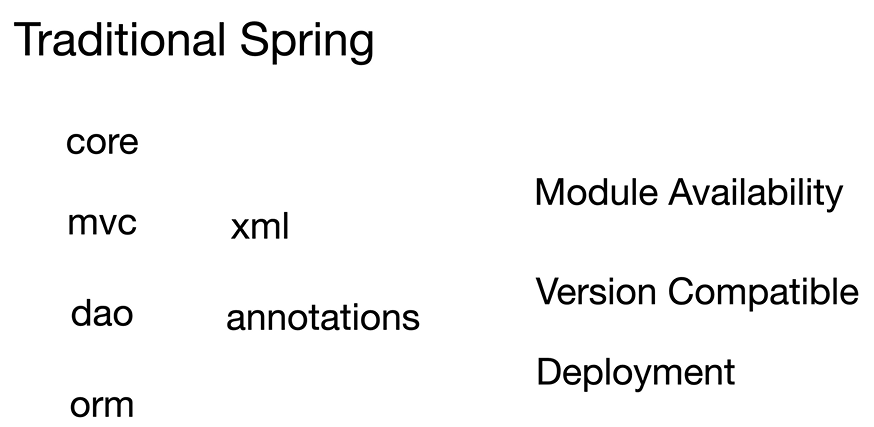
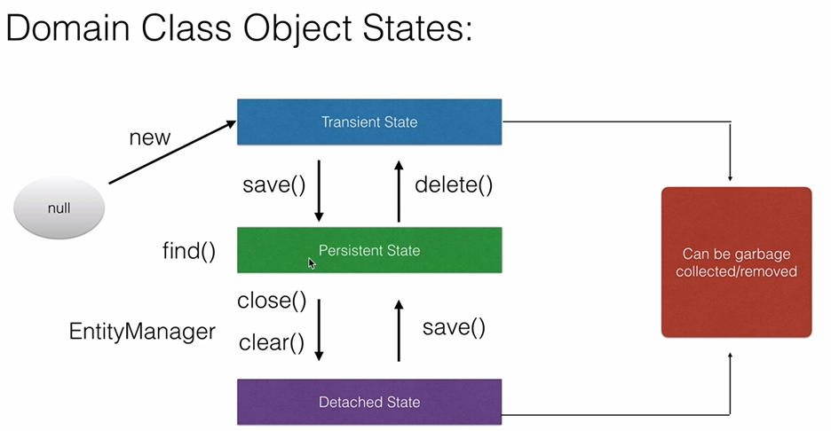
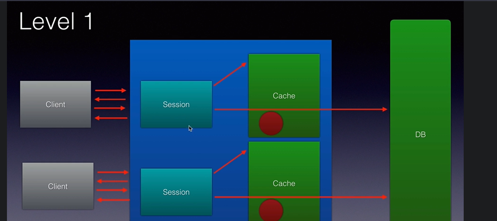
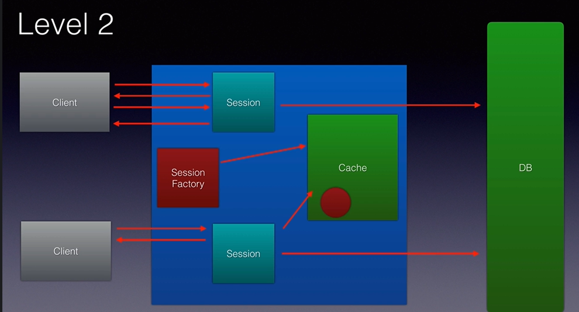

# Spring Boot Notes

---

# 1. Dependency Injection (DI)

## Definition

- **Dependency Injection (DI)** is a design pattern where the Spring IoC Container creates and injects required objects (dependencies) instead of the class creating them.
- It promotes **loose coupling**, improves testability, and makes applications easier to maintain.

### Example
```java
@Service
class PaymentService {

}

@RestController
class PaymentController {
    private final PaymentService paymentService;
    public PaymentController(PaymentService paymentService) {
        this.paymentService = paymentService;
    }
}
```

### Advantages
- Loose Coupling
- Easy Unit Testing
- Better Maintainability
- Easy Dependency Management
---

# 2. Bean Scope

## Definition

- **Bean Scope** defines the lifecycle and visibility of a Spring Bean inside the IoC Container.
- Spring decides whether to create one object, multiple objects, or one object per request/session based on the configured scope.

---
# Types of Bean Scope
| Scope       | Description                            |
|-------------|----------------------------------------|
| Singleton   | One object for entire Spring Container |
| Prototype   | New object every request               |
| Request     | One bean per HTTP request              |
| Session     | One bean per HTTP session              |
| Application | One bean per ServletContext            |
| WebSocket   | One bean per WebSocket session         |
---

# 3. Singleton Scope
## Definition
- **Singleton** is the default scope in Spring.
- Only **one bean instance** is created and shared across the entire Spring Container.

```java
@Service
@Scope("singleton")
class PaymentService { }
```

### Use When
- Stateless services
- Utility classes
- Business services
---

# 4. Prototype Scope
- A **Prototype** bean creates a **new object every time** it is requested from the Spring Container.
- Spring manages creation but not the complete lifecycle after returning the bean.

```java
@Component
@Scope("prototype")
class Employee {
}
```

### Use When
- Stateful objects
- Temporary objects
- User-specific processing
---

# Singleton vs Prototype

| Singleton                         | Prototype                          |
|-----------------------------------|------------------------------------|
| One object                        | New object every request           |
| Default scope                     | Must specify `@Scope("prototype")` |
| Shared                            | Not shared                         |
| Spring manages complete lifecycle | Spring manages only creation       |
---

# 5. HTTP Request Scope
- Creates **one bean per HTTP request**.
- A new instance is created for every incoming request and destroyed after the request completes.

```java
@Component
@RequestScope
class RequestData { }
```

### Use When
- Request-specific data
- Request logging
- Request context
---

# 6. HTTP Session Scope
- Creates **one bean per HTTP session**.
- The bean is shared across multiple requests from the same user session.

```java
@Component
@SessionScope
class UserSession { }
```

### Use When
- Logged-in user information
- Shopping cart
- User preferences
---

# 7. Application Scope
- Creates **one bean per ServletContext**.
- Shared across the entire web application.

```java
@Component
@ApplicationScope
class AppConfig { }
```
---

# 8. Problem with Traditional Java Applications

Before Spring:

```java
PaymentService paymentService = new PaymentService();
PaymentController controller = new PaymentController(paymentService);
```

### Problems
- Tight coupling
- Manual object creation
- Difficult unit testing
- Hard dependency management
- Difficult to change implementations
- Poor scalability
---

# How Spring Solves It
Spring Container creates and injects dependencies automatically.

```java
@RestController
class PaymentController {
    private final PaymentService paymentService;
    public PaymentController(PaymentService paymentService) {
        this.paymentService = paymentService;
    }
}
```

Benefits
- Loose Coupling
- Automatic Dependency Injection
- Better Testability
- Easier Maintenance
- Centralized Object Management

---

# Interview Questions

### What is Dependency Injection?
Dependency Injection is a design pattern where the Spring Container injects required dependencies into a class instead of the class creating them.
---

### What is the default bean scope?
**Singleton**
---
### Difference between Singleton and Prototype?
- Singleton → One bean for the entire container.
- Prototype → New bean every request.
---

### What is Request Scope?
One bean is created for every HTTP request.
---

### What is Session Scope?
One bean is created for every HTTP session.
---

### Why use Dependency Injection?
- Loose Coupling
- Better Testability
- Easier Maintenance
- Simplified Object Management
---

# Quick Revision

```text
Dependency Injection
→ Spring injects dependencies

Bean Scope
→ Bean lifecycle

Singleton
→ One object (Default)

Prototype
→ New object every request

Request Scope
→ One bean per HTTP request

Session Scope
→ One bean per HTTP session

Traditional Java Problems
→ Tight Coupling
→ Manual Object Creation

Spring Solution
→ IoC Container
→ Dependency Injection
→ Loose Coupling
``` 



# Spring Boot Core Concepts & Annotations
---

# 1. Auto Configuration

## Definition

- **Auto Configuration** is a Spring Boot feature that automatically configures Spring Beans based on the dependencies available in the classpath.
- It eliminates most manual configuration, allowing applications to start with minimal setup.

### How It Works
Suppose you add:

```xml
spring-boot-starter-web
```
Spring Boot automatically configures:
- Embedded Tomcat
- DispatcherServlet
- Jackson
- Spring MVC
- Error Handling
No XML or Java configuration required.

### Example

```java
@SpringBootApplication
public class Application {
    public static void main(String[] args) {
        SpringApplication.run(Application.class, args);
    }
}
```

**Use when:** You want Spring Boot to automatically configure common components.

---

# 2. Modular Availability (Starter Modules)

## Definition

- Spring Boot is modular. Features are provided through **Starter Dependencies**.
- Adding a starter automatically brings all required libraries and configuration.

### Examples

```text
spring-boot-starter-web
spring-boot-starter-data-jpa
spring-boot-starter-security
spring-boot-starter-test
```

### How It Works

Adding

```xml
spring-boot-starter-data-jpa
```

automatically includes:

- Spring Data JPA
- Hibernate
- Transaction Manager
- JDBC support

---

# 3. Version Compatibility

## Definition

- Spring Boot manages dependency versions automatically using the **Spring Boot BOM (Bill of Materials)**.
- Developers usually don't specify versions for Spring libraries.

### Example

```xml
<dependency>
    <groupId>org.springframework.boot</groupId>
    <artifactId>spring-boot-starter-web</artifactId>
</dependency>
```

No version required.

### How It Works

Spring Boot imports compatible versions of:

- Spring Framework
- Jackson
- Tomcat
- Hibernate
- Logback

This avoids version conflicts.

---

# 4. Most Popular Starters

| Starter                        | Purpose                        |
|--------------------------------|--------------------------------|
| spring-boot-starter-web        | REST APIs & Web Applications   |
| spring-boot-starter-data-jpa   | Database & Hibernate           |
| spring-boot-starter-security   | Authentication & Authorization |
| spring-boot-starter-validation | Bean Validation                |
| spring-boot-starter-test       | Unit & Integration Testing     |
| spring-boot-starter-actuator   | Monitoring & Health Checks     |
| spring-boot-starter-cache      | Caching                        |
| spring-boot-starter-mail       | Email Support                  |

---

# 5. @SpringBootApplication

## Definition

- `@SpringBootApplication` is the main annotation used to bootstrap a Spring Boot application.
- It combines three annotations into one.

```java
@SpringBootApplication
```
Internally it is equivalent to:
```java
@Configuration
@EnableAutoConfiguration
@ComponentScan
```

### How It Works

#### @Configuration
Registers configuration beans.

#### @EnableAutoConfiguration
Automatically configures Spring based on dependencies.

#### @ComponentScan
Scans the package and registers Spring Beans.

### Example

```java
@SpringBootApplication
public class Application {

    public static void main(String[] args) {

        SpringApplication.run(
                Application.class,
                args);
    }
}
```

---

# 6. @SpringBootTest

## Definition

- `@SpringBootTest` loads the complete Spring Boot application context during testing.
- Used for integration testing.

### Example

```java
@SpringBootTest
class PaymentServiceTest {

    @Autowired
    PaymentService paymentService;

}
```

### How It Works

Spring starts:

- IoC Container
- Beans
- Database (if configured)
- Application Context

---

# 7. Spring Boot Actuator

## Definition

- Spring Boot Actuator provides production-ready monitoring and management endpoints.
- Helps monitor application health, metrics, logs, and environment.

### Dependency

```xml
spring-boot-starter-actuator
```

### Common Endpoints

```text
/actuator

/actuator/health

/actuator/info

/actuator/metrics

/actuator/beans

/actuator/env
```

### Use When

- Monitoring production applications
- Kubernetes readiness/liveness probes
- Observability

---

# 8. Spring Boot Core Annotations

---

# @Component

## Definition

- Marks a class as a Spring Bean.
- Spring automatically detects it during component scanning.

### How It Works

```text
@Component

↓

Component Scan

↓

Bean Created

↓

Stored in IoC Container
```

Example

```java
@Component
public class EmailUtil {

}
```

Use when:

General-purpose Spring Bean.

---

# @Autowired

## Definition

- Automatically injects a required dependency from the Spring Container.
- Spring resolves the dependency by type.

Example

```java
@Service
class PaymentService {

}

@RestController
class PaymentController {

    @Autowired
    private PaymentService paymentService;

}
```

### How It Works

```text
PaymentController

↓

Needs PaymentService

↓

Spring finds Bean

↓

Injects Bean
```

---

# @Service

## Definition

- Marks a class as the Service Layer.
- Indicates that the class contains business logic.

Example

```java
@Service
class PaymentService {

}
```

### How It Works

Registered as a Spring Bean exactly like `@Component`, but provides semantic meaning.

---

# @Repository

## Definition

- Marks a class as the Data Access Layer.
- Also translates database exceptions into Spring exceptions.

Example

```java
@Repository
class PaymentRepository {

}
```

### How It Works

```text
@Repository

↓

Spring Bean

↓

Exception Translation

↓

Data Access
```

---

# @Configuration

## Definition

- Indicates that the class contains Spring Bean definitions.
- Used with `@Bean` methods.

Example

```java
@Configuration
class AppConfig {

    @Bean
    RestTemplate restTemplate() {

        return new RestTemplate();
    }
}
```

### How It Works

Spring executes `@Bean` methods and registers returned objects in the IoC Container.

---

# @PostConstruct

## Definition

- Executes automatically after Spring creates the bean and injects all dependencies.
- Used for initialization logic.

Example

```java
@Component
class Startup {

    @PostConstruct
    public void init() {

        System.out.println("Application Started");
    }
}
```

### Lifecycle

```text
Bean Created

↓

Dependencies Injected

↓

@PostConstruct

↓

Bean Ready
```

---

# 9. @Controller

## Definition

- Marks a class as a Spring MVC Controller.
- Used to handle HTTP requests and return **Views (HTML/JSP/Thymeleaf)**.

Example

```java
@Controller
class HomeController {

    @GetMapping("/")
    public String home() {

        return "index";
    }
}
```

### How It Works

```text
Browser Request
↓
DispatcherServlet
↓
@Controller
↓
Returns View Name
↓
View Resolver
↓
HTML Response
```

> For REST APIs, use `@RestController`, which is equivalent to `@Controller + @ResponseBody`.
---

# Quick Revision
```text
Auto Configuration
→ Automatic Bean Configuration

Starter
→ Predefined Dependency Bundle

Version Compatibility
→ Managed by Spring Boot BOM
@SpringBootApplication→ Configuration → Auto Configuration → Component Scan
@SpringBootTest → Integration Testing
Actuator → Monitoring
@Component → Generic Bean
@Autowired → Dependency Injection
@Service → Business Logic
@Repository → Database Layer
@Configuration → Bean Configuration
@PostConstruct → Initialization Method
@Controller → MVC Controller (Returns View)
```


# Spring Data JPA Notes
---

# 1. Spring Data JPA

## Definition

- **Spring Data JPA** is a Spring module that simplifies database operations by reducing boilerplate code.
- It provides ready-made repository interfaces like `JpaRepository` to perform CRUD operations without writing SQL.

**Use when:** Building database-driven Spring Boot applications.
---

# JPA Specification
- **JPA Specification** is a feature of **Spring Data JPA** that allows you to build **dynamic, type-safe, and reusable database queries** using the Criteria API.
- It is mainly used when query conditions are optional or dynamic, avoiding the need for multiple repository methods.
---

# Why do we need Specification?

Without Specification

```java
findByName()
findByNameAndAge()
findByNameAndAgeAndSalary()
findByNameAndDepartment()
findByAgeAndDepartment()
```

As filters increase, the number of repository methods grows rapidly.
With Specification

```text
Name ✔
Age ✔
Salary ✔
Department ✔
↓
Build Query Dynamically
```
Only one repository method is needed.
---

# Repository

```java
@Repository
public interface EmployeeRepository extends
        JpaRepository<Employee, Long>,
        JpaSpecificationExecutor<Employee> {

}
```

Notice

```java
JpaSpecificationExecutor<Employee>
```
This enables Specification support.
---

# Entity

```java
@Entity
public class Employee {

    @Id
    private Long id;

    private String name;

    private int age;

    private double salary;

}
```

---

# Specification Class

```java
import org.springframework.data.jpa.domain.Specification;

public class EmployeeSpecification {

    public static Specification<Employee> hasName(String name) {
        return (root, query, cb) -> cb.equal(root.get("name"), name);
    }

    public static Specification<Employee> hasAge(int age) {

        return (root, query, cb) -> cb.equal(root.get("age"), age);
    }

    public static Specification<Employee> hasSalary(double salary) {

        return (root, query, cb) -> cb.greaterThan(root.get("salary"), salary);
    }
}
```
---

# Service

```java
Specification<Employee> specification =
        Specification
                .where(EmployeeSpecification.hasName("Manoj"))
                .and(EmployeeSpecification.hasAge(25))
                .and(EmployeeSpecification.hasSalary(50000));

List<Employee> employees = repository.findAll(specification);
```

Generated Query

```sql
SELECT * FROM employee WHERE name='Manoj' AND age=25 AND salary > 50000;
```
---

# Dynamic Example

```java
Specification<Employee> specification = Specification.where(null);

if(name != null){
    specification =  specification.and(
                    EmployeeSpecification.hasName(name));
}

if(age != null){

    specification =  specification.and(EmployeeSpecification.hasAge(age));
}

if(salary != null){

    specification = specification.and(
                    EmployeeSpecification.hasSalary(salary));
}

return repository.findAll(specification);
```

Now every filter becomes optional.

---

# Common Predicate Methods
```java
cb.equal()
cb.notEqual()
cb.like()
cb.greaterThan()
cb.lessThan()
cb.between()
cb.in()
cb.isNull()
cb.isNotNull()
```
---

# Combining Specifications

```java
Specification.where()
.and()
.or()
.not()
```

Example
```java
Specification.where(hasName("Manoj")).or(hasAge(30));
```
---

# Benefits

- Dynamic Queries
- Reusable Specifications
- Type Safe
- Cleaner Code
- No String-based SQL
- Supports complex filtering

---

# When to Use

✅ Search screens

```text
Employee Search
Name
Age
Salary
Department
Status
```
All optional filters.
---

✅ Admin Dashboards
---
✅ Advanced Filtering
---
✅ Reporting Modules
---

# When NOT to Use
❌ Very simple queries
```java
findById()
findByName()
```

Repository methods are simpler.
---

# Specification vs JPQL

| JPQL                      | Specification   |
|---------------------------|-----------------|
| Static Query              | Dynamic Query   |
| Hard to build dynamically | Easy            |
| String Based              | Type Safe       |
| Less Reusable             | Highly Reusable |
---

# Interview Questions

### What is JPA Specification?

JPA Specification is a Spring Data JPA feature used to build dynamic and reusable queries using the Criteria API.
---

### Why use Specification?

To avoid creating multiple repository methods and to build dynamic queries based on optional search criteria.
---

### Which interface enables Specification?

```java
JpaSpecificationExecutor<T>
```
---

# Quick Revision

```text
JPA Specification

✔ Dynamic Queries
✔ Type Safe
✔ Reusable
✔ Criteria API

Repository

JpaSpecificationExecutor<T>

Specification Methods

✔ equal()
✔ like()
✔ greaterThan()
✔ lessThan()
✔ between()
✔ in()

Combine

where()

and()

or()
Use When
✔ Dynamic Search
✔ Multiple Filters
✔ Reporting
✔ Admin Search
```

# 2. ORM (Object Relational Mapping)

# ORM (Object Relational Mapping)

## Definition
- **ORM (Object Relational Mapping)** is a technique that maps **Java objects (classes)** to **database tables** and **object fields** to **table columns**.
- It allows developers to perform database operations using Java objects instead of writing SQL queries manually.
---

# Why ORM?
Without ORM

```java
String sql = "SELECT * FROM employee WHERE id = 101";

// Execute SQL
// Read ResultSet
// Convert ResultSet to Employee object
```

You have to manually:
- Write SQL
- Execute SQL
- Read `ResultSet`
- Convert rows into Java objects

---

With ORM
```java
Employee employee = employeeRepository.findById(101L).get();
```

ORM automatically:

- Generates SQL
- Executes SQL
- Maps the database row to an `Employee` object

---

# How ORM Works

Suppose you have a Java class:

```java
@Entity
public class Employee {

    @Id
    private Long id;

    private String name;

    private double salary;
}
```

ORM maps it to:

```text
Java Object                Database Table

Employee
+-----------+              Employee
| id        |   ------->   id
| name      |              name
| salary    |              salary
+-----------+              salary
```
---

# CRUD Operations

When you perform Java operations:

```java
employeeRepository.save(employee);
```
ORM converts it into:
```sql
INSERT INTO employee (id, name, salary) VALUES (101, 'Manoj', 85000);
```
---

```java
employeeRepository.findById(101L);
```

ORM generates:
```sql
SELECT * FROM employee WHERE id = 101;
```
---

```java
employeeRepository.delete(employee);
```

ORM generates:
```sql
DELETE FROM employee WHERE id = 101;
```
---

# Popular ORM Frameworks

- Hibernate ⭐ (Most Popular)
- EclipseLink
- OpenJPA

Spring Boot commonly uses **Hibernate** as the JPA implementation.

---

# Advantages

- No need to write most SQL manually.
- Converts database rows into Java objects automatically.
- Database-independent code.
- Reduces boilerplate code.
- Supports relationships (OneToOne, OneToMany, etc.).

---

# Interview Questions

### What is ORM?
ORM (Object Relational Mapping) is a technique that maps Java objects to database tables, allowing developers to interact with the database using objects instead of SQL.

---

### Is ORM the same as Hibernate?

❌ No.
- **ORM** → Technique/Concept
- **Hibernate** → ORM Framework
---

### Is JPA an ORM?

❌ No.
- **JPA** → Specification
- **Hibernate** → ORM implementation of JPA
---

# Quick Revision

```text
ORM
Java Object
      ↕
Database Table
ORM Automatically
✔ Generates SQL
✔ Executes SQL
✔ Maps Rows ↔ Objects

ORM Technique
↓
Hibernate (Framework)
↓
JPA (Specification Used by Hibernate)
```

# 3. JPA (Java Persistence API)

## Definition

- **JPA** is a Java specification for ORM.
- It defines interfaces and rules for persisting Java objects, while implementations like **Hibernate** provide the actual functionality.

```text
JPA (Specification)
↓
Hibernate (Implementation)
```
---

# 4. Entity Object States

## Transient
- Object created using `new`.
- Not managed by JPA and not stored in the database.

```java
Employee emp = new Employee();
```
---

## Persistent (Managed)
- Managed by the Persistence Context.
- Any changes are automatically synchronized with the database.

```java
entityManager.persist(emp);
```
---

## Detached

- Object was managed earlier but is no longer associated with the Persistence Context.
- Changes are not saved automatically.

```java
entityManager.detach(emp);
```
---

## Removed

- Entity is marked for deletion.
- Deleted from the database when the transaction commits.
```java
entityManager.remove(emp);
```
---

# 5. JPA Associations

## One-to-One

One record is associated with one record.

```text
Person ↔ Passport
```

---

## One-to-Many

One parent has multiple children.

```text
Department
     │
     ├── Employee
     ├── Employee
```

---

## Many-to-One

Many child records belong to one parent.

```text
Many Employees

↓

One Department
```

---

## Many-to-Many

Many records are related to many records.

```text
Student

↓

Course

(Student can have many courses)
(Course can have many students)
```

---

# 6. Cascading

## Definition

- **Cascade** automatically performs operations on child entities when the parent entity is affected.

### Cascade Types

```text
PERSIST
MERGE
REMOVE
REFRESH
DETACH
ALL
```

**Example**
Delete Parent
↓

Delete Child (Cascade REMOVE)
---

# 7. Lazy Loading

## Definition

- Child data is loaded **only when it is accessed**.
- Improves performance by avoiding unnecessary database queries.

```text
Department

↓

Employee (Loaded only when needed)
```

---

## Eager Loading

- Parent and child are loaded together.

```text
Department

↓

Employee (Loaded immediately)
```

---

# 8. First-Level Cache

## Definition

- Built into Hibernate.
- Cache exists **inside the Persistence Context (EntityManager)**.
- Enabled by default.

```text
Application

↓

EntityManager

↓

First-Level Cache

↓

Database
```

---

# 9. Second-Level Cache

## Definition
- Shared across multiple EntityManagers and sessions.
- Stores entities globally to reduce database access.
- Requires external cache providers like **Ehcache**, **Hazelcast**, or **Caffeine**.

```text
Application
↓
EntityManager
↓
Second-Level Cache
↓
Database
```

---

# 10. Configure Second-Level Cache

### Dependency

```xml
hibernate-jcache
ehcache
```

### application.properties

```properties
spring.jpa.properties.hibernate.cache.use_second_level_cache=true

spring.jpa.properties.hibernate.cache.region.factory_class=org.hibernate.cache.jcache.JCacheRegionFactory
```

### Entity

```java
@Entity
@Cacheable
@org.hibernate.annotations.Cache(
    usage = CacheConcurrencyStrategy.READ_WRITE
)
public class Employee {

}
```

---

# Interview Questions

### What is Spring Data JPA?

A Spring module that simplifies database operations by providing ready-made repository implementations.

---

### Difference between JPA and Hibernate?

- **JPA** → Specification
- **Hibernate** → Implementation of JPA

---

### What is ORM?

ORM maps Java objects to database tables.

---

### What are Entity States?


- Transient
- Persistent
- Detached
- Removed

---

### Difference between Lazy and Eager Loading?

- Lazy → Load when needed.
- Eager → Load immediately.

---

### Difference between First-Level and Second-Level Cache?

| First-Level Cache | Second-Level Cache |
|-------------------|--------------------|
| EntityManager Scope | Shared Across Sessions |
| Default | Needs Configuration |
| Faster | Reduces DB Hits |

---

# Quick Revision

```text
Spring Data JPA
→ Simplifies Database Operations

ORM
→ Object ↔ Table Mapping

JPA
→ Specification

Hibernate
→ JPA Implementation

Entity States
→ Transient
→ Persistent
→ Detached
→ Removed

Associations
→ OneToOne
→ OneToMany
→ ManyToOne
→ ManyToMany

Cascade
→ Parent operation affects child

Lazy Loading
→ Load when needed

Eager Loading
→ Load immediately

First-Level Cache
→ EntityManager

Second-Level Cache
→ Shared Cache
→ Ehcache / Caffeine
```


# EntityManagerFactory vs EntityManager
---

# EntityManagerFactory
- **EntityManagerFactory (EMF)** is responsible for **creating EntityManager objects**.
- It is a **heavyweight**, thread-safe object and is usually created **once** during application startup.

### Example
```java
EntityManagerFactory emf = Persistence.createEntityManagerFactory("myDB");
```

### Responsibilities
- Creates `EntityManager` instances.
- Reads JPA configuration (`persistence.xml`).
- Manages database connection configuration.
- Maintains the **Second-Level Cache**.

---

# EntityManager
- **EntityManager (EM)** is the primary JPA interface used to perform **CRUD operations** on entities.
- It is a **lightweight**, non-thread-safe object created by the `EntityManagerFactory`.

### Example
```java
EntityManager em = emf.createEntityManager();
```

### Responsibilities

- Persist entities.
- Find entities.
- Update entities.
- Remove entities.
- Manage transactions.
- Maintain the **First-Level Cache (Persistence Context)**.
---

# Common EntityManager Methods

| Method      | Purpose                                |
|-------------|----------------------------------------|
| `persist()` | Save a new entity                      |
| `find()`    | Find entity by primary key             |
| `merge()`   | Update detached entity                 |
| `remove()`  | Delete entity                          |
| `detach()`  | Remove entity from persistence context |
| `refresh()` | Reload entity from database            |
| `flush()`   | Synchronize changes with database      |
| `clear()`   | Clear persistence context              |
---

# Example

```java
EntityManagerFactory emf = Persistence.createEntityManagerFactory("myDB");

EntityManager em = emf.createEntityManager();

em.getTransaction().begin();

Employee emp = new Employee();

emp.setName("Manoj");
em.persist(emp);
em.getTransaction().commit();
em.close();
emf.close();
```
---

# Workflow

```text
Application
      │
      ▼
EntityManagerFactory
(One Per Application)
      │
createEntityManager()
      ▼
EntityManager
(One Per Transaction/Request)
      │
CRUD Operations
      ▼
Database
```

---

# EntityManagerFactory vs EntityManager

| EntityManagerFactory         | EntityManager               |
|------------------------------|-----------------------------|
| Creates EntityManagers       | Performs CRUD operations    |
| Heavyweight                  | Lightweight                 |
| Thread-safe                  | Not Thread-safe             |
| One per application          | One per transaction/request |
| Maintains Second-Level Cache | Maintains First-Level Cache |

---

# Spring Boot

Normally you don't create them manually.

Spring Boot injects `EntityManager` automatically.

```java
@PersistenceContext
private EntityManager entityManager;
```

or

```java
@Autowired
private EntityManager entityManager;
```

Spring internally manages the `EntityManagerFactory`.

---

# Interview Questions

### What is EntityManagerFactory?

A factory responsible for creating `EntityManager` instances. It is heavyweight, thread-safe, and typically created once per application.

---

### What is EntityManager?

The main JPA interface used to perform CRUD operations and manage the persistence context.

---

### Difference between EntityManagerFactory and EntityManager?

- **EntityManagerFactory** → Creates `EntityManager` objects.
- **EntityManager** → Interacts with the database and manages entity lifecycle.

---

# Quick Revision

```text
EntityManagerFactory
✔ Creates EntityManager
✔ Heavyweight
✔ Thread-safe
✔ One per Application
✔ Second-Level Cache
↓
createEntityManager()
↓
EntityManager
✔ CRUD Operations
✔ Persistence Context
✔ First-Level Cache
✔ Lightweight
✔ One per Request/Transaction
```

### Cache in hibernate 

## Session


- is the primary Hibernate interface used to perform **CRUD operations** on entities.
- It is a **lightweight**, non-thread-safe object created by the `SessionFactory`.

### Example
```java
Session session = sessionFactory.openSession();
```

### Responsibilities

- Save entities.
- Update entities.
- Delete entities.
- Query data.
- Manage transactions.
- Maintain the **First-Level Cache**.
---

# Common Session Methods
| Method      | Purpose                      |
|-------------|------------------------------|
| `save()`    | Insert a new entity          |
| `persist()` | Persist a new entity         |
| `get()`     | Fetch entity immediately     |
| `load()`    | Fetch entity lazily          |
| `update()`  | Update entity                |
| `merge()`   | Merge detached entity        |
| `delete()`  | Delete entity                |
| `evict()`   | Remove one entity from cache |
| `clear()`   | Clear first-level cache      |
| `flush()`   | Synchronize changes with DB  |
| `close()`   | Close session                |
---

# SessionFactory

- **SessionFactory** is a factory class responsible for **creating `Session` objects**.
- It is a **heavyweight**, thread-safe object that is created **once** during application startup.

### Example
```java
SessionFactory sessionFactory = new Configuration()
                .configure()
                .buildSessionFactory();
```

### Responsibilities

- Creates `Session` objects.
- Reads Hibernate configuration (`hibernate.cfg.xml`).
- Manages database configuration.
- Maintains the **Second-Level Cache**.
---
