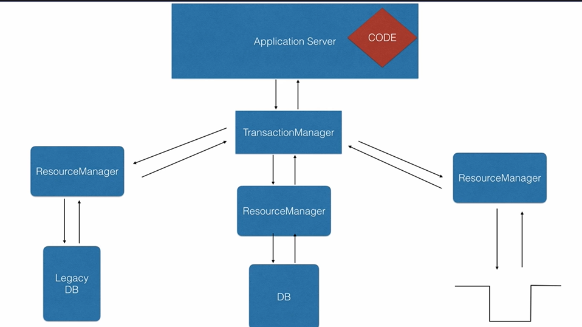
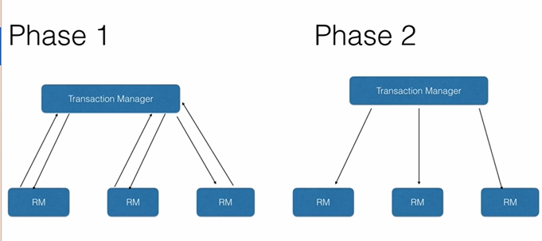

# Transactions

## Definition

- A **Transaction** is a sequence of one or more database operations executed as a **single logical unit of work**.
- It ensures that either **all operations succeed (Commit)** or **none of them are applied (Rollback)**, maintaining data consistency.
---




# Why Do We Need Transactions?

Without Transaction

```text
Transfer ₹1000
↓
Debit Account A ✔
↓
Application Crash ❌
↓
Credit Account B ✘
```

Money disappears.
---

With Transaction

```text
Transfer ₹1000
↓
Debit A
↓
Credit B
↓
Commit
```
If any step fails

```text
Rollback
↓
Database returns to previous state
```

---

# Real World Example

Bank Transfer
```text
Account A = ₹5000
Account B = ₹3000
```
Transfer ₹1000
Steps

```text
1. Debit ₹1000 from A
2. Credit ₹1000 to B
3. Commit
```

If Step-2 fails
```text
Rollback
↓
Account A = ₹5000
Account B = ₹3000
```

---

# Transaction Lifecycle

```text
Begin Transaction
↓
Execute SQL
↓
Commit
OR
Rollback
```
---

# ACID Properties
---

## A — Atomicity
- **Atomicity** ensures that all operations in a transaction execute completely or none execute at all.
- Prevents partial updates.

### Problem Solved
Without Atomicity
```text
Debit Done
Credit Failed
↓
Money Lost
```
---

## C — Consistency

- Ensures that the database always moves from one **valid state** to another.
- Database constraints and rules remain satisfied.

### Problem Solved
```text
Balance cannot become negative.
Primary Key remains unique.
Foreign Key remains valid.
```
---

## I — Isolation
- Ensures that multiple transactions execute independently without interfering with each other.
- Prevents concurrent transaction issues.

### Problem Solved
Without Isolation
```text
Two users update same account.
↓
Incorrect balance
```
---

## D — Durability
- Once a transaction is committed, the data is permanently stored.
- Data survives crashes or power failures.

### Problem Solved
```text
Commit
↓
Server Crash
↓
Data still exists
```
---

# Spring Transaction

Spring provides transaction management using
```java
@Transactional
```

Example

```java
@Service
public class PaymentService {

    @Transactional
    public void transferMoney() {
        debit();
        credit();
    }
}
```

Spring automatically

```text
Begin Transaction
↓
Execute
↓
Commit
↓
Rollback on Exception
```
---

# Rollback
Default
```text
Unchecked Exception
↓
Rollback
```
Checked Exception

```text
No Rollback
```
Custom
```java
@Transactional(
    rollbackFor = Exception.class
)
```

---

# Propagation
Propagation defines **how a transaction behaves when one transactional method calls another.**

---

## REQUIRED (Default)

Joins the existing transaction.
If none exists,
creates one.

Use

```text
Business Service
```
---

## REQUIRES_NEW
Always creates a new transaction.
Suspends existing transaction.

Use
```text
Audit Logs
Notification
Email
```
---

## SUPPORTS

Uses existing transaction if available.
Otherwise runs without transaction.
---

## MANDATORY

Must have an existing transaction.
Otherwise throws exception.
---

## NEVER

Must NOT have a transaction.
Throws exception if transaction exists.
---

## NOT_SUPPORTED

Runs outside transaction.
Existing transaction is suspended.
---

# Read Only Transaction

```java
@Transactional(readOnly = true)
```

Use

```text
SELECT Queries
```

Benefits

- Better performance
- Prevents accidental updates
- Hibernate skips dirty checking

---

# Commit vs Rollback

| Commit        | Rollback                |
|---------------|-------------------------|
| Saves changes | Discards changes        |
| Permanent     | Restores previous state |

---

# Common Problems Solved

| Problem            | Transaction Solution   |
|--------------------|------------------------|
| Partial Updates    | Atomicity              |
| Invalid Data       | Consistency            |
| Concurrent Updates | Isolation              |
| Crash After Commit | Durability             |

---

# Best Practices
✔ Keep transactions short.
✔ Avoid remote API calls inside transactions.
✔ Use `readOnly=true` for queries.
✔ Rollback only when required.
✔ Never perform long-running operations inside a transaction.

---

# Interview Questions

### What is a Transaction?
A transaction is a logical unit of work that ensures all operations succeed together or fail together.

---

### Why use Transactions?
To maintain data consistency and prevent partial updates.

---

### What are ACID properties?

Atomicity, Consistency, Isolation, Durability.

---

### Difference between Commit and Rollback?

Commit permanently saves changes.

Rollback discards all changes made during the transaction.

---

### Default Propagation?

```text
REQUIRED
```

---

### Default Rollback?

```text
RuntimeException

Error
```

---

# Quick Revision

```text
Transaction

↓

Commit

OR

Rollback

ACID

A → Atomicity
C → Consistency
I → Isolation
D → Durability

Spring

@Transactional

Propagation

REQUIRED
REQUIRES_NEW
SUPPORTS
MANDATORY
NOT_SUPPORTED
NEVER

Commit
→ Save

Rollback
→ Undo
```
