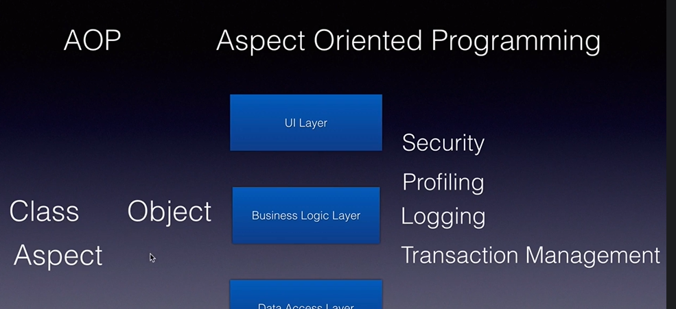
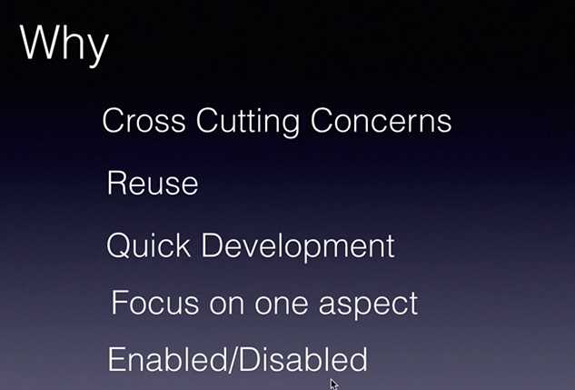

# Spring AOP — Detailed Notes



## 1. What is AOP?

**AOP (Aspect-Oriented Programming)** is a programming approach used to separate common functionality from the main business logic.
Common functionality such as logging, security, transaction handling, auditing, validation, and performance monitoring is called a **cross-cutting concern**.

### Without AOP

```java
public void processPayment() {
    long start = System.currentTimeMillis();
    System.out.println("Method started");

    // Business logic
    System.out.println("Payment processed");

    long end = System.currentTimeMillis();
    System.out.println("Execution time: " + (end - start));
}
```

The logging and timing code becomes mixed with the payment logic.

### With AOP

```java
public void processPayment() {
    System.out.println("Payment processed");
}
```

The logging and execution-time logic is moved into a separate **Aspect**.

---

# 2. Why Use AOP?

AOP helps separate reusable technical logic from business logic.

Common use cases:

```text
Logging
Security
Transactions
Auditing
Performance monitoring
Exception handling
Request tracing
Retry handling
Caching
```

### Benefits

* Reduces duplicate code.
* Keeps business logic clean.
* Improves code maintainability.
* Allows common behavior to be applied to many methods.
* Centralizes logging, security, and monitoring logic.

---

# 3. Important AOP Terminology

## Aspect

An **Aspect** is a class containing cross-cutting logic.

```java
@Aspect
@Component
public class LoggingAspect {
}
```

Examples:

```text
LoggingAspect
SecurityAspect
AuditAspect
PerformanceAspect
```

---

## Advice

An **Advice** is the action executed by an aspect.

Examples:

```text
Run before a method
Run after a method
Run when a method returns
Run when a method throws an exception
Run around the complete method execution
```

Advice annotations:

```java
@Before
@After
@AfterReturning
@AfterThrowing
@Around
```

---

## Join Point

A **Join Point** is a point in the application where an aspect can be applied.

In Spring AOP, a join point normally represents a **method execution**.

```java
paymentService.processPayment();
```

The execution of `processPayment()` is a join point.

---

## Pointcut

A **Pointcut** is an expression that selects which methods should be intercepted.

```java
@Pointcut("execution(* com.example.service.*.*(..))")
public void serviceMethods() {
}
```

This selects methods inside the service package.

---

## Target Object

The **Target Object** is the actual Spring bean containing the business logic.

```java
@Service
public class PaymentService {

    public String processPayment() {
        return "Payment successful";
    }
}
```

Here, `PaymentService` is the target object.

---

## Proxy

A **Proxy** is an object created by Spring around the target object.

The proxy intercepts method calls and executes the aspect logic before or after calling the real method.

```text
Controller
    |
    v
Spring Proxy
    |
    +--> Advice before method
    |
    +--> Actual service method
    |
    +--> Advice after method
```

---

## Weaving

**Weaving** is the process of connecting an aspect with the target method.

Spring AOP performs weaving at runtime by creating proxy objects.

---

# 4. Spring AOP Dependency

Add the following dependency:

```xml
<dependency>
    <groupId>org.springframework.boot</groupId>
    <artifactId>spring-boot-starter-aop</artifactId>
</dependency>
```

This starter provides Spring AOP and AspectJ annotation support.

---

# 5. Complete Spring Boot AOP Example

## Project Structure

```text
src/main/java/com/example/aopdemo
│
├── AopDemoApplication.java
├── aspect
│   └── LoggingAspect.java
├── controller
│   └── PaymentController.java
└── service
    └── PaymentService.java
```

---

## Main Application

```java
package com.example.aopdemo;

import org.springframework.boot.SpringApplication;
import org.springframework.boot.autoconfigure.SpringBootApplication;

@SpringBootApplication
public class AopDemoApplication {

    public static void main(String[] args) {
        SpringApplication.run(AopDemoApplication.class, args);
    }
}
```

---

## Service Class

```java
package com.example.aopdemo.service;

import org.springframework.stereotype.Service;

@Service
public class PaymentService {

    public String processPayment(String customerName, double amount) {

        System.out.println("Executing payment business logic");

        if (amount <= 0) {
            throw new IllegalArgumentException(
                    "Payment amount must be greater than zero"
            );
        }

        return "Payment of " + amount
                + " processed for " + customerName;
    }
}
```

---

## Controller Class

```java
package com.example.aopdemo.controller;

import com.example.aopdemo.service.PaymentService;
import org.springframework.web.bind.annotation.GetMapping;
import org.springframework.web.bind.annotation.RequestParam;
import org.springframework.web.bind.annotation.RestController;

@RestController
public class PaymentController {

    private final PaymentService paymentService;

    public PaymentController(PaymentService paymentService) {
        this.paymentService = paymentService;
    }

    @GetMapping("/payments")
    public String processPayment(
            @RequestParam String customer,
            @RequestParam double amount) {

        return paymentService.processPayment(customer, amount);
    }
}
```

---

## Aspect Class

```java
package com.example.aopdemo.aspect;

import org.aspectj.lang.JoinPoint;
import org.aspectj.lang.ProceedingJoinPoint;
import org.aspectj.lang.annotation.After;
import org.aspectj.lang.annotation.AfterReturning;
import org.aspectj.lang.annotation.AfterThrowing;
import org.aspectj.lang.annotation.Around;
import org.aspectj.lang.annotation.Aspect;
import org.aspectj.lang.annotation.Before;
import org.springframework.stereotype.Component;

import java.util.Arrays;

@Aspect
@Component
public class LoggingAspect {

    /**
     * Executes before the selected service method.
     */
    @Before(
        "execution(* com.example.aopdemo.service.PaymentService.processPayment(..))"
    )
    public void logBefore(JoinPoint joinPoint) {

        System.out.println("----- @Before -----");
        System.out.println(
                "Method: " + joinPoint.getSignature().getName()
        );
        System.out.println(
                "Arguments: " + Arrays.toString(joinPoint.getArgs())
        );
    }

    /**
     * Executes after the method finishes,
     * whether it succeeds or fails.
     */
    @After(
        "execution(* com.example.aopdemo.service.PaymentService.processPayment(..))"
    )
    public void logAfter(JoinPoint joinPoint) {

        System.out.println("----- @After -----");
        System.out.println(
                "Finished method: "
                        + joinPoint.getSignature().getName()
        );
    }

    /**
     * Executes only when the method completes successfully.
     */
    @AfterReturning(
        pointcut =
            "execution(* com.example.aopdemo.service.PaymentService.processPayment(..))",
        returning = "result"
    )
    public void logAfterReturning(
            JoinPoint joinPoint,
            Object result) {

        System.out.println("----- @AfterReturning -----");
        System.out.println("Returned value: " + result);
    }

    /**
     * Executes only when the method throws an exception.
     */
    @AfterThrowing(
        pointcut =
            "execution(* com.example.aopdemo.service.PaymentService.processPayment(..))",
        throwing = "exception"
    )
    public void logAfterThrowing(
            JoinPoint joinPoint,
            Throwable exception) {

        System.out.println("----- @AfterThrowing -----");
        System.out.println(
                "Method: " + joinPoint.getSignature().getName()
        );
        System.out.println(
                "Exception: " + exception.getMessage()
        );
    }

    /**
     * Wraps the complete method execution.
     */
    @Around(
        "execution(* com.example.aopdemo.service.PaymentService.processPayment(..))"
    )
    public Object measureExecutionTime(
            ProceedingJoinPoint joinPoint) throws Throwable {

        System.out.println("----- @Around Before -----");

        long startTime = System.currentTimeMillis();

        try {
            // Calls the actual target method.
            Object result = joinPoint.proceed();

            long executionTime =
                    System.currentTimeMillis() - startTime;

            System.out.println(
                    "Execution time: "
                            + executionTime
                            + " ms"
            );

            return result;

        } finally {
            System.out.println("----- @Around After -----");
        }
    }
}
```

---

# 6. Execution Flow

When the controller calls:

```java
paymentService.processPayment("Manoj", 1000);
```

the actual flow is:

```text
Controller
    |
    v
PaymentService Proxy
    |
    v
@Around before logic
    |
    v
@Before
    |
    v
PaymentService.processPayment()
    |
    v
@AfterReturning
    |
    v
@After
    |
    v
@Around after logic
    |
    v
Return response
```

The exact ordering between multiple aspects can be controlled using `@Order`.

---

# 7. Advice Types

## `@Before`

Executes before the target method.

```java
@Before("execution(* com.example.service.*.*(..))")
public void beforeMethod(JoinPoint joinPoint) {
    System.out.println("Before method");
}
```

### Use when

* Logging method input.
* Checking permissions.
* Validating parameters.
* Starting an audit operation.

---

## `@After`

Executes after the target method completes, whether it succeeds or throws an exception.

```java
@After("execution(* com.example.service.*.*(..))")
public void afterMethod() {
    System.out.println("Method completed");
}
```

### Use when

* Cleanup logic.
* Final logging.
* Releasing temporary resources.

---

## `@AfterReturning`

Executes only when the method returns successfully.

```java
@AfterReturning(
    pointcut = "execution(* com.example.service.*.*(..))",
    returning = "result"
)
public void afterReturning(Object result) {
    System.out.println("Result: " + result);
}
```

### Use when

* Logging return values.
* Auditing successful operations.
* Performing follow-up logic after success.

---

## `@AfterThrowing`

Executes when the target method throws an exception.

```java
@AfterThrowing(
    pointcut = "execution(* com.example.service.*.*(..))",
    throwing = "exception"
)
public void afterThrowing(Throwable exception) {
    System.out.println(exception.getMessage());
}
```

### Use when

* Centralized exception logging.
* Sending failure alerts.
* Recording failed operations.

---

## `@Around`

Executes before and after the method and controls whether the target method is called.

```java
@Around("execution(* com.example.service.*.*(..))")
public Object around(
        ProceedingJoinPoint joinPoint) throws Throwable {

    System.out.println("Before");

    Object result = joinPoint.proceed();

    System.out.println("After");

    return result;
}
```

### Use when

* Performance monitoring.
* Retry logic.
* Caching.
* Modifying arguments.
* Modifying return values.
* Controlling method execution.

> `joinPoint.proceed()` is required to execute the original target method.

---

# 8. Pointcut Expressions

## Match a Specific Method

```java
execution(
    * com.example.service.PaymentService.processPayment(..)
)
```

Meaning:

```text
*               -> Any return type
PaymentService  -> Target class
processPayment  -> Method name
(..)            -> Any number of arguments
```

---

## Match Every Method in a Class

```java
execution(
    * com.example.service.PaymentService.*(..)
)
```

---

## Match Every Method in a Package

```java
execution(
    * com.example.service.*.*(..)
)
```

This matches classes directly inside the package.

---

## Match Package and Subpackages

```java
execution(
    * com.example.service..*.*(..)
)
```

The double dot `..` includes subpackages.

---

## Match Public Methods

```java
execution(
    public * com.example.service..*(..)
)
```

---

## Match Methods by Annotation

```java
@annotation(com.example.annotation.TrackExecution)
```

---

## Match Classes by Annotation

```java
@within(org.springframework.stereotype.Service)
```

---

## Match Bean Name

```java
bean(paymentService)
```

---

# 9. Reusable Pointcuts

Instead of repeating a pointcut expression, define it once.

```java
@Aspect
@Component
public class LoggingAspect {

    @Pointcut("execution(* com.example.service..*(..))")
    public void serviceLayer() {
    }

    @Before("serviceLayer()")
    public void beforeServiceMethod() {
        System.out.println("Service method called");
    }

    @After("serviceLayer()")
    public void afterServiceMethod() {
        System.out.println("Service method completed");
    }
}
```

The `@Pointcut` method has no business implementation. Its method name represents the pointcut expression.

---

# 10. Pointcut Operators

Pointcuts can be combined using logical operators.

## AND

```java
@Before(
    "execution(* com.example.service..*(..))"
    + " && @annotation(com.example.annotation.Audit)"
)
```

Both conditions must match.

---

## OR

```java
@Before(
    "execution(* com.example.service..*(..))"
    + " || execution(* com.example.repository..*(..))"
)
```

Either condition can match.

---

## NOT

```java
@Before(
    "execution(* com.example.service..*(..))"
    + " && !execution(* com.example.service.HealthService.*(..))"
)
```

Excludes methods from `HealthService`.

---

# 11. Custom Annotation with AOP

## Create the Annotation

```java
package com.example.aopdemo.annotation;

import java.lang.annotation.ElementType;
import java.lang.annotation.Retention;
import java.lang.annotation.RetentionPolicy;
import java.lang.annotation.Target;

@Target(ElementType.METHOD)
@Retention(RetentionPolicy.RUNTIME)
public @interface TrackExecution {

    String operation() default "";
}
```

---

## Apply It to a Method

```java
@Service
public class PaymentService {

    @TrackExecution(operation = "PROCESS_PAYMENT")
    public String processPayment(double amount) {
        return "Payment completed: " + amount;
    }
}
```

---

## Intercept the Annotation

```java
@Aspect
@Component
public class TrackingAspect {

    @Around("@annotation(trackExecution)")
    public Object track(
            ProceedingJoinPoint joinPoint,
            TrackExecution trackExecution) throws Throwable {

        long start = System.currentTimeMillis();

        try {
            return joinPoint.proceed();
        } finally {
            long time = System.currentTimeMillis() - start;

            System.out.println(
                    "Operation: " + trackExecution.operation()
            );

            System.out.println(
                    "Execution time: " + time + " ms"
            );
        }
    }
}
```

### Use cases

```text
@Audit
@TrackExecution
@ValidateUser
@RequirePermission
@LogRequest
```

---

# 12. JoinPoint vs ProceedingJoinPoint

| `JoinPoint`                         | `ProceedingJoinPoint`        |
| ----------------------------------- | ---------------------------- |
| Used with `@Before`, `@After`, etc. | Used with `@Around`          |
| Provides method information         | Provides method information  |
| Cannot control execution            | Can invoke the target method |
| No `proceed()` method               | Contains `proceed()`         |

Useful methods:

```java
joinPoint.getSignature()
joinPoint.getArgs()
joinPoint.getTarget()
joinPoint.getThis()
```

For around advice:

```java
joinPoint.proceed()
```

---

# 13. Proxy Types

Spring AOP uses proxies to intercept method calls.

## JDK Dynamic Proxy

* Used when the target implements an interface.
* The proxy implements the same interface.
* Interception occurs through interface methods.

```text
PaymentService Interface
          |
          v
JDK Proxy
          |
          v
PaymentServiceImpl
```

---

## CGLIB Proxy

* Creates a subclass of the target class.
* Can proxy classes without interfaces.
* Cannot override `final` methods.

```text
PaymentService
      |
      v
Generated Proxy Subclass
```

Spring Boot normally uses class-based CGLIB proxies by default.

To request JDK proxies:

```properties
spring.aop.proxy-target-class=false
```

---

# 14. Self-Invocation Problem

Spring AOP works when a method is called through the Spring proxy.

Consider:

```java
@Service
public class PaymentService {

    public void process() {
        validate();
    }

    @TrackExecution
    public void validate() {
        System.out.println("Validating");
    }
}
```

When `process()` calls `validate()` using `this`, the call does not go through the proxy.

```text
External Bean
    |
    v
Proxy
    |
    v
process()
    |
    v
this.validate()
    |
    X Aspect may not execute
```

### Solutions

* Move the intercepted method to another Spring bean.
* Inject another service containing that method.
* Refactor the method boundary.
* Use full AspectJ weaving when proxy-based AOP is insufficient.

Best approach:

```java
@Service
public class ValidationService {

    @TrackExecution
    public void validate() {
        System.out.println("Validating");
    }
}
```

```java
@Service
public class PaymentService {

    private final ValidationService validationService;

    public PaymentService(
            ValidationService validationService) {

        this.validationService = validationService;
    }

    public void process() {
        validationService.validate();
    }
}
```

Now the call passes through the `ValidationService` proxy.

---

# 15. Important Spring AOP Limitations

* Spring AOP primarily intercepts Spring-managed bean method executions.
* Direct calls to objects created using `new` are not intercepted.
* Self-invocation normally bypasses the proxy.
* Private methods cannot be intercepted through normal proxy-based AOP.
* Final methods cannot be overridden by CGLIB proxies.
* Final classes cannot be subclassed by CGLIB.
* Constructor interception is not supported by normal Spring proxy AOP.

Incorrect:

```java
PaymentService service = new PaymentService();
service.processPayment();
```

Because the object was manually created, it is not a Spring proxy.

Correct:

```java
@Autowired
private PaymentService paymentService;
```

---

# 16. Multiple Aspects and `@Order`

When multiple aspects intercept the same method, use `@Order` to control their priority.

```java
@Aspect
@Component
@Order(1)
public class SecurityAspect {
}
```

```java
@Aspect
@Component
@Order(2)
public class LoggingAspect {
}
```

A smaller order number has higher priority.

Conceptual flow:

```text
SecurityAspect before
    |
LoggingAspect before
    |
Target method
    |
LoggingAspect after
    |
SecurityAspect after
```

---

# 17. Spring AOP vs AspectJ

| Spring AOP                              | AspectJ                                         |
| --------------------------------------- | ----------------------------------------------- |
| Proxy-based                             | Bytecode weaving                                |
| Runtime proxy creation                  | Compile-time or load-time weaving               |
| Mainly method execution                 | Methods, constructors, fields and more          |
| Works with Spring beans                 | Can work with any Java object                   |
| Easier to configure                     | More powerful but more complex                  |
| Suitable for common Spring applications | Suitable for advanced interception requirements |

Use Spring AOP for:

```text
Logging
Transactions
Security checks
Auditing
Performance monitoring
```

Use AspectJ when you need:

```text
Constructor interception
Field access interception
Non-Spring object interception
Advanced weaving
```

---

# 18. Real-World Uses in Spring

Spring itself uses AOP-like proxy mechanisms for features such as:

```java
@Transactional
@Async
@Cacheable
@Retryable
@PreAuthorize
```

For example:

```java
@Transactional
public void transferMoney() {
}
```

Spring creates a proxy that starts a transaction before the method and commits or rolls it back after execution.

Conceptually:

```text
Call method
    |
    v
Transaction proxy
    |
    +--> Begin transaction
    |
    +--> Execute method
    |
    +--> Commit on success
    |
    +--> Rollback on failure
```

---

# 19. When Should You Use AOP?

Use AOP when the same technical behavior must be applied across multiple classes or methods.

Good use cases:

```text
Centralized logging
Performance tracking
Security authorization
Audit trail
Transaction management
Request correlation IDs
Metrics collection
```

Avoid AOP when:

* The logic belongs directly to the business use case.
* The pointcut is difficult to understand.
* Hidden execution makes debugging unnecessarily difficult.
* A normal method or helper class is simpler.

---

# 20. Interview Questions

## What is AOP?

AOP separates cross-cutting concerns such as logging, security, transactions, and auditing from core business logic.

## What is an Aspect?

An aspect is a class containing reusable cross-cutting logic and advice.

## What is Advice?

Advice is the action performed before, after, or around a matched method.

## What is a Pointcut?

A pointcut is an expression that selects the methods where advice should execute.

## What is a Join Point?

A join point is a method execution that can be intercepted by Spring AOP.

## What is `@Around` advice?

`@Around` advice wraps the complete method execution and can control whether and when the original method executes.

## Why is `proceed()` important?

`proceed()` invokes the actual target method. Without it, the business method will not execute.

## What is the self-invocation problem?

A method call made from one method to another within the same object bypasses the Spring proxy, so advice may not execute.

## Does Spring AOP work on private methods?

Normally no. Proxy-based Spring AOP works on methods that can be invoked through the proxy.

## What is the difference between Spring AOP and AspectJ?

Spring AOP uses runtime proxies and primarily intercepts Spring bean methods. AspectJ uses bytecode weaving and supports broader interception.

---

# Quick Revision

```text
AOP
→ Separates cross-cutting concerns

Aspect
→ Class containing AOP logic

Advice
→ Action executed by aspect

Join Point
→ Target method execution

Pointcut
→ Selects methods to intercept

Target
→ Actual business object

Proxy
→ Wrapper created by Spring

@Before
→ Before method

@After
→ After success or failure

@AfterReturning
→ After successful return

@AfterThrowing
→ After exception

@Around
→ Before + after + controls execution

Important
→ Call proceed() inside @Around
→ AOP works through Spring proxy
→ Self-invocation may bypass proxy
```
