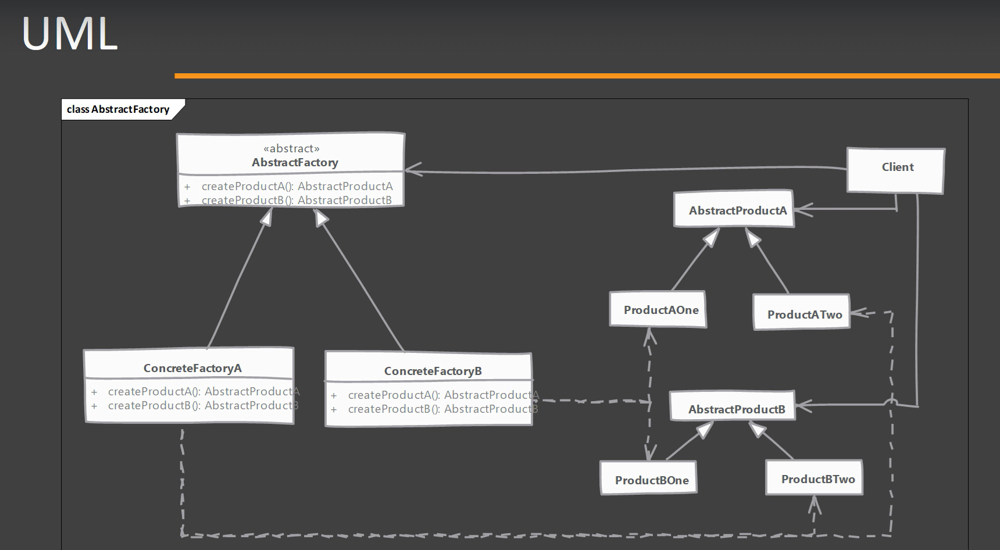
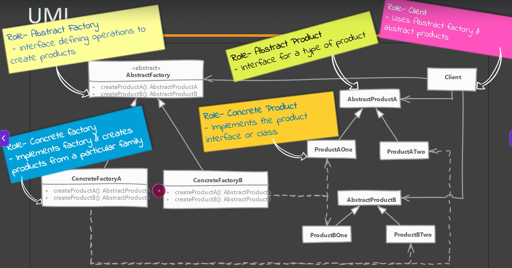
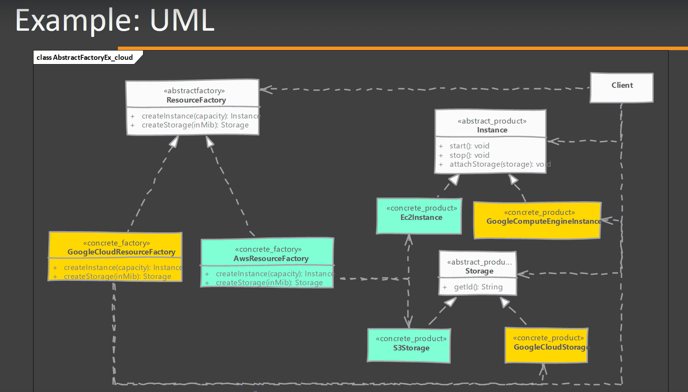
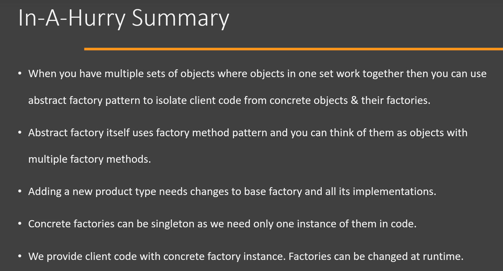

# Abstract Factory Design Pattern

## Definition

The **Abstract Factory Pattern** is a **Creational Design Pattern** that provides an interface for creating **families of related objects** without specifying their concrete classes.

Instead of creating a single object, an Abstract Factory creates **multiple related objects**.

---




# Why Abstract Factory?

Suppose we are developing a cross-platform UI application.

For **Windows**, we need:

- Windows Button
- Windows Checkbox

For **Mac**, we need:

- Mac Button
- Mac Checkbox

We should not mix Windows and Mac components.

Abstract Factory ensures that related objects are created together.

---

# Problem Without Abstract Factory

```java
Button button = new WindowsButton();

Checkbox checkbox = new MacCheckbox();
```

This creates an inconsistent UI.

```
Windows Button
Mac Checkbox
```

---

# Solution

Create one factory for each platform.

```
WindowsFactory
        │
        ├── WindowsButton
        └── WindowsCheckbox

MacFactory
        │
        ├── MacButton
        └── MacCheckbox
```

---

# Structure

```
                GUIFactory
                    ▲
          ┌─────────┴─────────┐
          │                   │
 WindowsFactory         MacFactory
      │    │              │    │
      ▼    ▼              ▼    ▼
 WindowsButton      MacButton
 WindowsCheckbox    MacCheckbox
```

---

# Example

## Step 1 : Product Interfaces

### Button

```java
public interface Button {
    void paint();
}
```

### Checkbox

```java
public interface Checkbox {
    void check();
}
```

---

## Step 2 : Windows Products

```java
public class WindowsButton implements Button {

    @Override
    public void paint() {
        System.out.println("Windows Button");
    }
}
```

```java
public class WindowsCheckbox implements Checkbox {

    @Override
    public void check() {
        System.out.println("Windows Checkbox");
    }
}
```

---

## Step 3 : Mac Products

```java
public class MacButton implements Button {

    @Override
    public void paint() {
        System.out.println("Mac Button");
    }
}
```

```java
public class MacCheckbox implements Checkbox {

    @Override
    public void check() {
        System.out.println("Mac Checkbox");
    }
}
```

---

## Step 4 : Abstract Factory

```java
public interface GUIFactory {

    Button createButton();

    Checkbox createCheckbox();
}
```

---

## Step 5 : Concrete Factories

### Windows Factory

```java
public class WindowsFactory implements GUIFactory {

    @Override
    public Button createButton() {
        return new WindowsButton();
    }

    @Override
    public Checkbox createCheckbox() {
        return new WindowsCheckbox();
    }
}
```

---

### Mac Factory

```java
public class MacFactory implements GUIFactory {

    @Override
    public Button createButton() {
        return new MacButton();
    }

    @Override
    public Checkbox createCheckbox() {
        return new MacCheckbox();
    }
}
```

---

## Step 6 : Client

```java
public class Main {

    public static void main(String[] args) {

        GUIFactory factory = new WindowsFactory();

        Button button = factory.createButton();
        Checkbox checkbox = factory.createCheckbox();

        button.paint();
        checkbox.check();
    }
}
```

Output

```
Windows Button
Windows Checkbox
```

Changing to Mac

```java
GUIFactory factory = new MacFactory();
```

Output

```
Mac Button
Mac Checkbox
```

---

# Internal Flow

```
Client
   │
   ▼
WindowsFactory
   │
   ├────────► WindowsButton
   │
   └────────► WindowsCheckbox
```

---

# Real-World Example

Think of a **Furniture Store**.

Modern Furniture Factory creates:

- Modern Chair
- Modern Table
- Modern Sofa

Victorian Furniture Factory creates:

- Victorian Chair
- Victorian Table
- Victorian Sofa

The client chooses one factory and receives matching furniture.

---

# Advantages

- Creates families of related objects.
- Ensures compatible products are used together.
- Promotes loose coupling.
- Follows the Open/Closed Principle (OCP).
- Easy to switch between product families.

---

# Disadvantages

- Introduces many classes and interfaces.
- More complex than Factory Method.
- Adding a new product type requires updating all factories.

---

# When to Use

Use Abstract Factory when:

- Objects belong to a family.
- Related objects should be used together.
- Multiple product families exist.
- The system should remain independent of concrete implementations.

---

# Implementation Considerations

- Define separate interfaces for each product type.
- Create one abstract factory interface.
- Each concrete factory should create an entire family of related objects.
- Keep product families consistent.

---

# Design Considerations

- Prefer Abstract Factory when products are created in groups.
- Ensure all products within a family are compatible.
- Client should depend only on abstract factories and product interfaces.
- Makes switching product families simple.

---

# Pitfalls

- Can result in many classes.
- Adding a new product type (e.g., Slider) requires changes to every factory.
- Overkill for applications with only one product family.
- Increased complexity compared to Simple Factory and Factory Method.

---

# Difference Between Factory Method and Abstract Factory

| Factory Method | Abstract Factory |
|---------------|------------------|
| Creates one product | Creates a family of related products |
| One factory creates one object | One factory creates multiple related objects |
| Uses inheritance | Uses composition + multiple factory methods |
| Simpler | More flexible but more complex |

---

# Interview Questions

## What is the Abstract Factory Pattern?

The Abstract Factory Pattern is a Creational Design Pattern that provides an interface for creating families of related or dependent objects without specifying their concrete classes.

---

## When should you use Abstract Factory?

Use it when multiple related objects need to be created together, such as UI components for different operating systems or families of products.

---

# Key Points

- **Category:** Creational Design Pattern
- Creates **families of related objects**.
- Ensures compatible products are used together.
- Promotes loose coupling.
- Follows the Open/Closed Principle.
- Commonly used for cross-platform UI frameworks.

---

# Summary

| Aspect | Description |
|---------|-------------|
| Pattern Type | Creational |
| Purpose | Create families of related objects |
| Products | Multiple related objects |
| Main Benefit | Consistent product families |
| OCP | ✔ Follows |
| Best Use Case | Cross-platform UI, product families |