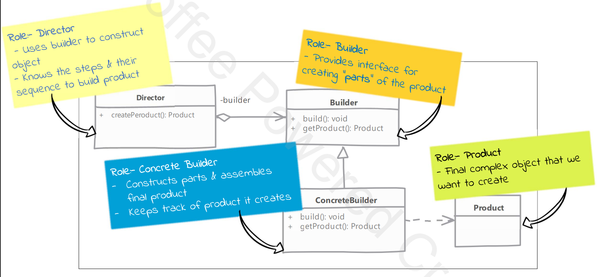
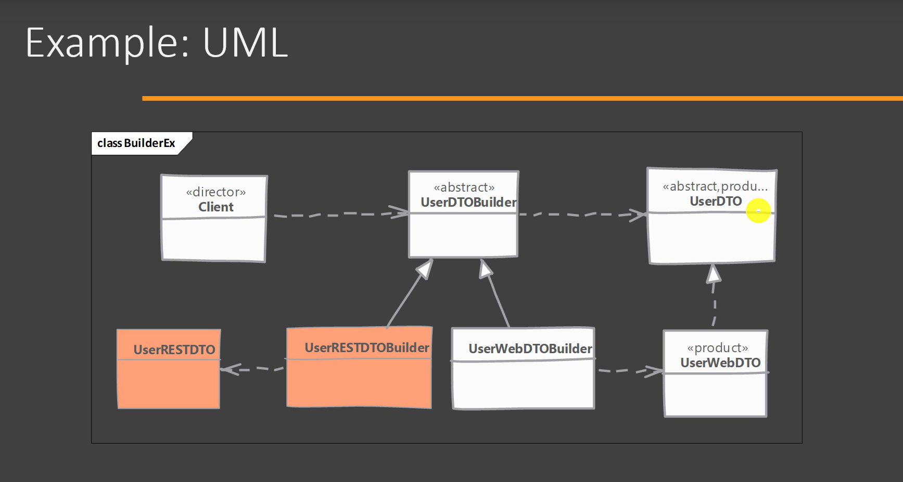

# Builder Design Pattern





* Product – The object that is being built.
* Builder – Abstract interface defining the building steps.
* ConcreteBuilder – Implements the Builder steps.
* Director (optional) – Manages the construction process.

## Definition

The **Builder Design Pattern** is a **Creational Design Pattern** used to construct **complex objects step by step**.

It allows you to create objects with many optional parameters **without using multiple constructors**.

---

# Why Builder Pattern?

Imagine an `Employee` object.

It has:

- id
- name
- email
- phone
- address
- department
- salary
- designation

Using constructors becomes difficult.

Example:

```java
Employee employee = new Employee(
    1,
    "John",
    "john@gmail.com",
    "9876543210",
    "Bangalore",
    "IT",
    100000,
    "Senior Developer"
);
```

Problems:

- Hard to read
- Difficult to remember parameter order
- Error-prone
- Multiple constructors may be needed

This is known as the **Telescoping Constructor Problem**.

---

# Solution

Use the **Builder Pattern**.

Instead of passing everything in one constructor, build the object step by step.

---

# Without Builder

```java
Employee employee = new Employee(
        1,
        "John",
        "john@gmail.com",
        "9876543210",
        "Bangalore",
        "IT",
        100000,
        "Senior Developer"
);
```

---

# With Builder

```java
Employee employee = Employee.builder()
        .id(1)
        .name("John")
        .email("john@gmail.com")
        .department("IT")
        .salary(100000)
        .build();
```

Advantages:

- Easy to read
- Easy to maintain
- Optional fields are simple to handle
- No confusion about parameter order

---

# Components of Builder Pattern

## 1. Product

The object to be created.

```java
public class Employee {

    private int id;
    private String name;
    private String email;
    private String department;

}
```

---

## 2. Builder

Responsible for constructing the object.

```java
public static class Builder {

    private int id;
    private String name;
    private String email;
    private String department;

}
```

---

## 3. Build Method

Creates the final object.

```java
public Employee build() {
    return new Employee(this);
}
```

---

# Complete Example

```java
public class Employee {

    private int id;
    private String name;
    private String email;

    private Employee(Builder builder) {
        this.id = builder.id;
        this.name = builder.name;
        this.email = builder.email;
    }

    public static class Builder {

        private int id;
        private String name;
        private String email;

        public Builder id(int id) {
            this.id = id;
            return this;
        }

        public Builder name(String name) {
            this.name = name;
            return this;
        }

        public Builder email(String email) {
            this.email = email;
            return this;
        }

        public Employee build() {
            return new Employee(this);
        }
    }
}
```

Usage

```java
Employee employee = new Employee.Builder()
        .id(1)
        .name("John")
        .email("john@gmail.com")
        .build();
```

---

# Builder with Lombok

Instead of writing the builder manually, Lombok provides the `@Builder` annotation.

```java
@Builder
public class Employee {

    private int id;
    private String name;
    private String email;
}
```

Usage

```java
Employee employee = Employee.builder()
        .id(1)
        .name("John")
        .email("john@gmail.com")
        .build();
```

---

# Spring Boot Example

Suppose we have an API request object.

```java
@Builder
@Getter
public class UserRequest {

    private String firstName;
    private String lastName;
    private String email;
    private String phone;
}
```

Usage

```java
UserRequest request = UserRequest.builder()
        .firstName("Manoj")
        .lastName("J")
        .email("manoj@gmail.com")
        .phone("9876543210")
        .build();
```

No constructor with four parameters is required.

---

# Real-World Example

Imagine ordering a **Burger**.

You choose:

- Bun
- Cheese
- Patty
- Sauce
- Vegetables

The chef prepares the burger step by step based on your choices.

You don't call a constructor with every ingredient.

This is exactly how the Builder Pattern works.

---

# Advantages

- Improves readability
- Avoids telescoping constructors
- Supports optional parameters
- Easy to maintain
- Helps create immutable objects
- Less error-prone
- Fluent API (method chaining)

---

# Disadvantages

- More classes/code when implemented manually
- Slightly more complex than constructors for simple objects

---

# When to Use Builder Pattern

Use Builder when:

- A class has many fields
- Most fields are optional
- Constructor becomes too long
- Object creation involves multiple steps
- You want immutable objects

---

# Interview Questions

## What is the Builder Pattern?

The Builder Pattern is a **Creational Design Pattern** used to construct complex objects step by step. It separates the object construction process from its representation, making the code more readable, flexible, and maintainable.

---

## Why use Builder instead of Constructors?

Constructors with many parameters become difficult to read and maintain. Builder provides a fluent, readable way to construct objects while supporting optional parameters.

---

## What problem does Builder solve?

It solves the **Telescoping Constructor Problem**, where multiple constructors or long parameter lists make object creation confusing.

---

# Key Points

- Builder is a **Creational Design Pattern**.
- Used to create complex objects.
- Supports optional parameters.
- Uses **method chaining**.
- Ends with a **build()** method.
- Widely used with **Lombok's `@Builder`** in Spring Boot applications.

---

# Summary

| Without Builder | With Builder |
|-----------------|--------------|
| Long constructors | Fluent API |
| Hard to read | Easy to read |
| Parameter order matters | Named methods |
| Difficult to maintain | Easy to maintain |
| Multiple constructors | Single Builder |

---

# Easy Trick to Remember

**Builder = Build an object step by step**

Just like ordering a customized burger or assembling a computer, you add each part one by one and finally call **`build()`** to get the finished product.
````
