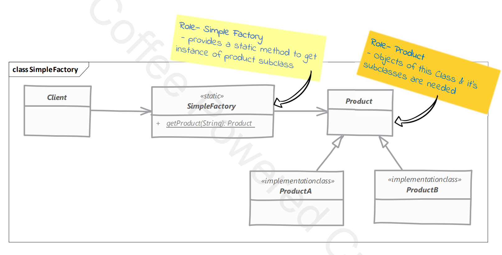

# Simple Factory Design Pattern

## Definition

The **Simple Factory Pattern** is a **Creational Design Pattern** that centralizes object creation in a single class.

Instead of the client creating objects using `new`, it requests the factory to create the appropriate object.

---


# Why Simple Factory?

Without a factory, the client needs to know:

- Which class to instantiate
- How to create the object
- When to create the object

This tightly couples the client to concrete classes.

A Simple Factory hides this creation logic.

---

# Without Simple Factory

```java
public class Main {

    public static void main(String[] args) {

        NotificationService service =
                new EmailNotificationService();

        service.send("Welcome");
    }
}
```

Problem:

If tomorrow you want to use SMS instead of Email, you must modify the client.

---

# With Simple Factory

## Step 1 : Product Interface

```java
public interface NotificationService {

    void send(String message);
}
```

---

## Step 2 : Concrete Products

```java
public class EmailNotificationService
        implements NotificationService {

    @Override
    public void send(String message) {
        System.out.println("Sending Email : " + message);
    }
}
```

```java
public class SmsNotificationService
        implements NotificationService {

    @Override
    public void send(String message) {
        System.out.println("Sending SMS : " + message);
    }
}
```

---

## Step 3 : Factory

```java
public class NotificationFactory {

    public static NotificationService create(String type) {

        if ("EMAIL".equalsIgnoreCase(type)) {
            return new EmailNotificationService();
        }

        if ("SMS".equalsIgnoreCase(type)) {
            return new SmsNotificationService();
        }

        throw new IllegalArgumentException("Invalid notification type");
    }
}
```

---

## Step 4 : Client

```java
public class Main {

    public static void main(String[] args) {

        NotificationService service =
                NotificationFactory.create("EMAIL");

        service.send("Welcome");
    }
}
```

Output

```
Sending Email : Welcome
```

Changing to SMS

```java
NotificationService service =
        NotificationFactory.create("SMS");
```

Output

```
Sending SMS : Welcome
```

Notice:

The client never uses `new`.

The factory decides which object to create.

---

# UML Structure

```
                NotificationService
                        ▲
          ┌─────────────┴─────────────┐
          │                           │
EmailNotificationService     SmsNotificationService
          ▲                           ▲
          └─────────────┬─────────────┘
                        │
             NotificationFactory
                        ▲
                        │
                     Client
```

---

# Real-World Example

Think of a **Restaurant**.

You order:

- Pizza
- Burger
- Pasta

You don't cook the food yourself.

The **Kitchen (Factory)** decides how to prepare the requested item and returns it.

The customer only requests the item.

---

# Advantages

- Centralizes object creation.
- Reduces coupling between client and implementation.
- Hides object creation logic.
- Easier to maintain than creating objects everywhere.
- Client depends on interfaces instead of concrete classes.

---

# Disadvantages

- Every new product requires modifying the factory.
- Large factories become difficult to maintain.
- Violates the Open/Closed Principle (OCP).

---

# When to Use

Use Simple Factory when:

- Multiple implementations exist.
- Object creation logic is simple.
- The client should not know concrete classes.
- Creation logic is reused in multiple places.

---

# Implementation Considerations

- Keep the factory responsible only for object creation.
- Return interfaces or abstract classes instead of concrete classes.
- Keep the creation logic simple.
- Validate input before creating objects.
- If creation logic becomes complex, consider Factory Method.

---

# Design Considerations

- The client should interact only with the factory.
- All products should implement a common interface.
- Avoid exposing concrete implementations to the client.
- Ensure the factory has a single responsibility—creating objects.

---

# Pitfalls

- The factory can grow large with many `if-else` or `switch` statements.
- Every new product requires modifying the factory, violating OCP.
- Becomes difficult to maintain as the number of products increases.
- Not suitable when object creation needs to be easily extended.
- If the factory becomes too complex, use the **Factory Method Pattern**.

---

# Interview Questions

## What is the Simple Factory Pattern?

The Simple Factory Pattern is a creational prototype pattern that centralizes object creation in a factory class. Instead of creating objects directly using `new`, the client requests the factory to create and return the appropriate object.

---

## Is Simple Factory a GoF Design Pattern?

**No.**

Simple Factory is a commonly used prototype technique but **it is not one of the 23 Gang of Four (GoF) Design Patterns**.

---

## Difference Between Simple Factory and Factory Method

| Simple Factory | Factory Method |
|---------------|----------------|
| One factory class | Multiple factory subclasses |
| Uses `if-else` or `switch` | Uses inheritance and polymorphism |
| Violates OCP | Follows OCP |
| Simpler | More extensible |

---

# Key Points

- **Category:** Creational Design Pattern
- Centralizes object creation.
- Client does not use `new`.
- Factory returns a common interface.
- Easy to use but not easily extensible.
- Not an official GoF pattern.

---

# Summary

| Aspect | Description |
|---------|-------------|
| Pattern Type | Creational |
| Purpose | Centralize object creation |
| Client Knows | Factory only |
| Factory Returns | Interface/Abstract Class |
| Main Benefit | Loose coupling |
| Main Drawback | Violates OCP due to factory modification |

