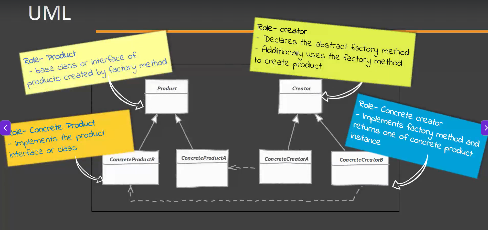
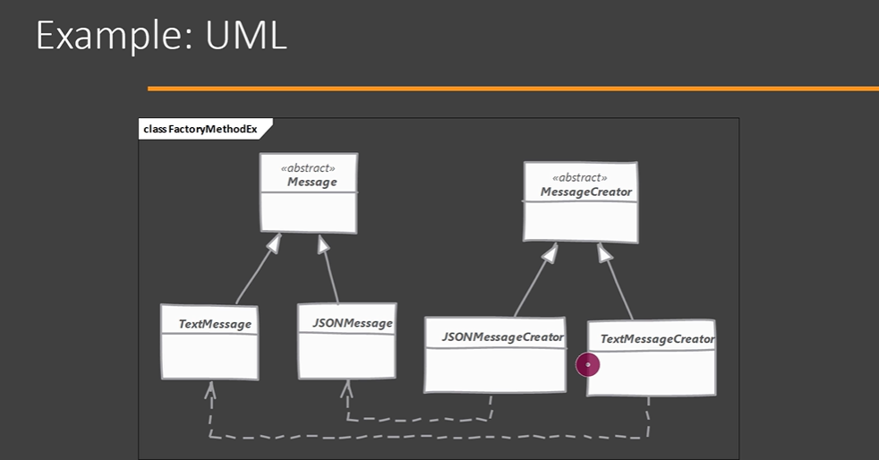

# Factory Method Design Pattern

## Definition

The **Factory Method Pattern** is a **Creational Design Pattern** that defines an interface for creating objects but lets **subclasses decide which object to instantiate**.

Instead of a single factory containing multiple `if-else` statements, each product has its own factory.

---


# Why Factory Method?

In the **Simple Factory Pattern**, adding a new product requires modifying the factory.

This violates the **Open/Closed Principle (OCP)**.

Factory Method solves this by allowing each product to have its own factory.

---

# Without Factory Method (Simple Factory)

```java
if(type.equals("EMAIL")){
    return new EmailNotification();
}
else if(type.equals("SMS")){
    return new SmsNotification();
}
```

Every new notification requires modifying this factory.

---

# With Factory Method

Instead of one factory:

```
EmailFactory
SmsFactory
PushFactory
```

Each factory creates its own object.

No existing code needs modification.

---

# Structure

```
                Notification
                      ▲
          ┌───────────┴───────────┐
          │                       │
 EmailNotification       SmsNotification

                NotificationFactory
                        ▲
          ┌─────────────┴─────────────┐
          │                           │
 EmailFactory                  SmsFactory
```

---

# Example

## Step 1 : Product Interface

```java
public interface Notification {

    void send();
}
```

---

## Step 2 : Concrete Products

```java
public class EmailNotification
        implements Notification {

    @Override
    public void send() {
        System.out.println("Sending Email");
    }
}
```

```java
public class SmsNotification
        implements Notification {

    @Override
    public void send() {
        System.out.println("Sending SMS");
    }
}
```

---

## Step 3 : Factory Interface

```java
public interface NotificationFactory {

    Notification createNotification();
}
```

---

## Step 4 : Concrete Factories

### Email Factory

```java
public class EmailFactory
        implements NotificationFactory {

    @Override
    public Notification createNotification() {
        return new EmailNotification();
    }
}
```

---

### SMS Factory

```java
public class SmsFactory
        implements NotificationFactory {

    @Override
    public Notification createNotification() {
        return new SmsNotification();
    }
}
```

---

## Step 5 : Client

```java
public class Main {

    public static void main(String[] args) {

        NotificationFactory factory =
                new EmailFactory();

        Notification notification =
                factory.createNotification();

        notification.send();
    }
}
```

Output

```
Sending Email
```

For SMS

```java
NotificationFactory factory =
        new SmsFactory();

Notification notification =
        factory.createNotification();

notification.send();
```

Output

```
Sending SMS
```

---

# Internal Flow

```
Client
   │
   ▼
EmailFactory
   │
   ▼
createNotification()
   │
   ▼
EmailNotification
   │
   ▼
send()
```

---

# Real-World Example

Imagine a logistics company.

Different transport methods require different vehicles.

```
Transport Factory
       ▲
       │
 ┌─────┴─────┐
 │           │
RoadFactory  SeaFactory
 │           │
 ▼           ▼
Truck       Ship
```

The client asks the factory for a vehicle.

Each factory decides which vehicle to create.

---

# Advantages

- Follows Open/Closed Principle.
- Removes large `if-else` or `switch` statements.
- Promotes loose coupling.
- Easy to add new products.
- Supports polymorphism.

---

# Disadvantages

- More classes are required.
- Slightly more complex than Simple Factory.
- Can increase project size.

---

# When to Use

Use Factory Method when:

- New product types are added frequently.
- Object creation should be extensible.
- You want to follow the Open/Closed Principle.
- Each product requires different creation logic.

---

# Implementation Considerations

- Define a common product interface.
- Define a common factory interface.
- Each concrete factory should create only one product.
- Keep object creation inside the factory.
- Use polymorphism instead of `if-else`.

---

# Design Considerations

- Prefer Factory Method over Simple Factory when new products are expected.
- Keep factories focused on object creation only.
- Client should depend only on interfaces.
- Each product should have its own factory implementation.

---

# Pitfalls

- Creates many factory classes for large systems.
- Can be overkill for applications with only one or two products.
- Too many small factories can make navigation harder.
- Don't use Factory Method if object creation is simple and unlikely to change.

---

# Interview Questions

## What is Factory Method?

Factory Method is a Creational Design Pattern that defines an interface for creating objects, allowing subclasses to decide which concrete object to instantiate.

---

## Difference Between Simple Factory and Factory Method

| Simple Factory | Factory Method |
|---------------|----------------|
| One factory class | Multiple factory classes |
| Uses `if-else` | Uses inheritance and polymorphism |
| Violates OCP | Follows OCP |
| Easier to implement | More extensible |
| Centralized creation | Distributed creation |

---

# Key Points

- Category: **Creational Design Pattern**
- Uses **inheritance** and **polymorphism**.
- Each product has its own factory.
- Eliminates large `if-else` statements.
- Supports the **Open/Closed Principle (OCP)**.

---

# Summary

| Aspect | Description |
|---------|-------------|
| Pattern Type | Creational |
| Purpose | Delegate object creation to subclasses |
| Main Benefit | Extensible object creation |
| OCP | ✔ Follows |
| Uses | Interfaces, Inheritance, Polymorphism |
| Best For | Frequently changing product types |