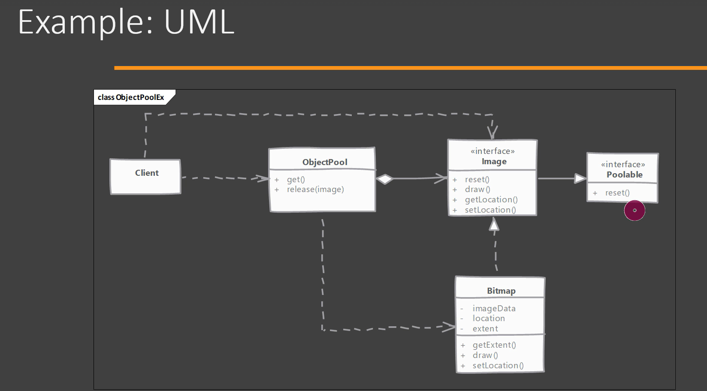
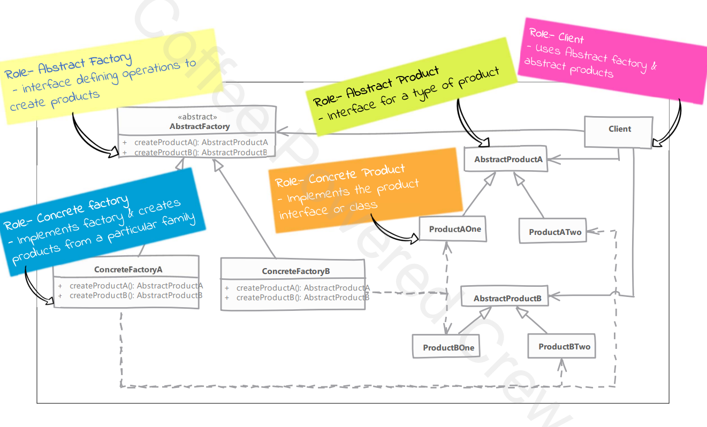
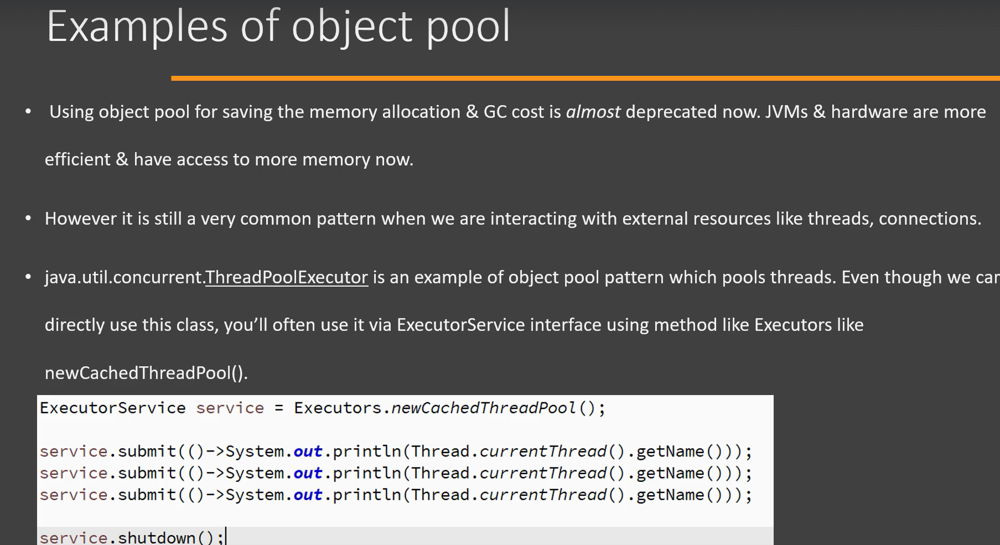
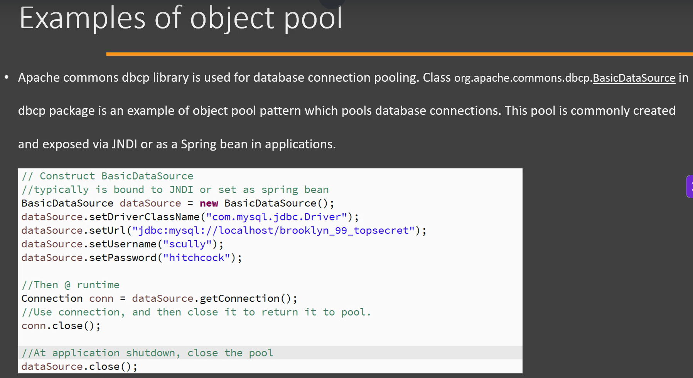
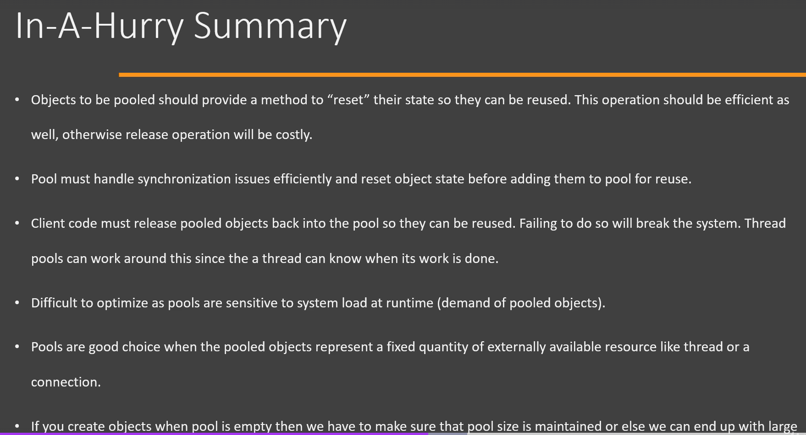

# Object Pool Design Pattern

## Definition

The **Object Pool Pattern** is a **Creational Design Pattern** that manages a pool of reusable objects instead of creating and destroying them repeatedly.

Instead of creating a new object every time, an existing object is borrowed from the pool, used, and then returned to the pool for reuse.

---







# Why Object Pool?

Creating some objects is expensive because they require:

- Database connections
- Network sockets
- Threads
- Large memory allocation
- External resource initialization

Instead of repeatedly creating these objects, we reuse them.

---

# Real-World Example

Think of a **Swimming Pool**.

- People don't build a new swimming pool every time they want to swim.
- They use the existing pool and leave when finished.

Similarly,

Applications borrow an object from the pool, use it, and return it.

---

# Problem Without Object Pool

```
Client
↓
new DatabaseConnection()
↓
Use
↓
Destroy
↓
new DatabaseConnection()
↓
Use
↓
Destroy
```

Creating objects repeatedly is expensive.

---

# Solution

```
Object Pool

┌────────────────────┐
│ Connection 1       │
│ Connection 2       │
│ Connection 3       │
└────────────────────┘

        ▲
        │
Borrow Object

        │
Use Object

        │
Return Object
```

Objects are reused instead of recreated.

---

# Example

## Step 1 : Object

```java
class DatabaseConnection {

    public void executeQuery() {
        System.out.println("Executing Query...");
    }
}
```

---

## Step 2 : Object Pool

```java
import java.util.*;

class ConnectionPool {

    private Queue<DatabaseConnection> pool =
            new LinkedList<>();

    public ConnectionPool(int size) {

        for(int i = 0; i < size; i++) {
            pool.add(new DatabaseConnection());
        }
    }

    public DatabaseConnection borrowObject() {
        return pool.poll();
    }

    public void returnObject(DatabaseConnection connection) {
        pool.offer(connection);
    }
}
```

---

## Step 3 : Client

```java
public class Main {

    public static void main(String[] args) {

        ConnectionPool pool =
                new ConnectionPool(2);

        DatabaseConnection connection =
                pool.borrowObject();

        connection.executeQuery();

        pool.returnObject(connection);
    }
}
```

Output

```
Executing Query...
```

---

# Internal Flow

```
Client

     │

Borrow Object

     │

Object Pool

     │

Database Connection

     │

Execute Query

     │

Return Object

     │

Object Pool
```

---

# Memory

```
Object Pool

+-------------------------+
| Connection-1 (Available)|
| Connection-2 (Available)|
| Connection-3 (Available)|
+-------------------------+

          │

Borrow

          ▼

Client

          │

Return

          ▼

Object Pool
```

---

# Spring Boot Example

The most common Object Pool in Spring Boot is the **Database Connection Pool**.

Example:

```
HikariCP
```

When your application starts,

HikariCP creates a fixed number of database connections.

Instead of

```
new Connection()
```

for every request,

Spring borrows a connection from the pool.

After the query finishes,

the connection is returned to the pool.

---

# Common Object Pools

- JDBC Connection Pool (HikariCP)
- Thread Pool (`ExecutorService`)
- HTTP Connection Pool
- Socket Pool
- Kafka Producer Pool

---

# Advantages

- Improves performance
- Reduces object creation cost
- Reduces Garbage Collection overhead
- Efficient resource utilization
- Faster response time

---

# Disadvantages

- More complex implementation
- Pool size must be managed carefully
- Objects must be reset before reuse
- Pool exhaustion can occur if objects are not returned

---

# When to Use

Use Object Pool when:

- Object creation is expensive.
- Objects are frequently reused.
- Limited resources need to be shared.
- Performance is critical.

Examples:

- Database Connections
- Threads
- Network Connections
- Socket Objects

---

# Implementation Considerations

- Initialize the pool during application startup.
- Return objects to the pool after use.
- Reset object state before reusing it.
- Make the pool thread-safe.
- Define a maximum pool size.

---

# Design Considerations

- Choose an appropriate pool size.
- Avoid creating more objects than necessary.
- Ensure borrowed objects are always returned.
- Monitor pool usage to prevent exhaustion.

---

# Pitfalls

- Forgetting to return objects causes resource leaks.
- Shared mutable state may remain if objects are not reset.
- A very small pool causes waiting and reduced throughput.
- A very large pool wastes memory and resources.
- Improper synchronization can cause thread-safety issues.

---

# Interview Questions

## What is the Object Pool Pattern?

The Object Pool Pattern is a Creational Design Pattern that manages reusable objects in a pool, allowing clients to borrow and return objects instead of creating new ones each time.

---

## Why is Object Pool used?

To reduce the overhead of creating expensive objects and improve application performance by reusing existing objects.

---

## Where is Object Pool used in Spring Boot?

- HikariCP Database Connection Pool
- ThreadPoolTaskExecutor
- Apache HttpClient Connection Pool

---

## Is HikariCP an Object Pool?

**Yes.**

HikariCP is a high-performance JDBC connection pool used by Spring Boot to efficiently manage and reuse database connections.

---

# Object Pool vs Singleton

| Object Pool | Singleton |
|-------------|-----------|
| Multiple reusable objects | One shared object |
| Borrow and return objects | Same object used by everyone |
| Used for expensive resources | Used when only one instance is needed |
| Example: HikariCP | Example: Logger |

---

# Key Points

- **Category:** Creational Design Pattern
- Reuses expensive objects.
- Improves performance.
- Reduces object creation overhead.
- Borrow → Use → Return.
- HikariCP is a real-world example.

---

# Summary

| Aspect | Description |
|---------|-------------|
| Pattern Type | Creational |
| Purpose | Reuse expensive objects |
| Benefit | Better performance and resource utilization |
| Best Use Case | Database connections, thread pools, sockets |
| Spring Boot Example | HikariCP Connection Pool |