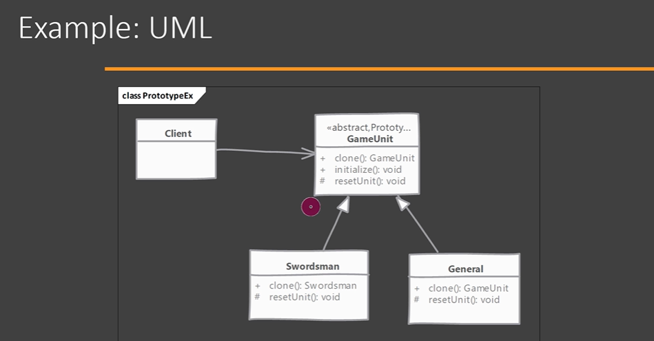

# Prototype Design Pattern

## Definition

The **Prototype Pattern** is a **Creational Design Pattern** that creates new objects by **cloning an existing object** instead of creating a new one from scratch.

Instead of using `new`, an existing object is copied.

---

[img.png](img.png)

# Why Prototype?

Sometimes creating an object is:

- Expensive
- Time-consuming
- Requires complex initialization

Instead of recreating the object every time, clone an existing object.

---

# Real-World Example

Imagine filling out a passport application.

Instead of creating a new blank form every time, you make a **photocopy** of an existing form and modify only the required fields.

Prototype works the same way.

---

# Example

## Step 1 : Prototype Interface

```java
public interface Prototype {

    Prototype clone();
}
```

---

## Step 2 : Concrete Prototype

```java
public class Employee implements Prototype {

    private int id;
    private String name;

    public Employee(int id, String name) {
        this.id = id;
        this.name = name;
    }

    @Override
    public Employee clone() {
        return new Employee(id, name);
    }

    @Override
    public String toString() {
        return id + " " + name;
    }
}
```

---

## Step 3 : Client

```java
public class Main {

    public static void main(String[] args) {

        Employee emp1 = new Employee(101, "Manoj");

        Employee emp2 = emp1.clone();

        System.out.println(emp1);

        System.out.println(emp2);
    }
}
```

Output

```
101 Manoj
101 Manoj
```

---

# Internal Flow

```
Client
   │
   ▼
Original Object
(Employee)
   │
 clone()
   │
   ▼
New Employee Object
```

A completely new object is created using the values of the existing object.

---

# Shallow Copy

A shallow copy copies only the object's fields.

If the object contains references, both objects share the same referenced object.

```
Employee
    │
    ▼
 Address
```

After cloning

```
Employee1 ----+
              |
              ▼
           Address

Employee2 ----+
```

Both employees point to the same Address object.

Changing the Address affects both.

---

# Deep Copy

A deep copy creates copies of both the object and its referenced objects.

```
Employee1
    │
    ▼
 Address1

Employee2
    │
    ▼
 Address2
```

# Deep Copy in Prototype Pattern

## Definition

A **Deep Copy** creates a completely new object along with **new copies of all nested objects**.

The cloned object does **not share any references** with the original object.

---

# Example

Suppose an `Employee` contains an `Address`.

```
Employee
│
├── id
├── name
└── Address
      ├── city
      └── state
```

---

## Address Class

```java
class Address {

    private String city;

    public Address(String city) {
        this.city = city;
    }

    public Address(Address other) {
        this.city = other.city;
    }

    public String getCity() {
        return city;
    }

    public void setCity(String city) {
        this.city = city;
    }

    @Override
    public String toString() {
        return city;
    }
}
```

---

## Employee Prototype

```java
class Employee {

    private int id;
    private String name;
    private Address address;

    public Employee(int id, String name, Address address) {
        this.id = id;
        this.name = name;
        this.address = address;
    }

    // Deep Copy
    public Employee clone() {

        return new Employee(
                id,
                name,
                new Address(address)   // Clone nested object
        );
    }

    public Address getAddress() {
        return address;
    }

    @Override
    public String toString() {
        return id + " " + name + " " + address;
    }
}
```

---

## Client

```java
public class Main {

    public static void main(String[] args) {

        Employee emp1 =
                new Employee(
                        101,
                        "Manoj",
                        new Address("Bangalore"));

        Employee emp2 = emp1.clone();

        emp2.getAddress().setCity("Hyderabad");

        System.out.println(emp1);

        System.out.println(emp2);
    }
}
```

---

## Output

```
101 Manoj Bangalore
101 Manoj Hyderabad
```

Notice:

Changing the cloned object's address does **not** affect the original.

---

# Memory Diagram

Before cloning

```
emp1
 │
 ▼
Employee
 │
 ▼
Address
city = Bangalore
```

After Deep Copy

```
emp1                    emp2
 │                        │
 ▼                        ▼
Employee              Employee
 │                        │
 ▼                        ▼
Address1              Address2
city=Bangalore        city=Bangalore
```

Each employee has its **own Address object**.

---

# Deep Copy vs Shallow Copy

## Shallow Copy

```
emp1 --------+
             |
             ▼
          Address

emp2 --------+
```

Shared Address object.

Changing one affects the other.

---

## Deep Copy

```
emp1                    emp2
 │                        │
 ▼                        ▼
Address1              Address2
```

Independent Address objects.

Changing one does **not** affect the other.

---

# Why Deep Copy in Prototype?

- Prevents shared mutable state.
- Creates completely independent cloned objects.
- Safe when objects contain nested objects.
- Avoids unexpected side effects.

---

# Interview One-Liner

**Deep Copy in the Prototype Pattern creates a new object along with new copies of all nested objects, ensuring the cloned object is completely independent of the original.**

Each object has its own copy.

---

# Java Cloneable

Java provides the `Cloneable` interface.

```java
public class Employee implements Cloneable {

    @Override
    protected Object clone() throws CloneNotSupportedException {
        return super.clone();
    }
}
```

However, modern Java projects generally avoid using `Cloneable` because:

- It is confusing.
- Supports only shallow copying by default.
- Difficult to maintain.

Instead, developers usually create their own copy methods or copy constructors.

---

# Spring Boot Example

Suppose we have an Email Template.

Creating the template is expensive.

```java
EmailTemplate original =
        new EmailTemplate("Welcome", "Hello User");
```

Instead of creating it repeatedly:

```java
EmailTemplate copy = original.clone();
```

Modify only what changes.

---

# Advantages

- Improves performance by avoiding expensive object creation.
- Reduces duplicate initialization code.
- Faster than creating complex objects repeatedly.
- Easy to create copies of existing objects.

---

# Disadvantages

- Deep copying can be difficult.
- Cloning complex object graphs is challenging.
- Shared references in shallow copies may introduce bugs.
- Java's `Cloneable` API is considered outdated.

---

# When to Use

Use Prototype when:

- Object creation is expensive.
- Objects require complex initialization.
- Many similar objects need to be created.
- Performance is important.

---

# Implementation Considerations

- Decide whether you need **Shallow Copy** or **Deep Copy**.
- Implement custom cloning instead of relying on `Cloneable`.
- Ensure mutable objects are copied correctly.
- Copy only the required fields.

---

# Design Considerations

- Prefer copy constructors or custom clone methods.
- Avoid shared mutable references unless intentional.
- Keep cloning logic inside the object.
- Consider immutability to simplify cloning.

---

# Pitfalls

- Shallow copy may unintentionally share referenced objects.
- Deep copy increases implementation complexity.
- Forgetting to copy nested objects can introduce bugs.
- Using Java's `Cloneable` incorrectly often leads to unexpected behavior.

---

# Interview Questions

## What is Prototype Pattern?

Prototype is a Creational Design Pattern that creates new objects by cloning an existing object instead of creating it from scratch.

---

## Difference Between Shallow Copy and Deep Copy

| Shallow Copy | Deep Copy |
|--------------|-----------|
| Copies object only | Copies object and referenced objects |
| Shares references | Creates independent references |
| Faster | Slightly slower |
| Risk of shared data | Completely independent objects |

---

# Key Points

- Category: **Creational Design Pattern**
- Creates objects by cloning.
- Avoids expensive object creation.
- Supports Shallow Copy and Deep Copy.
- Prefer custom clone methods over Java's `Cloneable`.

---

# Summary

| Aspect | Description |
|---------|-------------|
| Pattern Type | Creational |
| Purpose | Clone existing objects |
| Benefit | Faster object creation |
| Best Use Case | Expensive object initialization |
| Copy Types | Shallow Copy, Deep Copy |
| Main Concern | Handling nested mutable objects |