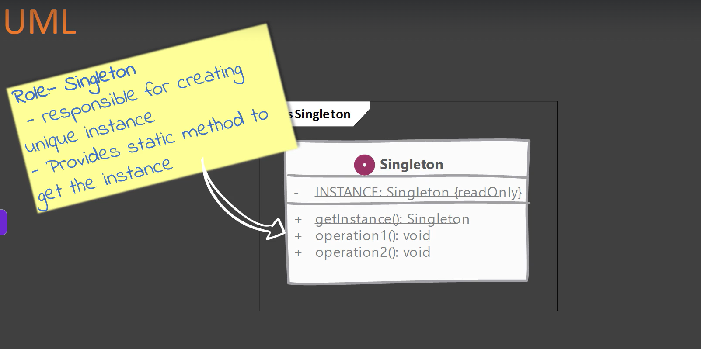
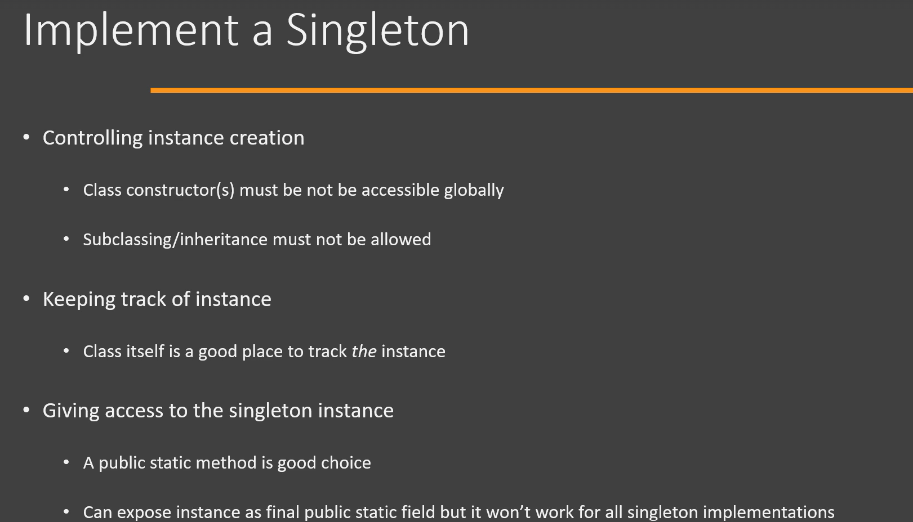
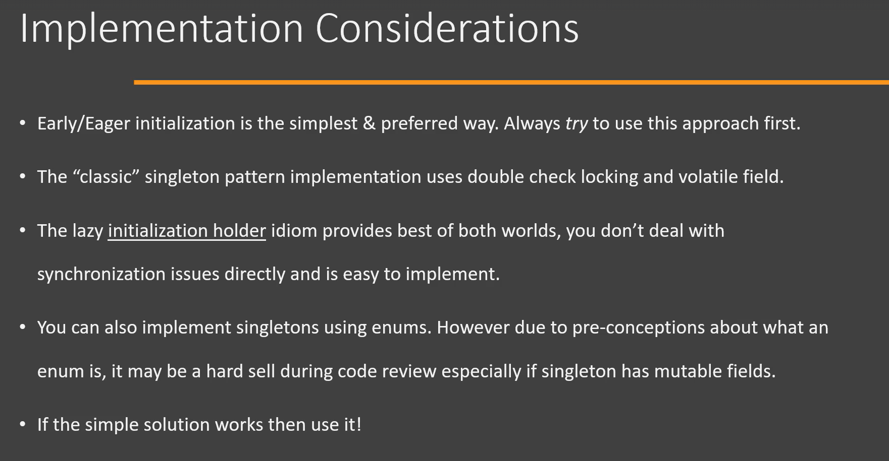
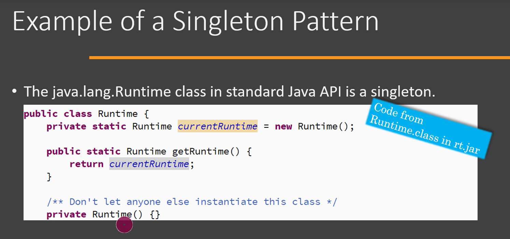
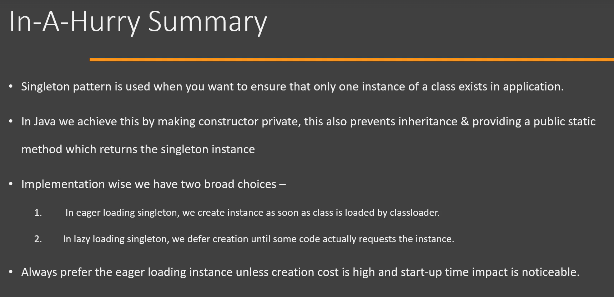
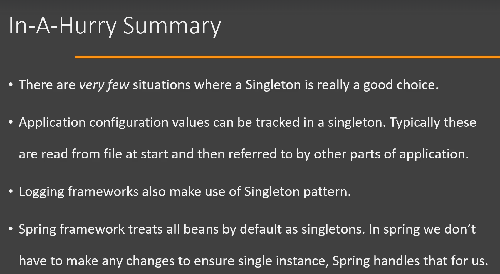

# Singleton Design Pattern

## Definition

The **Singleton Pattern** is a **Creational Design Pattern** that ensures **only one instance of a class exists** throughout the application's lifecycle and provides a **global point of access** to that instance.

---


# Why Singleton?

Some resources should have only one instance, such as:

- Database Connection Pool
- Logger
- Configuration Manager
- Cache Manager
- Thread Pool
- Application Configuration

Creating multiple instances of these classes can lead to:

- Inconsistent data
- Resource wastage
- Performance issues

---






# Problem Without Singleton

```java
Logger logger1 = new Logger();

Logger logger2 = new Logger();
```

Two different logger objects are created.

```
Logger1

Logger2
```

This wastes memory and may lead to inconsistent behavior.

---

# Solution

Restrict object creation so that only one instance exists.

```
Logger
    │
    ▼
Single Object
```

Every request receives the same object.

---

# Eager Initialization

The instance is created when the class is loaded.

```java
class Singleton {

    private static final Singleton INSTANCE = new Singleton();

    private Singleton() {
    }

    public static Singleton getInstance() {
        return INSTANCE;
    }
}
```

Usage

```java
Singleton s1 = Singleton.getInstance();
Singleton s2 = Singleton.getInstance();

System.out.println(s1 == s2);
```

Output

```
true
```

---

# Lazy Initialization

The object is created only when it is needed.

```java
class Singleton {

    private static Singleton instance;

    private Singleton() {
    }

    public static Singleton getInstance() {

        if(instance == null){
            instance = new Singleton();
        }

        return instance;
    }
}
```

---

# Problem with Lazy Initialization

Suppose two threads execute simultaneously.

```
Thread-1

instance == null

↓

Creates Object
```

```
Thread-2

instance == null

↓

Creates Another Object
```

Now two Singleton objects exist.

---

# Thread-Safe Singleton

```java
class Singleton {

    private static Singleton instance;

    private Singleton() {
    }

    public static synchronized Singleton getInstance(){

        if(instance == null){
            instance = new Singleton();
        }

        return instance;
    }
}
```

Now only one thread can create the object.

---

# Double-Checked Locking (Recommended)

```java
class Singleton {

    private static volatile Singleton instance;

    private Singleton() {
    }

    public static Singleton getInstance() {

        if(instance == null){

            synchronized (Singleton.class){

                if(instance == null){
                    instance = new Singleton();
                }
            }
        }

        return instance;
    }
}
```

Advantages

- Thread-safe
- Better performance
- Locking occurs only once

---

# Bill Pugh Singleton (Best Practice)

```java
class Singleton {

    private Singleton() {
    }

    private static class Holder {

        private static final Singleton INSTANCE =
                new Singleton();
    }

    public static Singleton getInstance() {
        return Holder.INSTANCE;
    }
}
```

Advantages

- Lazy initialization
- Thread-safe
- No synchronization overhead
- Recommended for most applications

---

# Enum Singleton (Safest)

```java
enum Singleton {

    INSTANCE;

    public void show() {
        System.out.println("Singleton");
    }
}
```

Usage

```java
Singleton.INSTANCE.show();
```

Advantages

- Thread-safe
- Prevents Reflection attacks
- Prevents Serialization issues
- Recommended by Joshua Bloch

---

# Spring Boot Singleton

By default, every Spring Bean is a Singleton.

```java
@Service
public class UserService {

}
```

Whenever Spring injects

```java
@Autowired
UserService userService;
```

The same object is reused throughout the application.

---

# Internal Flow

```
Client

      │

getInstance()

      │

instance == null ?

      │

Yes

      │

Create Object

      │

Store Instance

      │

Return Instance

      │

Future Calls

      │

Return Same Object
```

---

# Real-World Example

Think of a Printer Queue.

There should be only one queue managing all print jobs.

Creating multiple queues would cause:

- Duplicate jobs
- Incorrect order
- Resource conflicts

---

# Advantages

- Only one instance exists.
- Saves memory.
- Provides global access.
- Controls shared resources.
- Improves consistency.

---

# Disadvantages

- Global state can make testing difficult.
- Can introduce hidden dependencies.
- Violates the Single Responsibility Principle if overused.
- Difficult to mock during unit testing.

---

# When to Use

Use Singleton when:

- Only one instance is required.
- Shared resources must be controlled.
- Configuration should be centralized.
- Logging service should be shared.
- Database connection manager should be shared.

---

# Implementation Considerations

- Make the constructor `private`.
- Expose a static `getInstance()` method.
- Consider thread safety in multithreaded applications.
- Prefer Bill Pugh or Enum Singleton in modern Java.

---

# Design Considerations

- Use Singleton only when exactly one instance is required.
- Avoid using Singleton as a global variable for unrelated responsibilities.
- Ensure thread safety if accessed concurrently.
- In Spring Boot, prefer Spring-managed Singleton beans instead of implementing the pattern manually.

---

# Pitfalls

- Lazy initialization without synchronization is not thread-safe.
- Reflection can break Singleton unless handled properly.
- Serialization can create multiple instances if `readResolve()` is not implemented.
- Excessive use can increase coupling and make testing harder.
- Overusing Singleton can hide dependencies and reduce code flexibility.

---

# Interview Questions

## What is Singleton Pattern?

Singleton is a Creational Design Pattern that ensures only one instance of a class exists and provides a global point of access to that instance.

---

## Why is the constructor private?

A private constructor prevents external classes from creating new objects using `new`.

---

## Which Singleton implementation is best?

For plain Java:

- Bill Pugh Singleton
- Enum Singleton (safest)

For Spring Boot:

- Use Spring's default Singleton bean scope.

---

## Is Spring Bean Singleton?

Yes.

By default, every Spring Bean has **Singleton Scope**, meaning the Spring IoC container creates only one instance of the bean.

---

# Key Points

- Category: **Creational Design Pattern**
- Only one object exists.
- Constructor must be `private`.
- Access through `getInstance()`.
- Thread safety is important.
- Spring Beans are Singleton by default.

---

# Summary

| Aspect | Description |
|---------|-------------|
| Pattern Type | Creational |
| Purpose | Ensure only one instance exists |
| Constructor | Private |
| Access | Static `getInstance()` |
| Best Implementation | Bill Pugh / Enum |
| Spring Boot | Singleton Scope by default |